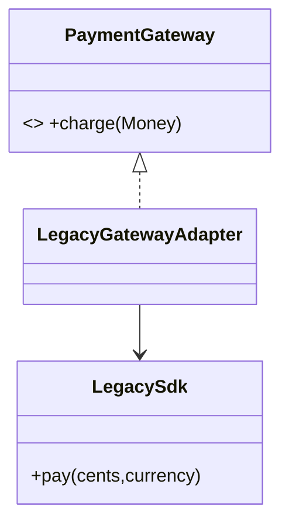

# Adapter Pattern

## Mục tiêu

Chuyển interface của vendor thành contract nội bộ.

## Vấn đề thực tế

Hệ thống cần tích hợp SDK thanh toán có method và data shape khác domain. Hiện tại business code gọi trực tiếp API của vendor, khiến thay đổi lan sang code nghiệp vụ và test.

## Dấu hiệu nhận biết

- Business code gọi trực tiếp api của vendor.
- Test phải dựng chi tiết không liên quan đến behavior cần kiểm chứng.
- Yêu cầu mới buộc sửa class đang ổn định thay vì thêm collaborator độc lập.

## Ý tưởng giải pháp

Dùng Adapter để đặt boundary quanh phần thay đổi. Policy chính phụ thuộc contract nhỏ; chi tiết triển khai được đưa vào object có trách nhiệm rõ ràng.

## Khi nên dùng

- Tích hợp API/SDK bên thứ ba.

## Khi không nên dùng

- Không dùng nếu có thể thay đổi trực tiếp contract nguồn.

## Ưu điểm

- Cô lập thay đổi liên quan đến tích hợp SDK thanh toán có method và data shape khác domain.
- Test policy và implementation độc lập.
- Thể hiện rõ quyết định dùng Adapter trong vocabulary của code.

## Nhược điểm

- Tăng số lượng type và bước điều hướng.
- Không có lợi nếu tích hợp SDK thanh toán có method và data shape khác domain chỉ có một biến thể ổn định.
- Cần composition root rõ để tránh giấu call flow.

## Bài tập

Thực hiện yêu cầu: **tích hợp SDK mới mà domain contract không đổi**. Trước khi refactor, viết characterization test khóa behavior hiện tại; sau đó thêm implementation mới mà không sửa policy đã ổn định.

### Gợi ý cách làm

1. Khoanh vùng lực thay đổi: dịch contract bên ngoài sang ngôn ngữ nội bộ.
2. Đặt contract nhỏ dùng vocabulary của use case, không dùng tên chung như `Behavior` hoặc `Manager`.
3. Di chuyển concrete detail ra sau contract; wiring tại composition root.
4. Viết test cho happy path, failure path và trường hợp implementation mới.
5. Hoàn thành khi: Adapter map dữ liệu, lỗi và semantics tại boundary.

### Tiêu chí tự review

- Invariant chính có được nói rõ: **vendor model không rò qua application contract**?
- Client đã ngừng phụ thuộc concrete detail nào, và dependency được wire ở đâu?
- Test có kiểm chứng **fixture contract, timeout và unknown error code** thay vì chỉ assert class được gọi?
- Failure/return semantics giữa các implementation có nhất quán không?
- Adapter chỉ dịch; rule như eligibility/fee vẫn thuộc domain.

### Câu 1: Adapter giải quyết vấn đề gì?

**Trả lời:** Pattern này cô lập nhu cầu **dịch contract bên ngoài sang ngôn ngữ nội bộ** sau một contract rõ ràng. Giá trị chính không phải giảm số dòng code mà là giảm phạm vi thay đổi và cho phép test policy tách khỏi concrete detail.

### Câu 2: Trade-off quan trọng nhất là gì?

**Trả lời:** Thiết kế thêm type, indirection và wiring. Nếu chỉ có một biến thể ổn định hoặc logic rất nhỏ, giải pháp trực tiếp thường dễ đọc hơn. Hãy chứng minh bằng change axis, testability hoặc ownership boundary thay vì áp dụng theo thói quen.  
> **Ngữ cảnh áp dụng:** Áp dụng riêng cho **Adapter Pattern**: liên hệ checklist với sơ đồ và code trước/sau trong bài, rồi nêu change axis mà pattern bảo vệ.

### Câu 3: So sánh với Facade

**Trả lời:** Adapter làm tương thích hai interface; Facade đơn giản hóa một subsystem vốn đã tương thích.

### Câu 4: Bạn kiểm thử pattern này thế nào?

**Trả lời:** Bắt đầu bằng behavior contract của adapter: fixture contract, timeout và unknown error code. Sau đó thêm failure-path test cho exception/side effect, wiring test tại composition root và regression test để bảo đảm client không cần biết concrete implementation. Tránh mock từng method nội bộ vì điều đó khóa cấu trúc thay vì semantics.

## UML Adapter



Đọc theo hướng dịch contract: model lỗi và dữ liệu của vendor dừng tại adapter, không chảy vào application core.

## Minh họa trước và sau refactor

### Trước khi áp dụng

```php
$response = $legacyClient->makePayment($amount);
if ($response['code'] !== '00') { throw new RuntimeException($response['message']); }
```

### Sau khi áp dụng

```php
final class LegacyGatewayAdapter implements PaymentGateway
{
    public function __construct(private LegacyClient $client) {}

    public function charge(Money $amount): PaymentResult
    {
        $raw = $this->client->makePayment($amount->cents());
        return $raw['code'] === '00'
            ? PaymentResult::succeeded($raw['transaction_id'])
            : throw new PaymentDeclined($raw['message']);
    }
}
```

> Ý tưởng trọng tâm: Adapter chuyển API vendor sang contract nội bộ.

## Ví dụ chạy được

Xem [`examples/structural/adapter-weather`](../../examples/structural/adapter-weather/README.md) để chạy bản `before.php` và `after.php`.

## Bài tập thực hành

1. Khóa behavior hiện tại bằng characterization test.
2. Thực hiện yêu cầu: thay vendor bằng adapter khác mà use case không đổi.
3. Viết một test cho failure path đặc trưng của Adapter.
4. Ghi rõ khi nào giải pháp trực tiếp sẽ dễ hiểu hơn.

### Gợi ý thực hiện bài tập thực hành

1. Viết characterization test tái hiện pain point của adapter.
2. Đánh dấu chính xác nơi invariant “vendor model không rò qua application contract” đang bị đe dọa.
3. Refactor một dependency hoặc branch mỗi lần; giữ output/public API trong bước đầu.
4. Chứng minh thiết kế bằng phép thử: **fixture contract, timeout và unknown error code**.
5. Ghi lại trường hợp không áp dụng: Adapter chỉ dịch; rule như eligibility/fee vẫn thuộc domain.

### Câu hỏi quan sát

- Trong ví dụ này, lực thay đổi nào được Adapter cô lập?
- Client còn biết concrete class hoặc lifecycle detail nào không?
- Test nào chứng minh có thể thay implementation mà không sửa policy?

## Hướng refactor an toàn

1. Viết characterization test cho behavior hiện tại, đặc biệt quanh **dịch contract, dữ liệu và lỗi tại boundary**.
2. Đánh dấu đúng change axis và dependency cần đảo chiều; chưa tạo interface cho phần ổn định.
3. Tách một bước nhỏ, giữ public behavior và chạy test sau mỗi commit.
4. Chạy contract test bằng fixture vendor và lỗi không xác định.
5. So sánh độ đọc hiểu, số type và chi phí wiring với phiên bản trực tiếp trước khi chấp nhận refactor.

## Kiểm thử nên tập trung vào đâu?

- **Behavior/contract:** chạy contract test bằng fixture vendor và lỗi không xác định.
- **Failure semantics:** exception, kết quả rỗng và side effect phải nhất quán giữa các implementation.
- **Wiring:** composition root chọn đúng collaborator mà không để client phụ thuộc concrete type.
- **Regression:** test bảo vệ behavior cũ, không khóa private method hoặc cấu trúc class.

Adapter phải bảo vệ ngôn ngữ nội bộ khỏi SDK; không đặt business rule trong lớp dịch.

## Câu hỏi tự review

1. Pattern này đang bảo vệ **dịch contract, dữ liệu và lỗi tại boundary** hay chỉ tăng số lớp?
2. Test nào thất bại nếu một implementation vi phạm contract nhưng vẫn trả đúng kiểu dữ liệu?
3. Concrete detail nào đã biến mất khỏi client sau refactor?
4. Adapter phải bảo vệ ngôn ngữ nội bộ khỏi SDK; không đặt business rule trong lớp dịch.

