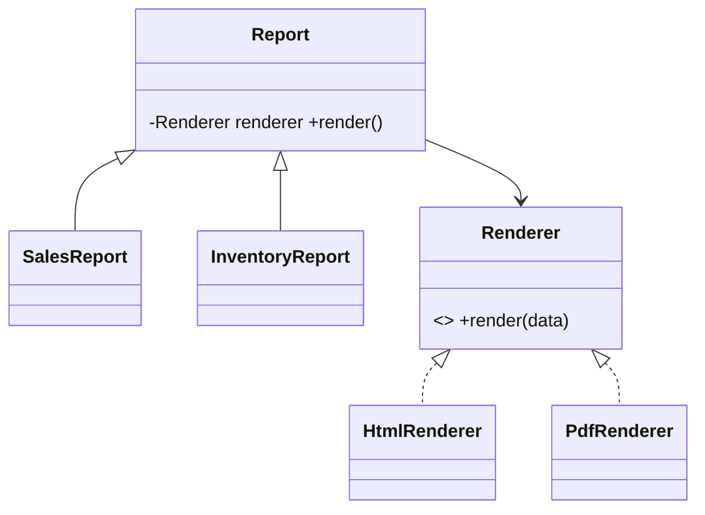

# Bridge Pattern

## Mục tiêu

Tách abstraction khỏi implementation để hai phía thay đổi độc lập.

## Vấn đề thực tế

Hệ thống cần tách loại notification khỏi kênh gửi. Hiện tại số subclass tăng theo tích của loại thông báo và channel, khiến thay đổi lan sang code nghiệp vụ và test.

## Dấu hiệu nhận biết

- Số subclass tăng theo tích của loại thông báo và channel.
- Test phải dựng chi tiết không liên quan đến behavior cần kiểm chứng.
- Yêu cầu mới buộc sửa class đang ổn định thay vì thêm collaborator độc lập.

## Ý tưởng giải pháp

Dùng Bridge để đặt boundary quanh phần thay đổi. Policy chính phụ thuộc contract nhỏ; chi tiết triển khai được đưa vào object có trách nhiệm rõ ràng.

## Khi nên dùng

- Hai chiều biến đổi độc lập.

## Khi không nên dùng

- Không dùng nếu chỉ có một implementation ổn định.

## Ưu điểm

- Cô lập thay đổi liên quan đến tách loại notification khỏi kênh gửi.
- Test policy và implementation độc lập.
- Thể hiện rõ quyết định dùng Bridge trong vocabulary của code.

## Nhược điểm

- Tăng số lượng type và bước điều hướng.
- Không có lợi nếu tách loại notification khỏi kênh gửi chỉ có một biến thể ổn định.
- Cần composition root rõ để tránh giấu call flow.

## Bài tập

Thực hiện yêu cầu: **thêm report type và renderer mà không tạo tích Descartes subclass**. Trước khi refactor, viết characterization test khóa behavior hiện tại; sau đó thêm implementation mới mà không sửa policy đã ổn định.

### Gợi ý cách làm

1. Khoanh vùng lực thay đổi: tách abstraction khỏi implementation để hai chiều biến đổi độc lập.
2. Đặt contract nhỏ dùng vocabulary của use case, không dùng tên chung như `Behavior` hoặc `Manager`.
3. Di chuyển concrete detail ra sau contract; wiring tại composition root.
4. Viết test cho happy path, failure path và trường hợp implementation mới.
5. Hoàn thành khi: Abstraction giữ implementation interface.

### Tiêu chí tự review

- Invariant chính có được nói rõ: **abstraction và implementation thay đổi độc lập**?
- Client đã ngừng phụ thuộc concrete detail nào, và dependency được wire ở đâu?
- Test có kiểm chứng **thêm một cặp combination mới không sửa hierarchy cũ** thay vì chỉ assert class được gọi?
- Failure/return semantics giữa các implementation có nhất quán không?
- Bridge thừa nếu chỉ một chiều thay đổi hoặc số combination nhỏ và ổn định.

### Câu 1: Bridge giải quyết vấn đề gì?

**Trả lời:** Pattern này cô lập nhu cầu **tách abstraction khỏi implementation để hai chiều biến đổi độc lập** sau một contract rõ ràng. Giá trị chính không phải giảm số dòng code mà là giảm phạm vi thay đổi và cho phép test policy tách khỏi concrete detail.

### Câu 2: Trade-off quan trọng nhất là gì?

**Trả lời:** Thiết kế thêm type, indirection và wiring. Nếu chỉ có một biến thể ổn định hoặc logic rất nhỏ, giải pháp trực tiếp thường dễ đọc hơn. Hãy chứng minh bằng change axis, testability hoặc ownership boundary thay vì áp dụng theo thói quen.  
> **Ngữ cảnh áp dụng:** Áp dụng riêng cho **Bridge Pattern**: liên hệ checklist với sơ đồ và code trước/sau trong bài, rồi nêu change axis mà pattern bảo vệ.

### Câu 3: So sánh với Strategy

**Trả lời:** Strategy thường thay một thuật toán; Bridge thiết kế hai hierarchy độc lập ngay từ đầu.

### Câu 4: Bạn kiểm thử pattern này thế nào?

**Trả lời:** Bắt đầu bằng behavior contract của bridge: thêm một cặp combination mới không sửa hierarchy cũ. Sau đó thêm failure-path test cho exception/side effect, wiring test tại composition root và regression test để bảo đảm client không cần biết concrete implementation. Tránh mock từng method nội bộ vì điều đó khóa cấu trúc thay vì semantics.

## UML hai trục thay đổi



Hai hierarchy phải tiến hóa độc lập; nếu chỉ một phía thay đổi thì sơ đồ đang cảnh báo rằng Bridge có thể quá mức.

## Minh họa trước và sau refactor

### Trước khi áp dụng

```php
final class PdfEmailReport extends Report {}
final class PdfSlackReport extends Report {}
final class CsvEmailReport extends Report {}
final class CsvSlackReport extends Report {}
```

### Sau khi áp dụng

```php
interface Renderer { public function render(ReportData $data): string; }

abstract class Report
{
    public function __construct(protected Renderer $renderer) {}
    abstract public function generate(): string;
}

final class SalesReport extends Report
{
    public function generate(): string { return $this->renderer->render($this->data()); }
}
```

> Ý tưởng trọng tâm: Tách hai chiều thay đổi và nối bằng composition.

## Ví dụ chạy được

Xem [`examples/structural/adapter-weather`](../../examples/structural/adapter-weather/README.md) để chạy bản `before.php` và `after.php`.

## Bài tập thực hành

1. Khóa behavior hiện tại bằng characterization test.
2. Thực hiện yêu cầu: thêm channel độc lập với loại notification.
3. Viết một test cho failure path đặc trưng của Bridge.
4. Ghi rõ khi nào giải pháp trực tiếp sẽ dễ hiểu hơn.

### Gợi ý thực hiện bài tập thực hành

1. Viết characterization test tái hiện pain point của bridge.
2. Đánh dấu chính xác nơi invariant “abstraction và implementation thay đổi độc lập” đang bị đe dọa.
3. Refactor một dependency hoặc branch mỗi lần; giữ output/public API trong bước đầu.
4. Chứng minh thiết kế bằng phép thử: **thêm một cặp combination mới không sửa hierarchy cũ**.
5. Ghi lại trường hợp không áp dụng: Bridge thừa nếu chỉ một chiều thay đổi hoặc số combination nhỏ và ổn định.

### Câu hỏi quan sát

- Trong ví dụ này, lực thay đổi nào được Bridge cô lập?
- Client còn biết concrete class hoặc lifecycle detail nào không?
- Test nào chứng minh có thể thay implementation mà không sửa policy?

## Hướng refactor an toàn

1. Viết characterization test cho behavior hiện tại, đặc biệt quanh **hai trục thay đổi độc lập**.
2. Đánh dấu đúng change axis và dependency cần đảo chiều; chưa tạo interface cho phần ổn định.
3. Tách một bước nhỏ, giữ public behavior và chạy test sau mỗi commit.
4. Thêm một abstraction và một implementation để chứng minh số kết hợp không làm nổ inheritance.
5. So sánh độ đọc hiểu, số type và chi phí wiring với phiên bản trực tiếp trước khi chấp nhận refactor.

## Kiểm thử nên tập trung vào đâu?

- **Behavior/contract:** thêm một abstraction và một implementation để chứng minh số kết hợp không làm nổ inheritance.
- **Failure semantics:** exception, kết quả rỗng và side effect phải nhất quán giữa các implementation.
- **Wiring:** composition root chọn đúng collaborator mà không để client phụ thuộc concrete type.
- **Regression:** test bảo vệ behavior cũ, không khóa private method hoặc cấu trúc class.

Bridge có ích khi cả abstraction lẫn implementation đều biến đổi; nếu chỉ một trục thay đổi, composition đơn giản đủ dùng.

## Câu hỏi tự review

1. Pattern này đang bảo vệ **hai trục thay đổi độc lập** hay chỉ tăng số lớp?
2. Test nào thất bại nếu một implementation vi phạm contract nhưng vẫn trả đúng kiểu dữ liệu?
3. Concrete detail nào đã biến mất khỏi client sau refactor?
4. Bridge có ích khi cả abstraction lẫn implementation đều biến đổi; nếu chỉ một trục thay đổi, composition đơn giản đủ dùng.

