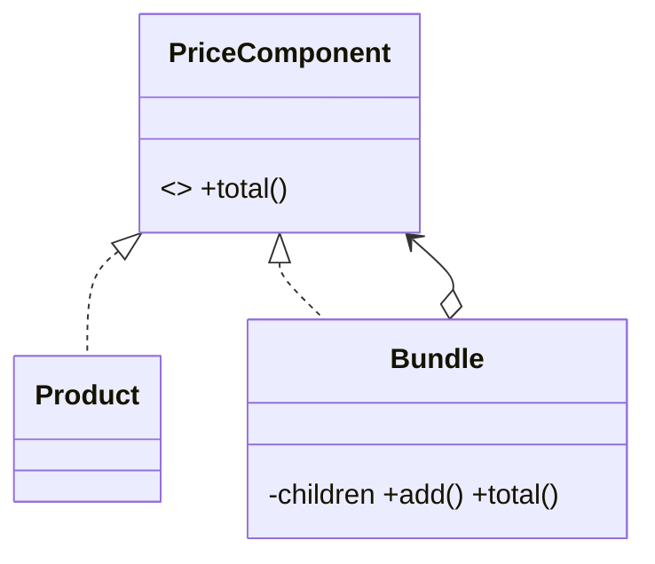

# Composite Pattern

## Mục tiêu

Xử lý object đơn và nhóm object qua cùng contract.

## Vấn đề thực tế

Hệ thống cần xử lý product đơn và bundle bằng cùng interface. Hiện tại client phải phân biệt leaf và group khi tính giá, khiến thay đổi lan sang code nghiệp vụ và test.

## Dấu hiệu nhận biết

- Client phải phân biệt leaf và group khi tính giá.
- Test phải dựng chi tiết không liên quan đến behavior cần kiểm chứng.
- Yêu cầu mới buộc sửa class đang ổn định thay vì thêm collaborator độc lập.

## Ý tưởng giải pháp

Dùng Composite để đặt boundary quanh phần thay đổi. Policy chính phụ thuộc contract nhỏ; chi tiết triển khai được đưa vào object có trách nhiệm rõ ràng.

## Khi nên dùng

- Cấu trúc cây như menu, rule group.

## Khi không nên dùng

- Không dùng khi leaf và composite có hành vi quá khác.

## Ưu điểm

- Cô lập thay đổi liên quan đến xử lý product đơn và bundle bằng cùng interface.
- Test policy và implementation độc lập.
- Thể hiện rõ quyết định dùng Composite trong vocabulary của code.

## Nhược điểm

- Tăng số lượng type và bước điều hướng.
- Không có lợi nếu xử lý product đơn và bundle bằng cùng interface chỉ có một biến thể ổn định.
- Cần composition root rõ để tránh giấu call flow.

## Bài tập

Thực hiện yêu cầu: **tính tổng cây bundle có leaf và nested group**. Trước khi refactor, viết characterization test khóa behavior hiện tại; sau đó thêm implementation mới mà không sửa policy đã ổn định.

### Gợi ý cách làm

1. Khoanh vùng lực thay đổi: xử lý leaf và group qua cùng contract.
2. Đặt contract nhỏ dùng vocabulary của use case, không dùng tên chung như `Behavior` hoặc `Manager`.
3. Di chuyển concrete detail ra sau contract; wiring tại composition root.
4. Viết test cho happy path, failure path và trường hợp implementation mới.
5. Hoàn thành khi: Client không cần phân biệt leaf/composite.

### Tiêu chí tự review

- Invariant chính có được nói rõ: **leaf và group cùng tham gia operation hợp lệ**?
- Client đã ngừng phụ thuộc concrete detail nào, và dependency được wire ở đâu?
- Test có kiểm chứng **nested tree, empty group và cycle** thay vì chỉ assert class được gọi?
- Failure/return semantics giữa các implementation có nhất quán không?
- Composite thất bại khi interface ép leaf thực hiện operation vô nghĩa.

### Câu 1: Composite giải quyết vấn đề gì?

**Trả lời:** Pattern này cô lập nhu cầu **xử lý leaf và group qua cùng contract** sau một contract rõ ràng. Giá trị chính không phải giảm số dòng code mà là giảm phạm vi thay đổi và cho phép test policy tách khỏi concrete detail.

### Câu 2: Trade-off quan trọng nhất là gì?

**Trả lời:** Thiết kế thêm type, indirection và wiring. Nếu chỉ có một biến thể ổn định hoặc logic rất nhỏ, giải pháp trực tiếp thường dễ đọc hơn. Hãy chứng minh bằng change axis, testability hoặc ownership boundary thay vì áp dụng theo thói quen.  
> **Ngữ cảnh áp dụng:** Áp dụng riêng cho **Composite Pattern**: liên hệ checklist với sơ đồ và code trước/sau trong bài, rồi nêu change axis mà pattern bảo vệ.

### Câu 3: So sánh với Decorator

**Trả lời:** Composite biểu diễn cấu trúc cây; Decorator bọc một component để thêm hành vi.

### Câu 4: Bạn kiểm thử pattern này thế nào?

**Trả lời:** Bắt đầu bằng behavior contract của composite: nested tree, empty group và cycle. Sau đó thêm failure-path test cho exception/side effect, wiring test tại composition root và regression test để bảo đảm client không cần biết concrete implementation. Tránh mock từng method nội bộ vì điều đó khóa cấu trúc thay vì semantics.

## UML cây Composite



Hãy xác minh operation chung có ý nghĩa cho cả leaf và group; uniformity không được ép leaf hỗ trợ hành vi giả.

## Minh họa trước và sau refactor

### Trước khi áp dụng

```php
if ($item instanceof Product) { return $item->price(); }
if ($item instanceof Bundle) {
    return array_sum(array_map(fn ($child) => total($child), $item->children()));
}
```

### Sau khi áp dụng

```php
interface PricedItem { public function total(): int; }

final class Product implements PricedItem { public function total(): int { return $this->price; } }
final class Bundle implements PricedItem
{
    public function total(): int
    {
        return array_sum(array_map(fn (PricedItem $item) => $item->total(), $this->items));
    }
}
```

> Ý tưởng trọng tâm: Cả leaf và composite dùng chung component contract.

## Ví dụ chạy được

Xem [`examples/enterprise/specification-discount`](../../examples/enterprise/specification-discount/README.md) để chạy bản `before.php` và `after.php`.

## Bài tập thực hành

1. Khóa behavior hiện tại bằng characterization test.
2. Thực hiện yêu cầu: lồng bundle nhiều cấp mà client không đổi.
3. Viết một test cho failure path đặc trưng của Composite.
4. Ghi rõ khi nào giải pháp trực tiếp sẽ dễ hiểu hơn.

### Gợi ý thực hiện bài tập thực hành

1. Viết characterization test tái hiện pain point của composite.
2. Đánh dấu chính xác nơi invariant “leaf và group cùng tham gia operation hợp lệ” đang bị đe dọa.
3. Refactor một dependency hoặc branch mỗi lần; giữ output/public API trong bước đầu.
4. Chứng minh thiết kế bằng phép thử: **nested tree, empty group và cycle**.
5. Ghi lại trường hợp không áp dụng: Composite thất bại khi interface ép leaf thực hiện operation vô nghĩa.

### Câu hỏi quan sát

- Trong ví dụ này, lực thay đổi nào được Composite cô lập?
- Client còn biết concrete class hoặc lifecycle detail nào không?
- Test nào chứng minh có thể thay implementation mà không sửa policy?

## Hướng refactor an toàn

1. Viết characterization test cho behavior hiện tại, đặc biệt quanh **đối xử đồng nhất leaf và group trong cấu trúc cây**.
2. Đánh dấu đúng change axis và dependency cần đảo chiều; chưa tạo interface cho phần ổn định.
3. Tách một bước nhỏ, giữ public behavior và chạy test sau mỗi commit.
4. Kiểm tra nested composite, empty composite và cycle protection.
5. So sánh độ đọc hiểu, số type và chi phí wiring với phiên bản trực tiếp trước khi chấp nhận refactor.

## Kiểm thử nên tập trung vào đâu?

- **Behavior/contract:** kiểm tra nested composite, empty composite và cycle protection.
- **Failure semantics:** exception, kết quả rỗng và side effect phải nhất quán giữa các implementation.
- **Wiring:** composition root chọn đúng collaborator mà không để client phụ thuộc concrete type.
- **Regression:** test bảo vệ behavior cũ, không khóa private method hoặc cấu trúc class.

Composite cần contract nhỏ áp dụng hợp lý cho cả leaf lẫn group; tránh ép leaf hỗ trợ operation vô nghĩa.

## Câu hỏi tự review

1. Pattern này đang bảo vệ **đối xử đồng nhất leaf và group trong cấu trúc cây** hay chỉ tăng số lớp?
2. Test nào thất bại nếu một implementation vi phạm contract nhưng vẫn trả đúng kiểu dữ liệu?
3. Concrete detail nào đã biến mất khỏi client sau refactor?
4. Composite cần contract nhỏ áp dụng hợp lý cho cả leaf lẫn group; tránh ép leaf hỗ trợ operation vô nghĩa.

