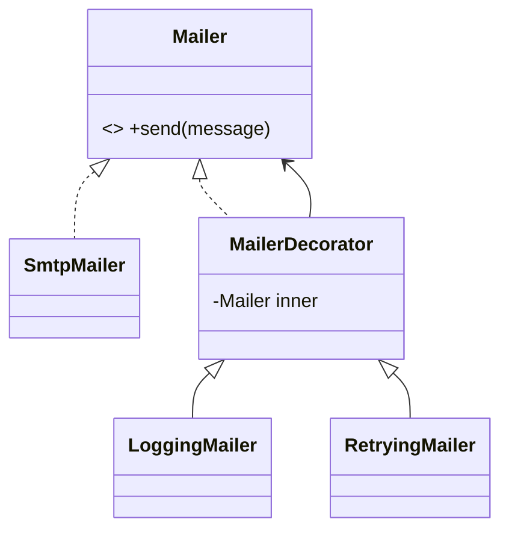

# Decorator Pattern

## Mục tiêu

Bọc object để bổ sung hành vi.

## Vấn đề thực tế

Hệ thống cần ghép logging, retry và cache cho API client. Hiện tại kế thừa tạo nhiều tổ hợp class, khiến thay đổi lan sang code nghiệp vụ và test.

## Dấu hiệu nhận biết

- Kế thừa tạo nhiều tổ hợp class.
- Test phải dựng chi tiết không liên quan đến behavior cần kiểm chứng.
- Yêu cầu mới buộc sửa class đang ổn định thay vì thêm collaborator độc lập.

## Ý tưởng giải pháp

Dùng Decorator để đặt boundary quanh phần thay đổi. Policy chính phụ thuộc contract nhỏ; chi tiết triển khai được đưa vào object có trách nhiệm rõ ràng.

## Khi nên dùng

- Logging, retry, cache, metrics.

## Khi không nên dùng

- Không dùng nếu thứ tự wrapper trở nên khó kiểm soát.

## Ưu điểm

- Cô lập thay đổi liên quan đến ghép logging, retry và cache cho API client.
- Test policy và implementation độc lập.
- Thể hiện rõ quyết định dùng Decorator trong vocabulary của code.

## Nhược điểm

- Tăng số lượng type và bước điều hướng.
- Không có lợi nếu ghép logging, retry và cache cho API client chỉ có một biến thể ổn định.
- Cần composition root rõ để tránh giấu call flow.

## Bài tập

Thực hiện yêu cầu: **ghép logging, retry và metrics mà không subclass explosion**. Trước khi refactor, viết characterization test khóa behavior hiện tại; sau đó thêm implementation mới mà không sửa policy đã ổn định.

### Gợi ý cách làm

1. Khoanh vùng lực thay đổi: thêm trách nhiệm động quanh cùng contract.
2. Đặt contract nhỏ dùng vocabulary của use case, không dùng tên chung như `Behavior` hoặc `Manager`.
3. Di chuyển concrete detail ra sau contract; wiring tại composition root.
4. Viết test cho happy path, failure path và trường hợp implementation mới.
5. Hoàn thành khi: Mỗi decorator gọi wrapped component đúng một lần trừ khi policy nói khác.

### Tiêu chí tự review

- Invariant chính có được nói rõ: **wrapper giữ contract và thứ tự composition rõ**?
- Client đã ngừng phụ thuộc concrete detail nào, và dependency được wire ở đâu?
- Test có kiểm chứng **đảo wrapper order, exception propagation** thay vì chỉ assert class được gọi?
- Failure/return semantics giữa các implementation có nhất quán không?
- Decorator dễ tạo stack khó debug; cần naming và tracing tốt.

### Câu 1: Decorator giải quyết vấn đề gì?

**Trả lời:** Pattern này cô lập nhu cầu **thêm trách nhiệm động quanh cùng contract** sau một contract rõ ràng. Giá trị chính không phải giảm số dòng code mà là giảm phạm vi thay đổi và cho phép test policy tách khỏi concrete detail.

### Câu 2: Trade-off quan trọng nhất là gì?

**Trả lời:** Thiết kế thêm type, indirection và wiring. Nếu chỉ có một biến thể ổn định hoặc logic rất nhỏ, giải pháp trực tiếp thường dễ đọc hơn. Hãy chứng minh bằng change axis, testability hoặc ownership boundary thay vì áp dụng theo thói quen.  
> **Ngữ cảnh áp dụng:** Áp dụng riêng cho **Decorator Pattern**: liên hệ checklist với sơ đồ và code trước/sau trong bài, rồi nêu change axis mà pattern bảo vệ.

### Câu 3: So sánh với Proxy

**Trả lời:** Decorator mở rộng behavior; Proxy chủ yếu kiểm soát truy cập/lifecycle.

### Câu 4: Bạn kiểm thử pattern này thế nào?

**Trả lời:** Bắt đầu bằng behavior contract của decorator: đảo wrapper order, exception propagation. Sau đó thêm failure-path test cho exception/side effect, wiring test tại composition root và regression test để bảo đảm client không cần biết concrete implementation. Tránh mock từng method nội bộ vì điều đó khóa cấu trúc thay vì semantics.

## UML Decorator chain



Thứ tự wrapper là một phần của behavior. Sơ đồ cần được đối chiếu với composition root và contract test cho order.

## Minh họa trước và sau refactor

### Trước khi áp dụng

```php
final class RetryingLoggedMailer extends Mailer
{
    public function send(Message $message): void { /* retry + log + send */ }
}
```

### Sau khi áp dụng

```php
$mailer = new RetryingMailer(
    new LoggingMailer(
        new SmtpMailer($transport),
        $logger,
    ),
    maxAttempts: 3,
);
$mailer->send($message);
```

> Ý tưởng trọng tâm: Bọc object để thêm hành vi runtime.

## Ví dụ chạy được

Xem [`examples/structural/decorator-coffee`](../../examples/structural/decorator-coffee/README.md) để chạy bản `before.php` và `after.php`.

## Bài tập thực hành

1. Khóa behavior hiện tại bằng characterization test.
2. Thực hiện yêu cầu: bật/tắt behavior bằng composition.
3. Viết một test cho failure path đặc trưng của Decorator.
4. Ghi rõ khi nào giải pháp trực tiếp sẽ dễ hiểu hơn.

### Gợi ý thực hiện bài tập thực hành

1. Viết characterization test tái hiện pain point của decorator.
2. Đánh dấu chính xác nơi invariant “wrapper giữ contract và thứ tự composition rõ” đang bị đe dọa.
3. Refactor một dependency hoặc branch mỗi lần; giữ output/public API trong bước đầu.
4. Chứng minh thiết kế bằng phép thử: **đảo wrapper order, exception propagation**.
5. Ghi lại trường hợp không áp dụng: Decorator dễ tạo stack khó debug; cần naming và tracing tốt.

### Câu hỏi quan sát

- Trong ví dụ này, lực thay đổi nào được Decorator cô lập?
- Client còn biết concrete class hoặc lifecycle detail nào không?
- Test nào chứng minh có thể thay implementation mà không sửa policy?

## Hướng refactor an toàn

1. Viết characterization test cho behavior hiện tại, đặc biệt quanh **ghép behavior quanh cùng contract**.
2. Đánh dấu đúng change axis và dependency cần đảo chiều; chưa tạo interface cho phần ổn định.
3. Tách một bước nhỏ, giữ public behavior và chạy test sau mỗi commit.
4. Đổi thứ tự wrapper và kiểm tra exception/side effect.
5. So sánh độ đọc hiểu, số type và chi phí wiring với phiên bản trực tiếp trước khi chấp nhận refactor.

## Kiểm thử nên tập trung vào đâu?

- **Behavior/contract:** đổi thứ tự wrapper và kiểm tra exception/side effect.
- **Failure semantics:** exception, kết quả rỗng và side effect phải nhất quán giữa các implementation.
- **Wiring:** composition root chọn đúng collaborator mà không để client phụ thuộc concrete type.
- **Regression:** test bảo vệ behavior cũ, không khóa private method hoặc cấu trúc class.

Decorator cho phép composition động nhưng thứ tự wrapper là một phần semantics cần test.

## Câu hỏi tự review

1. Pattern này đang bảo vệ **ghép behavior quanh cùng contract** hay chỉ tăng số lớp?
2. Test nào thất bại nếu một implementation vi phạm contract nhưng vẫn trả đúng kiểu dữ liệu?
3. Concrete detail nào đã biến mất khỏi client sau refactor?
4. Decorator cho phép composition động nhưng thứ tự wrapper là một phần semantics cần test.

