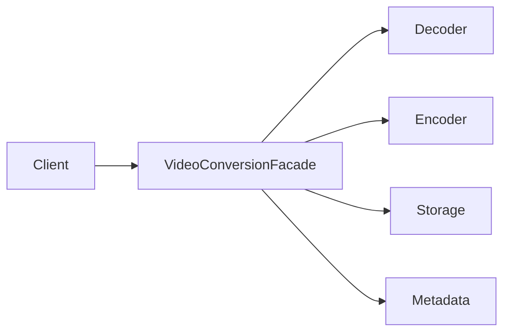

# Facade Pattern

## Mục tiêu

Cung cấp API đơn giản cho subsystem phức tạp.

## Vấn đề thực tế

Hệ thống cần cung cấp API đơn giản cho quy trình xử lý video. Hiện tại controller điều phối codec, metadata, storage và thumbnail, khiến thay đổi lan sang code nghiệp vụ và test.

## Dấu hiệu nhận biết

- Controller điều phối codec, metadata, storage và thumbnail.
- Test phải dựng chi tiết không liên quan đến behavior cần kiểm chứng.
- Yêu cầu mới buộc sửa class đang ổn định thay vì thêm collaborator độc lập.

## Ý tưởng giải pháp

Dùng Facade để đặt boundary quanh phần thay đổi. Policy chính phụ thuộc contract nhỏ; chi tiết triển khai được đưa vào object có trách nhiệm rõ ràng.

## Khi nên dùng

- Giảm kiến thức subsystem ở client.

## Khi không nên dùng

- Không biến facade thành God Object.

## Ưu điểm

- Cô lập thay đổi liên quan đến cung cấp API đơn giản cho quy trình xử lý video.
- Test policy và implementation độc lập.
- Thể hiện rõ quyết định dùng Facade trong vocabulary của code.

## Nhược điểm

- Tăng số lượng type và bước điều hướng.
- Không có lợi nếu cung cấp API đơn giản cho quy trình xử lý video chỉ có một biến thể ổn định.
- Cần composition root rõ để tránh giấu call flow.

## Bài tập

Thực hiện yêu cầu: **tạo `VideoConversionFacade` che orchestration codec**. Trước khi refactor, viết characterization test khóa behavior hiện tại; sau đó thêm implementation mới mà không sửa policy đã ổn định.

### Gợi ý cách làm

1. Khoanh vùng lực thay đổi: cung cấp API đơn giản cho subsystem phức tạp.
2. Đặt contract nhỏ dùng vocabulary của use case, không dùng tên chung như `Behavior` hoặc `Manager`.
3. Di chuyển concrete detail ra sau contract; wiring tại composition root.
4. Viết test cho happy path, failure path và trường hợp implementation mới.
5. Hoàn thành khi: Facade không làm mất khả năng truy cập subsystem khi cần.

### Tiêu chí tự review

- Invariant chính có được nói rõ: **client gọi use case đơn giản nhưng failure quan trọng không bị che**?
- Client đã ngừng phụ thuộc concrete detail nào, và dependency được wire ở đâu?
- Test có kiểm chứng **subsystem failure và partial completion** thay vì chỉ assert class được gọi?
- Failure/return semantics giữa các implementation có nhất quán không?
- Facade không phải nơi gom mọi business rule.

### Câu 1: Facade giải quyết vấn đề gì?

**Trả lời:** Pattern này cô lập nhu cầu **cung cấp API đơn giản cho subsystem phức tạp** sau một contract rõ ràng. Giá trị chính không phải giảm số dòng code mà là giảm phạm vi thay đổi và cho phép test policy tách khỏi concrete detail.

### Câu 2: Trade-off quan trọng nhất là gì?

**Trả lời:** Thiết kế thêm type, indirection và wiring. Nếu chỉ có một biến thể ổn định hoặc logic rất nhỏ, giải pháp trực tiếp thường dễ đọc hơn. Hãy chứng minh bằng change axis, testability hoặc ownership boundary thay vì áp dụng theo thói quen.  
> **Ngữ cảnh áp dụng:** Áp dụng riêng cho **Facade Pattern**: liên hệ checklist với sơ đồ và code trước/sau trong bài, rồi nêu change axis mà pattern bảo vệ.

### Câu 3: So sánh với Adapter

**Trả lời:** Facade giảm bề mặt sử dụng; Adapter đổi interface/semantics.

### Câu 4: Bạn kiểm thử pattern này thế nào?

**Trả lời:** Bắt đầu bằng behavior contract của facade: subsystem failure và partial completion. Sau đó thêm failure-path test cho exception/side effect, wiring test tại composition root và regression test để bảo đảm client không cần biết concrete implementation. Tránh mock từng method nội bộ vì điều đó khóa cấu trúc thay vì semantics.

## Facade và subsystem



Facade làm giảm số subsystem client phải biết, nhưng ownership business rule vẫn nằm ở component phù hợp.

## Minh họa trước và sau refactor

### Trước khi áp dụng

```php
$decoder->open($file);
$audio = $extractor->audio($file);
$video = $converter->convert($file, 'mp4');
$muxer->merge($video, $audio);
$storage->put($target, $video);
```

### Sau khi áp dụng

```php
final class VideoConversionFacade
{
    public function convertToMp4(string $source, string $target): void
    {
        $media = $this->decoder->open($source);
        $result = $this->converter->toMp4($media);
        $this->storage->put($target, $result);
    }
}
```

> Ý tưởng trọng tâm: Facade cung cấp use case cấp cao.

## Ví dụ chạy được

Xem [`examples/structural/facade-video`](../../examples/structural/facade-video/README.md) để chạy bản `before.php` và `after.php`.

## Bài tập thực hành

1. Khóa behavior hiện tại bằng characterization test.
2. Thực hiện yêu cầu: thay subsystem mà API use case ổn định.
3. Viết một test cho failure path đặc trưng của Facade.
4. Ghi rõ khi nào giải pháp trực tiếp sẽ dễ hiểu hơn.

### Gợi ý thực hiện bài tập thực hành

1. Viết characterization test tái hiện pain point của facade.
2. Đánh dấu chính xác nơi invariant “client gọi use case đơn giản nhưng failure quan trọng không bị che” đang bị đe dọa.
3. Refactor một dependency hoặc branch mỗi lần; giữ output/public API trong bước đầu.
4. Chứng minh thiết kế bằng phép thử: **subsystem failure và partial completion**.
5. Ghi lại trường hợp không áp dụng: Facade không phải nơi gom mọi business rule.

### Câu hỏi quan sát

- Trong ví dụ này, lực thay đổi nào được Facade cô lập?
- Client còn biết concrete class hoặc lifecycle detail nào không?
- Test nào chứng minh có thể thay implementation mà không sửa policy?

## Hướng refactor an toàn

1. Viết characterization test cho behavior hiện tại, đặc biệt quanh **API use-case đơn giản trước subsystem phức tạp**.
2. Đánh dấu đúng change axis và dependency cần đảo chiều; chưa tạo interface cho phần ổn định.
3. Tách một bước nhỏ, giữ public behavior và chạy test sau mỗi commit.
4. Kiểm tra facade không nuốt lỗi quan trọng và không trở thành god object.
5. So sánh độ đọc hiểu, số type và chi phí wiring với phiên bản trực tiếp trước khi chấp nhận refactor.

## Kiểm thử nên tập trung vào đâu?

- **Behavior/contract:** kiểm tra facade không nuốt lỗi quan trọng và không trở thành God Object.
- **Failure semantics:** exception, kết quả rỗng và side effect phải nhất quán giữa các implementation.
- **Wiring:** composition root chọn đúng collaborator mà không để client phụ thuộc concrete type.
- **Regression:** test bảo vệ behavior cũ, không khóa private method hoặc cấu trúc class.

Facade che giấu orchestration chứ không nên sở hữu mọi business rule.

## Câu hỏi tự review

1. Pattern này đang bảo vệ **API use-case đơn giản trước subsystem phức tạp** hay chỉ tăng số lớp?
2. Test nào thất bại nếu một implementation vi phạm contract nhưng vẫn trả đúng kiểu dữ liệu?
3. Concrete detail nào đã biến mất khỏi client sau refactor?
4. Facade che giấu orchestration chứ không nên sở hữu mọi business rule.

