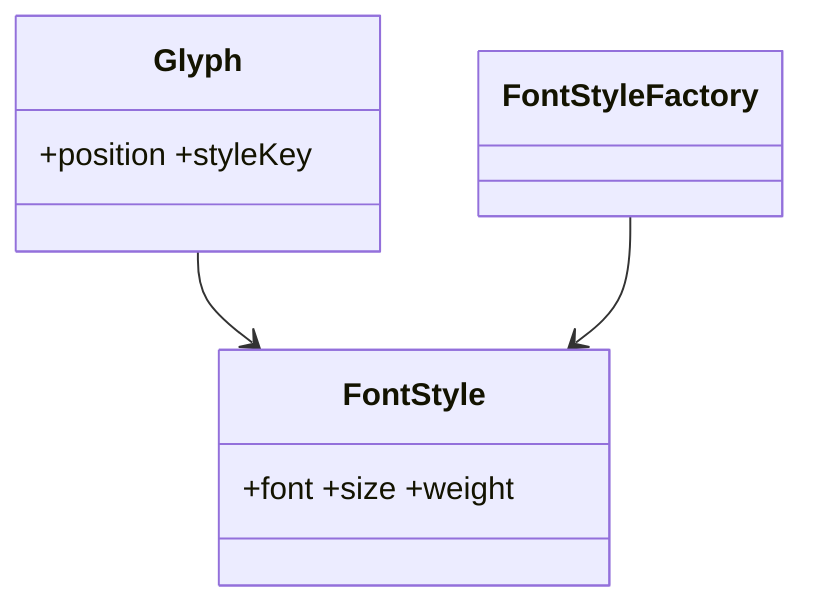

# Flyweight Pattern

## Mục tiêu

Chia sẻ trạng thái bất biến để giảm bộ nhớ.

## Vấn đề thực tế

Hệ thống cần chia sẻ intrinsic state giữa hàng nghìn glyph. Hiện tại mỗi object giữ bản sao dữ liệu font giống nhau, khiến thay đổi lan sang code nghiệp vụ và test.

## Dấu hiệu nhận biết

- Mỗi object giữ bản sao dữ liệu font giống nhau.
- Test phải dựng chi tiết không liên quan đến behavior cần kiểm chứng.
- Yêu cầu mới buộc sửa class đang ổn định thay vì thêm collaborator độc lập.

## Ý tưởng giải pháp

Dùng Flyweight để đặt boundary quanh phần thay đổi. Policy chính phụ thuộc contract nhỏ; chi tiết triển khai được đưa vào object có trách nhiệm rõ ràng.

## Khi nên dùng

- Số lượng object rất lớn và dữ liệu lặp lại.

## Khi không nên dùng

- Không dùng nếu tối ưu bộ nhớ chưa cần thiết.

## Ưu điểm

- Cô lập thay đổi liên quan đến chia sẻ intrinsic state giữa hàng nghìn glyph.
- Test policy và implementation độc lập.
- Thể hiện rõ quyết định dùng Flyweight trong vocabulary của code.

## Nhược điểm

- Tăng số lượng type và bước điều hướng.
- Không có lợi nếu chia sẻ intrinsic state giữa hàng nghìn glyph chỉ có một biến thể ổn định.
- Cần composition root rõ để tránh giấu call flow.

## Bài tập

Thực hiện yêu cầu: **render nhiều glyph dùng chung font metadata**. Trước khi refactor, viết characterization test khóa behavior hiện tại; sau đó thêm implementation mới mà không sửa policy đã ổn định.

### Gợi ý cách làm

1. Khoanh vùng lực thay đổi: chia sẻ intrinsic state cho số lượng object lớn.
2. Đặt contract nhỏ dùng vocabulary của use case, không dùng tên chung như `Behavior` hoặc `Manager`.
3. Di chuyển concrete detail ra sau contract; wiring tại composition root.
4. Viết test cho happy path, failure path và trường hợp implementation mới.
5. Hoàn thành khi: Intrinsic state immutable; extrinsic state truyền từ client.

### Tiêu chí tự review

- Invariant chính có được nói rõ: **intrinsic state immutable và được chia sẻ đúng key**?
- Client đã ngừng phụ thuộc concrete detail nào, và dependency được wire ở đâu?
- Test có kiểm chứng **cache identity, memory count và extrinsic input** thay vì chỉ assert class được gọi?
- Failure/return semantics giữa các implementation có nhất quán không?
- Chỉ dùng sau profiling; lookup/cache có thể tốn hơn object nhỏ.

### Câu 1: Flyweight giải quyết vấn đề gì?

**Trả lời:** Pattern này cô lập nhu cầu **chia sẻ intrinsic state cho số lượng object lớn** sau một contract rõ ràng. Giá trị chính không phải giảm số dòng code mà là giảm phạm vi thay đổi và cho phép test policy tách khỏi concrete detail.

### Câu 2: Trade-off quan trọng nhất là gì?

**Trả lời:** Thiết kế thêm type, indirection và wiring. Nếu chỉ có một biến thể ổn định hoặc logic rất nhỏ, giải pháp trực tiếp thường dễ đọc hơn. Hãy chứng minh bằng change axis, testability hoặc ownership boundary thay vì áp dụng theo thói quen.  
> **Ngữ cảnh áp dụng:** Áp dụng riêng cho **Flyweight Pattern**: liên hệ checklist với sơ đồ và code trước/sau trong bài, rồi nêu change axis mà pattern bảo vệ.

### Câu 3: So sánh với Object Pool

**Trả lời:** Flyweight chia sẻ state; Object Pool tái sử dụng object hữu hạn có lifecycle checkout/return.

### Câu 4: Bạn kiểm thử pattern này thế nào?

**Trả lời:** Bắt đầu bằng behavior contract của flyweight: cache identity, memory count và extrinsic input. Sau đó thêm failure-path test cho exception/side effect, wiring test tại composition root và regression test để bảo đảm client không cần biết concrete implementation. Tránh mock từng method nội bộ vì điều đó khóa cấu trúc thay vì semantics.

## Dữ liệu chia sẻ



Phân biệt intrinsic state được chia sẻ với extrinsic state do caller cung cấp; nhầm hai loại sẽ gây lỗi dữ liệu chéo.

## Minh họa trước và sau refactor

### Trước khi áp dụng

```php
foreach ($characters as $char) {
    $glyphs[] = new Glyph($char, new Font('Inter', 14, 'normal'));
}
```

### Sau khi áp dụng

```php
$font = $fontFactory->get('Inter', 14, 'normal');
foreach ($characters as $index => $char) {
    $glyphs[] = new Glyph($char, $font, x: $index * 8, y: 20);
}
```

> Ý tưởng trọng tâm: Tách intrinsic state để chia sẻ.

## Ví dụ chạy được

Xem [`examples/structural/facade-video`](../../examples/structural/facade-video/README.md) để chạy bản `before.php` và `after.php`.

## Bài tập thực hành

1. Khóa behavior hiện tại bằng characterization test.
2. Thực hiện yêu cầu: tách font data khỏi vị trí hiển thị.
3. Viết một test cho failure path đặc trưng của Flyweight.
4. Ghi rõ khi nào giải pháp trực tiếp sẽ dễ hiểu hơn.

### Gợi ý thực hiện bài tập thực hành

1. Viết characterization test tái hiện pain point của flyweight.
2. Đánh dấu chính xác nơi invariant “intrinsic state immutable và được chia sẻ đúng key” đang bị đe dọa.
3. Refactor một dependency hoặc branch mỗi lần; giữ output/public API trong bước đầu.
4. Chứng minh thiết kế bằng phép thử: **cache identity, memory count và extrinsic input**.
5. Ghi lại trường hợp không áp dụng: Chỉ dùng sau profiling; lookup/cache có thể tốn hơn object nhỏ.

### Câu hỏi quan sát

- Trong ví dụ này, lực thay đổi nào được Flyweight cô lập?
- Client còn biết concrete class hoặc lifecycle detail nào không?
- Test nào chứng minh có thể thay implementation mà không sửa policy?

## Hướng refactor an toàn

1. Viết characterization test cho behavior hiện tại, đặc biệt quanh **chia sẻ intrinsic state và tách extrinsic state**.
2. Đánh dấu đúng change axis và dependency cần đảo chiều; chưa tạo interface cho phần ổn định.
3. Tách một bước nhỏ, giữ public behavior và chạy test sau mỗi commit.
4. Đo số instance/cache hit và bảo đảm shared object immutable.
5. So sánh độ đọc hiểu, số type và chi phí wiring với phiên bản trực tiếp trước khi chấp nhận refactor.

## Kiểm thử nên tập trung vào đâu?

- **Behavior/contract:** đo số instance/cache hit và bảo đảm shared object immutable.
- **Failure semantics:** exception, kết quả rỗng và side effect phải nhất quán giữa các implementation.
- **Wiring:** composition root chọn đúng collaborator mà không để client phụ thuộc concrete type.
- **Regression:** test bảo vệ behavior cũ, không khóa private method hoặc cấu trúc class.

Flyweight đổi memory lấy lookup/complexity; chỉ dùng khi profiling chứng minh số object lớn là vấn đề.

## Câu hỏi tự review

1. Pattern này đang bảo vệ **chia sẻ intrinsic state và tách extrinsic state** hay chỉ tăng số lớp?
2. Test nào thất bại nếu một implementation vi phạm contract nhưng vẫn trả đúng kiểu dữ liệu?
3. Concrete detail nào đã biến mất khỏi client sau refactor?
4. Flyweight đổi memory lấy lookup/complexity; chỉ dùng khi profiling chứng minh số object lớn là vấn đề.

