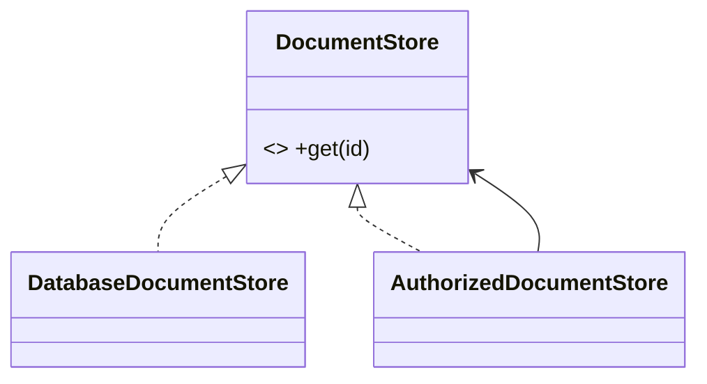

# Proxy Pattern

## Mục tiêu

Đại diện kiểm soát truy cập object thật.

## Vấn đề thực tế

Hệ thống cần kiểm soát truy cập hoặc lazy load report. Hiện tại client tự xử lý authorization/cache trước khi gọi service, khiến thay đổi lan sang code nghiệp vụ và test.

## Dấu hiệu nhận biết

- Client tự xử lý authorization/cache trước khi gọi service.
- Test phải dựng chi tiết không liên quan đến behavior cần kiểm chứng.
- Yêu cầu mới buộc sửa class đang ổn định thay vì thêm collaborator độc lập.

## Ý tưởng giải pháp

Dùng Proxy để đặt boundary quanh phần thay đổi. Policy chính phụ thuộc contract nhỏ; chi tiết triển khai được đưa vào object có trách nhiệm rõ ràng.

## Khi nên dùng

- Lazy load, permission, remote proxy.

## Khi không nên dùng

- Không dùng nếu chỉ thêm forwarding vô nghĩa.

## Ưu điểm

- Cô lập thay đổi liên quan đến kiểm soát truy cập hoặc lazy load report.
- Test policy và implementation độc lập.
- Thể hiện rõ quyết định dùng Proxy trong vocabulary của code.

## Nhược điểm

- Tăng số lượng type và bước điều hướng.
- Không có lợi nếu kiểm soát truy cập hoặc lazy load report chỉ có một biến thể ổn định.
- Cần composition root rõ để tránh giấu call flow.

## Bài tập

Thực hiện yêu cầu: **thêm lazy load hoặc authorization mà giữ contract**. Trước khi refactor, viết characterization test khóa behavior hiện tại; sau đó thêm implementation mới mà không sửa policy đã ổn định.

### Gợi ý cách làm

1. Khoanh vùng lực thay đổi: kiểm soát truy cập đến object thật.
2. Đặt contract nhỏ dùng vocabulary của use case, không dùng tên chung như `Behavior` hoặc `Manager`.
3. Di chuyển concrete detail ra sau contract; wiring tại composition root.
4. Viết test cho happy path, failure path và trường hợp implementation mới.
5. Hoàn thành khi: Proxy bảo toàn semantics của subject.

### Tiêu chí tự review

- Invariant chính có được nói rõ: **proxy giữ semantics subject khi thêm access control/cache/lazy load**?
- Client đã ngừng phụ thuộc concrete detail nào, và dependency được wire ở đâu?
- Test có kiểm chứng **authorization deny, cache miss/hit và target failure** thay vì chỉ assert class được gọi?
- Failure/return semantics giữa các implementation có nhất quán không?
- Proxy có side effect ẩn phải được tài liệu hóa.

### Câu 1: Proxy giải quyết vấn đề gì?

**Trả lời:** Pattern này cô lập nhu cầu **kiểm soát truy cập đến object thật** sau một contract rõ ràng. Giá trị chính không phải giảm số dòng code mà là giảm phạm vi thay đổi và cho phép test policy tách khỏi concrete detail.

### Câu 2: Trade-off quan trọng nhất là gì?

**Trả lời:** Thiết kế thêm type, indirection và wiring. Nếu chỉ có một biến thể ổn định hoặc logic rất nhỏ, giải pháp trực tiếp thường dễ đọc hơn. Hãy chứng minh bằng change axis, testability hoặc ownership boundary thay vì áp dụng theo thói quen.  
> **Ngữ cảnh áp dụng:** Áp dụng riêng cho **Proxy Pattern**: liên hệ checklist với sơ đồ và code trước/sau trong bài, rồi nêu change axis mà pattern bảo vệ.

### Câu 3: So sánh với Decorator

**Trả lời:** Proxy kiểm soát access/lifecycle; Decorator chủ đích thêm capability.

### Câu 4: Bạn kiểm thử pattern này thế nào?

**Trả lời:** Bắt đầu bằng behavior contract của proxy: authorization deny, cache miss/hit và target failure. Sau đó thêm failure-path test cho exception/side effect, wiring test tại composition root và regression test để bảo đảm client không cần biết concrete implementation. Tránh mock từng method nội bộ vì điều đó khóa cấu trúc thay vì semantics.

## Proxy kiểm soát truy cập



Proxy giữ cùng contract nhưng thay access semantics; cache, authorization hoặc remote call phải được làm rõ, không che giấu.

## Minh họa trước và sau refactor

### Trước khi áp dụng

```php
$document = $repository->find($id);
if (!$user->canView($document)) { throw new Forbidden(); }
return $document->content();
```

### Sau khi áp dụng

```php
final class AuthorizingDocumentProxy implements Document
{
    public function content(): string
    {
        if (!$this->authorization->canView($this->user, $this->documentId)) {
            throw new Forbidden();
        }
        return $this->realDocument()->content();
    }
}
```

> Ý tưởng trọng tâm: Proxy kiểm soát lazy-load/cache/authorization.

## Ví dụ chạy được

Xem [`examples/structural/facade-video`](../../examples/structural/facade-video/README.md) để chạy bản `before.php` và `after.php`.

## Bài tập thực hành

1. Khóa behavior hiện tại bằng characterization test.
2. Thực hiện yêu cầu: thêm policy truy cập mà real subject không đổi.
3. Viết một test cho failure path đặc trưng của Proxy.
4. Ghi rõ khi nào giải pháp trực tiếp sẽ dễ hiểu hơn.

### Gợi ý thực hiện bài tập thực hành

1. Viết characterization test tái hiện pain point của proxy.
2. Đánh dấu chính xác nơi invariant “proxy giữ semantics subject khi thêm access control/cache/lazy load” đang bị đe dọa.
3. Refactor một dependency hoặc branch mỗi lần; giữ output/public API trong bước đầu.
4. Chứng minh thiết kế bằng phép thử: **authorization deny, cache miss/hit và target failure**.
5. Ghi lại trường hợp không áp dụng: Proxy có side effect ẩn phải được tài liệu hóa.

### Câu hỏi quan sát

- Trong ví dụ này, lực thay đổi nào được Proxy cô lập?
- Client còn biết concrete class hoặc lifecycle detail nào không?
- Test nào chứng minh có thể thay implementation mà không sửa policy?

## Hướng refactor an toàn

1. Viết characterization test cho behavior hiện tại, đặc biệt quanh **kiểm soát truy cập tới subject**.
2. Đánh dấu đúng change axis và dependency cần đảo chiều; chưa tạo interface cho phần ổn định.
3. Tách một bước nhỏ, giữ public behavior và chạy test sau mỗi commit.
4. Kiểm tra authorization/cache/lazy-load nhưng vẫn giữ contract subject.
5. So sánh độ đọc hiểu, số type và chi phí wiring với phiên bản trực tiếp trước khi chấp nhận refactor.

## Kiểm thử nên tập trung vào đâu?

- **Behavior/contract:** kiểm tra authorization/cache/lazy-load nhưng vẫn giữ contract subject.
- **Failure semantics:** exception, kết quả rỗng và side effect phải nhất quán giữa các implementation.
- **Wiring:** composition root chọn đúng collaborator mà không để client phụ thuộc concrete type.
- **Regression:** test bảo vệ behavior cũ, không khóa private method hoặc cấu trúc class.

Proxy thay đổi cách truy cập, không thay đổi business meaning; cần làm rõ side effect ẩn như cache hoặc network.

## Câu hỏi tự review

1. Pattern này đang bảo vệ **kiểm soát truy cập tới subject** hay chỉ tăng số lớp?
2. Test nào thất bại nếu một implementation vi phạm contract nhưng vẫn trả đúng kiểu dữ liệu?
3. Concrete detail nào đã biến mất khỏi client sau refactor?
4. Proxy thay đổi cách truy cập, không thay đổi business meaning; cần làm rõ side effect ẩn như cache hoặc network.

