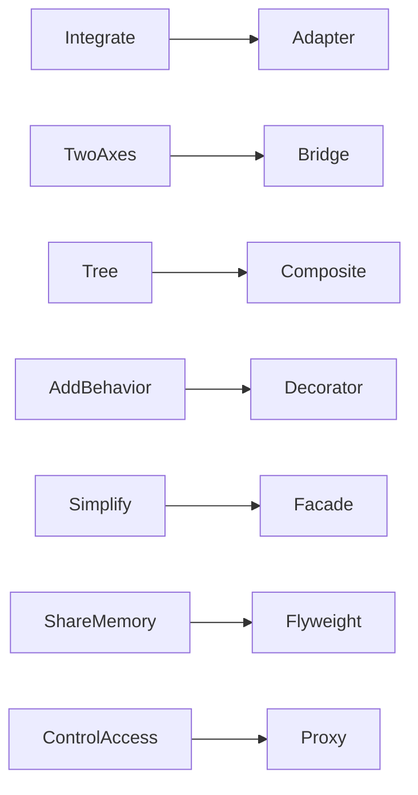

# Structural Patterns

Nhóm Structural tổ chức quan hệ giữa object và subsystem để thay đổi cấu trúc mà không làm client biết quá nhiều chi tiết.

## Mục tiêu học tập

- Phân biệt dịch contract, tách hai trục thay đổi, ghép cây object, bọc hành vi, đơn giản hóa subsystem và kiểm soát truy cập.
- Đánh giá chi phí indirection, thứ tự wrapper và nguy cơ che giấu latency/side effect.
- Thiết kế contract test cho boundary với vendor hoặc infrastructure.

## Nội dung

| Tài liệu | Giá trị chính |
|---|---|
| [Adapter Pattern](01-adapter.md) | Học và áp dụng chủ đề **Adapter Pattern** qua context, trade-off và bài tập liên quan. |
| [Bridge Pattern](02-bridge.md) | Học và áp dụng chủ đề **Bridge Pattern** qua context, trade-off và bài tập liên quan. |
| [Composite Pattern](03-composite.md) | Học và áp dụng chủ đề **Composite Pattern** qua context, trade-off và bài tập liên quan. |
| [Decorator Pattern](04-decorator.md) | Học và áp dụng chủ đề **Decorator Pattern** qua context, trade-off và bài tập liên quan. |
| [Facade Pattern](05-facade.md) | Học và áp dụng chủ đề **Facade Pattern** qua context, trade-off và bài tập liên quan. |
| [Flyweight Pattern](06-flyweight.md) | Học và áp dụng chủ đề **Flyweight Pattern** qua context, trade-off và bài tập liên quan. |
| [Proxy Pattern](07-proxy.md) | Học và áp dụng chủ đề **Proxy Pattern** qua context, trade-off và bài tập liên quan. |

## Cách học đề xuất

1. Vẽ dependency hiện tại giữa client, component và external/legacy API.
2. Học Adapter trước, sau đó so sánh Facade, Decorator, Proxy và Bridge.
3. Chạy ví dụ để quan sát translation, wrapping và access control khác nhau.
4. Kiểm tra wrapper order, recursive structure hoặc shared state tùy pattern.
5. Chỉ thêm layer khi client thực sự biết ít chi tiết hơn.

## Tiêu chí hoàn thành

- Phân biệt Adapter, Facade, Decorator và Proxy bằng intent.
- Xác định boundary nào được che hoặc contract nào được chuyển đổi.
- Test failure translation và wrapper ordering.
- Nhận diện layer trung gian chỉ chuyển tiếp vô nghĩa.

## Bản đồ lựa chọn

