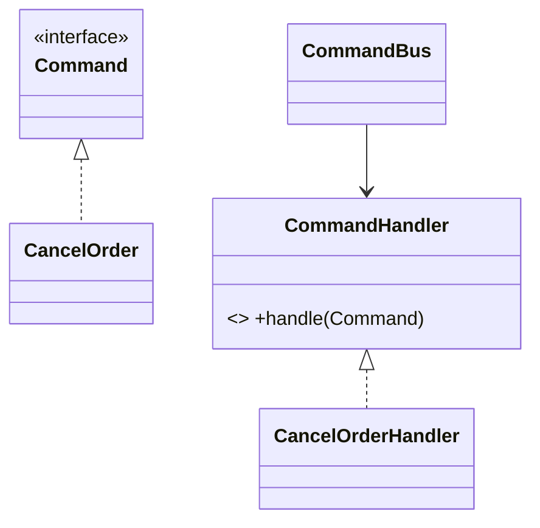

# Command Pattern

## Mục tiêu

Đóng gói hành động thành object.

## Vấn đề thực tế

Hệ thống cần đóng gói thao tác hoàn tiền để queue, audit hoặc retry. Hiện tại controller gọi thẳng nhiều service và không lưu được intent, khiến thay đổi lan sang code nghiệp vụ và test.

## Dấu hiệu nhận biết

- Controller gọi thẳng nhiều service và không lưu được intent.
- Test phải dựng chi tiết không liên quan đến behavior cần kiểm chứng.
- Yêu cầu mới buộc sửa class đang ổn định thay vì thêm collaborator độc lập.

## Ý tưởng giải pháp

Dùng Command để đặt boundary quanh phần thay đổi. Policy chính phụ thuộc contract nhỏ; chi tiết triển khai được đưa vào object có trách nhiệm rõ ràng.

## Khi nên dùng

- Queue, undo, audit, retry.

## Khi không nên dùng

- Không dùng cho thao tác một dòng không cần lifecycle.

## Ưu điểm

- Cô lập thay đổi liên quan đến đóng gói thao tác hoàn tiền để queue, audit hoặc retry.
- Test policy và implementation độc lập.
- Thể hiện rõ quyết định dùng Command trong vocabulary của code.

## Nhược điểm

- Tăng số lượng type và bước điều hướng.
- Không có lợi nếu đóng gói thao tác hoàn tiền để queue, audit hoặc retry chỉ có một biến thể ổn định.
- Cần composition root rõ để tránh giấu call flow.

## Bài tập

Thực hiện yêu cầu: **queue/retry một hành động có idempotency key**. Trước khi refactor, viết characterization test khóa behavior hiện tại; sau đó thêm implementation mới mà không sửa policy đã ổn định.

### Gợi ý cách làm

1. Khoanh vùng lực thay đổi: đóng gói yêu cầu thành object.
2. Đặt contract nhỏ dùng vocabulary của use case, không dùng tên chung như `Behavior` hoặc `Manager`.
3. Di chuyển concrete detail ra sau contract; wiring tại composition root.
4. Viết test cho happy path, failure path và trường hợp implementation mới.
5. Hoàn thành khi: Command chứa intent và handler thực thi side effect.

### Tiêu chí tự review

- Invariant chính có được nói rõ: **command diễn tả intent và có metadata cần cho retry/audit**?
- Client đã ngừng phụ thuộc concrete detail nào, và dependency được wire ở đâu?
- Test có kiểm chứng **duplicate command, unauthorized actor và handler failure** thay vì chỉ assert class được gọi?
- Failure/return semantics giữa các implementation có nhất quán không?
- Command object không tự làm operation idempotent; handler/storage phải hỗ trợ.

### Câu 1: Command giải quyết vấn đề gì?

**Trả lời:** Pattern này cô lập nhu cầu **đóng gói yêu cầu thành object** sau một contract rõ ràng. Giá trị chính không phải giảm số dòng code mà là giảm phạm vi thay đổi và cho phép test policy tách khỏi concrete detail.

### Câu 2: Trade-off quan trọng nhất là gì?

**Trả lời:** Thiết kế thêm type, indirection và wiring. Nếu chỉ có một biến thể ổn định hoặc logic rất nhỏ, giải pháp trực tiếp thường dễ đọc hơn. Hãy chứng minh bằng change axis, testability hoặc ownership boundary thay vì áp dụng theo thói quen.  
> **Ngữ cảnh áp dụng:** Áp dụng riêng cho **Command Pattern**: liên hệ checklist với sơ đồ và code trước/sau trong bài, rồi nêu change axis mà pattern bảo vệ.

### Câu 3: So sánh với Strategy

**Trả lời:** Command biểu diễn một yêu cầu có thể lưu/queue; Strategy biểu diễn thuật toán được chọn.

### Câu 4: Bạn kiểm thử pattern này thế nào?

**Trả lời:** Bắt đầu bằng behavior contract của command: duplicate command, unauthorized actor và handler failure. Sau đó thêm failure-path test cho exception/side effect, wiring test tại composition root và regression test để bảo đảm client không cần biết concrete implementation. Tránh mock từng method nội bộ vì điều đó khóa cấu trúc thay vì semantics.

## UML Command



Command biểu diễn intent có thể lưu/queue/audit; handler mới là nơi thực thi và quản lý dependency.

## Minh họa trước và sau refactor

### Trước khi áp dụng

```php
$order->cancel();
$repository->save($order);
$audit->record('order_cancelled', $order->id());
```

### Sau khi áp dụng

```php
$commandBus->dispatch(new CancelOrder(
    orderId: $orderId,
    reason: $reason,
    idempotencyKey: $requestId,
));

final class CancelOrderHandler
{
    public function __invoke(CancelOrder $command): void { /* load, cancel, save */ }
}
```

> Ý tưởng trọng tâm: Đóng gói request thành command có thể queue/audit.

## Ví dụ chạy được

Xem [`labs/advanced/order-workflow`](../../labs/advanced/order-workflow/README.md) để chạy bản `before.php` và `after.php`.

## Bài tập thực hành

1. Khóa behavior hiện tại bằng characterization test.
2. Thực hiện yêu cầu: replay command an toàn với idempotency key.
3. Viết một test cho failure path đặc trưng của Command.
4. Ghi rõ khi nào giải pháp trực tiếp sẽ dễ hiểu hơn.

### Gợi ý thực hiện bài tập thực hành

1. Viết characterization test tái hiện pain point của command.
2. Đánh dấu chính xác nơi invariant “command diễn tả intent và có metadata cần cho retry/audit” đang bị đe dọa.
3. Refactor một dependency hoặc branch mỗi lần; giữ output/public API trong bước đầu.
4. Chứng minh thiết kế bằng phép thử: **duplicate command, unauthorized actor và handler failure**.
5. Ghi lại trường hợp không áp dụng: Command object không tự làm operation idempotent; handler/storage phải hỗ trợ.

### Câu hỏi quan sát

- Trong ví dụ này, lực thay đổi nào được Command cô lập?
- Client còn biết concrete class hoặc lifecycle detail nào không?
- Test nào chứng minh có thể thay implementation mà không sửa policy?

## Hướng refactor an toàn

1. Viết characterization test cho behavior hiện tại, đặc biệt quanh **đóng gói intent thành object**.
2. Đánh dấu đúng change axis và dependency cần đảo chiều; chưa tạo interface cho phần ổn định.
3. Tách một bước nhỏ, giữ public behavior và chạy test sau mỗi commit.
4. Kiểm tra idempotency, authorization và audit metadata của command.
5. So sánh độ đọc hiểu, số type và chi phí wiring với phiên bản trực tiếp trước khi chấp nhận refactor.

## Kiểm thử nên tập trung vào đâu?

- **Behavior/contract:** kiểm tra idempotency, authorization và audit metadata của command.
- **Failure semantics:** exception, kết quả rỗng và side effect phải nhất quán giữa các implementation.
- **Wiring:** composition root chọn đúng collaborator mà không để client phụ thuộc concrete type.
- **Regression:** test bảo vệ behavior cũ, không khóa private method hoặc cấu trúc class.

Command hữu ích cho queue/audit/undo; đừng tạo command object cho mọi lời gọi nội bộ nhỏ.

## Câu hỏi tự review

1. Pattern này đang bảo vệ **đóng gói intent thành object** hay chỉ tăng số lớp?
2. Test nào thất bại nếu một implementation vi phạm contract nhưng vẫn trả đúng kiểu dữ liệu?
3. Concrete detail nào đã biến mất khỏi client sau refactor?
4. Command hữu ích cho queue/audit/undo; đừng tạo command object cho mọi lời gọi nội bộ nhỏ.

