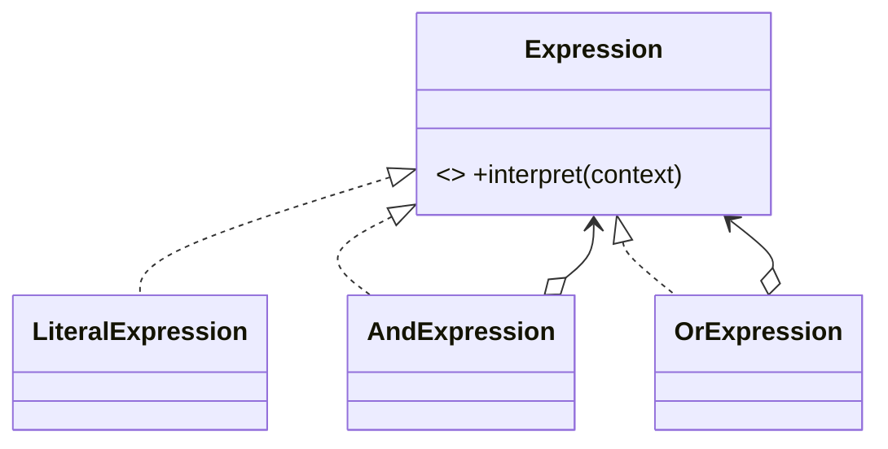

# Interpreter Pattern

## Mục tiêu

Biểu diễn và đánh giá grammar nhỏ.

## Vấn đề thực tế

Hệ thống cần đánh giá ngôn ngữ filter nhỏ và ổn định. Hiện tại parser ad-hoc rải rác trong query builder, khiến thay đổi lan sang code nghiệp vụ và test.

## Dấu hiệu nhận biết

- Parser ad-hoc rải rác trong query builder.
- Test phải dựng chi tiết không liên quan đến behavior cần kiểm chứng.
- Yêu cầu mới buộc sửa class đang ổn định thay vì thêm collaborator độc lập.

## Ý tưởng giải pháp

Dùng Interpreter để đặt boundary quanh phần thay đổi. Policy chính phụ thuộc contract nhỏ; chi tiết triển khai được đưa vào object có trách nhiệm rõ ràng.

## Khi nên dùng

- DSL hoặc biểu thức đơn giản.

## Khi không nên dùng

- Không dùng cho grammar lớn; dùng parser chuyên dụng.

## Ưu điểm

- Cô lập thay đổi liên quan đến đánh giá ngôn ngữ filter nhỏ và ổn định.
- Test policy và implementation độc lập.
- Thể hiện rõ quyết định dùng Interpreter trong vocabulary của code.

## Nhược điểm

- Tăng số lượng type và bước điều hướng.
- Không có lợi nếu đánh giá ngôn ngữ filter nhỏ và ổn định chỉ có một biến thể ổn định.
- Cần composition root rõ để tránh giấu call flow.

## Bài tập

Thực hiện yêu cầu: **thêm operator vào rule DSL có grammar rõ**. Trước khi refactor, viết characterization test khóa behavior hiện tại; sau đó thêm implementation mới mà không sửa policy đã ổn định.

### Gợi ý cách làm

1. Khoanh vùng lực thay đổi: biểu diễn và đánh giá một grammar nhỏ.
2. Đặt contract nhỏ dùng vocabulary của use case, không dùng tên chung như `Behavior` hoặc `Manager`.
3. Di chuyển concrete detail ra sau contract; wiring tại composition root.
4. Viết test cho happy path, failure path và trường hợp implementation mới.
5. Hoàn thành khi: Grammar nhỏ, AST và evaluator được test độc lập.

### Tiêu chí tự review

- Invariant chính có được nói rõ: **grammar nhỏ được biểu diễn đúng precedence**?
- Client đã ngừng phụ thuộc concrete detail nào, và dependency được wire ở đâu?
- Test có kiểm chứng **invalid token, nested expression và depth limit** thay vì chỉ assert class được gọi?
- Failure/return semantics giữa các implementation có nhất quán không?
- DSL lớn nên dùng parser chuyên dụng.

### Câu 1: Interpreter giải quyết vấn đề gì?

**Trả lời:** Pattern này cô lập nhu cầu **biểu diễn và đánh giá một grammar nhỏ** sau một contract rõ ràng. Giá trị chính không phải giảm số dòng code mà là giảm phạm vi thay đổi và cho phép test policy tách khỏi concrete detail.

### Câu 2: Trade-off quan trọng nhất là gì?

**Trả lời:** Thiết kế thêm type, indirection và wiring. Nếu chỉ có một biến thể ổn định hoặc logic rất nhỏ, giải pháp trực tiếp thường dễ đọc hơn. Hãy chứng minh bằng change axis, testability hoặc ownership boundary thay vì áp dụng theo thói quen.  
> **Ngữ cảnh áp dụng:** Áp dụng riêng cho **Interpreter Pattern**: liên hệ checklist với sơ đồ và code trước/sau trong bài, rồi nêu change axis mà pattern bảo vệ.

### Câu 3: So sánh với Parser library/Specification

**Trả lời:** Interpreter phù hợp DSL nhỏ; grammar lớn nên dùng parser generator hoặc thư viện chuyên dụng.

### Câu 4: Bạn kiểm thử pattern này thế nào?

**Trả lời:** Bắt đầu bằng behavior contract của interpreter: invalid token, nested expression và depth limit. Sau đó thêm failure-path test cho exception/side effect, wiring test tại composition root và regression test để bảo đảm client không cần biết concrete implementation. Tránh mock từng method nội bộ vì điều đó khóa cấu trúc thay vì semantics.

## Cây biểu thức



Mỗi expression node biểu diễn một phần grammar; chỉ dùng khi grammar nhỏ và ổn định hơn giải pháp parser chuyên dụng.

## Minh họa trước và sau refactor

### Trước khi áp dụng

```php
if ($field === 'total' && $operator === '>' && $order->total() > $value) { return true; }
```

### Sau khi áp dụng

```php
$rule = new AndExpression(
    new GreaterThan('total', 1_000_000),
    new Equals('country', 'VN'),
);
$eligible = $rule->evaluate($order->facts());
```

> Ý tưởng trọng tâm: Mô hình hóa grammar thành expression objects.

## Ví dụ chạy được

Xem [`labs/advanced/discount-engine`](../../labs/advanced/discount-engine/README.md) để chạy bản `before.php` và `after.php`.

## Bài tập thực hành

1. Khóa behavior hiện tại bằng characterization test.
2. Thực hiện yêu cầu: thêm grammar rule có test.
3. Viết một test cho failure path đặc trưng của Interpreter.
4. Ghi rõ khi nào giải pháp trực tiếp sẽ dễ hiểu hơn.

### Gợi ý thực hiện bài tập thực hành

1. Viết characterization test tái hiện pain point của interpreter.
2. Đánh dấu chính xác nơi invariant “grammar nhỏ được biểu diễn đúng precedence” đang bị đe dọa.
3. Refactor một dependency hoặc branch mỗi lần; giữ output/public API trong bước đầu.
4. Chứng minh thiết kế bằng phép thử: **invalid token, nested expression và depth limit**.
5. Ghi lại trường hợp không áp dụng: DSL lớn nên dùng parser chuyên dụng.

### Câu hỏi quan sát

- Trong ví dụ này, lực thay đổi nào được Interpreter cô lập?
- Client còn biết concrete class hoặc lifecycle detail nào không?
- Test nào chứng minh có thể thay implementation mà không sửa policy?

## Hướng refactor an toàn

1. Viết characterization test cho behavior hiện tại, đặc biệt quanh **biểu diễn grammar và đánh giá expression**.
2. Đánh dấu đúng change axis và dependency cần đảo chiều; chưa tạo interface cho phần ổn định.
3. Tách một bước nhỏ, giữ public behavior và chạy test sau mỗi commit.
4. Kiểm tra precedence, invalid token và giới hạn độ sâu.
5. So sánh độ đọc hiểu, số type và chi phí wiring với phiên bản trực tiếp trước khi chấp nhận refactor.

## Kiểm thử nên tập trung vào đâu?

- **Behavior/contract:** kiểm tra precedence, invalid token và giới hạn độ sâu.
- **Failure semantics:** exception, kết quả rỗng và side effect phải nhất quán giữa các implementation.
- **Wiring:** composition root chọn đúng collaborator mà không để client phụ thuộc concrete type.
- **Regression:** test bảo vệ behavior cũ, không khóa private method hoặc cấu trúc class.

Interpreter hợp với DSL nhỏ; grammar lớn nên dùng parser generator/thư viện chuyên dụng.

## Câu hỏi tự review

1. Pattern này đang bảo vệ **biểu diễn grammar và đánh giá expression** hay chỉ tăng số lớp?
2. Test nào thất bại nếu một implementation vi phạm contract nhưng vẫn trả đúng kiểu dữ liệu?
3. Concrete detail nào đã biến mất khỏi client sau refactor?
4. Interpreter hợp với DSL nhỏ; grammar lớn nên dùng parser generator/thư viện chuyên dụng.

