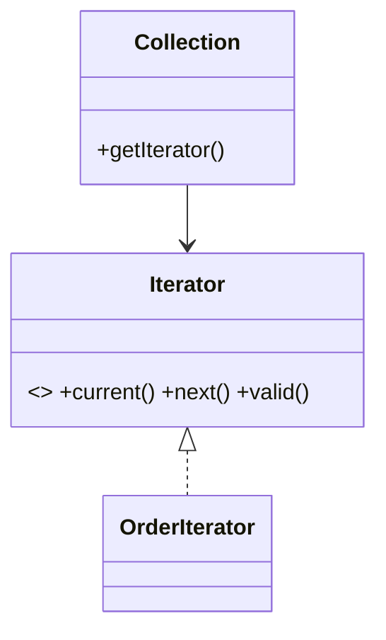

# Iterator Pattern

## Mục tiêu

Duyệt collection mà không lộ cấu trúc nội bộ.

## Vấn đề thực tế

Hệ thống cần duyệt collection phân trang mà client không biết storage. Hiện tại client tự quản cursor và cấu trúc collection, khiến thay đổi lan sang code nghiệp vụ và test.

## Dấu hiệu nhận biết

- Client tự quản cursor và cấu trúc collection.
- Test phải dựng chi tiết không liên quan đến behavior cần kiểm chứng.
- Yêu cầu mới buộc sửa class đang ổn định thay vì thêm collaborator độc lập.

## Ý tưởng giải pháp

Dùng Iterator để đặt boundary quanh phần thay đổi. Policy chính phụ thuộc contract nhỏ; chi tiết triển khai được đưa vào object có trách nhiệm rõ ràng.

## Khi nên dùng

- Collection tùy biến hoặc lazy traversal.

## Khi không nên dùng

- Không cần khi array/generator đã đủ.

## Ưu điểm

- Cô lập thay đổi liên quan đến duyệt collection phân trang mà client không biết storage.
- Test policy và implementation độc lập.
- Thể hiện rõ quyết định dùng Iterator trong vocabulary của code.

## Nhược điểm

- Tăng số lượng type và bước điều hướng.
- Không có lợi nếu duyệt collection phân trang mà client không biết storage chỉ có một biến thể ổn định.
- Cần composition root rõ để tránh giấu call flow.

## Bài tập

Thực hiện yêu cầu: **duyệt paginated records mà client không biết cursor**. Trước khi refactor, viết characterization test khóa behavior hiện tại; sau đó thêm implementation mới mà không sửa policy đã ổn định.

### Gợi ý cách làm

1. Khoanh vùng lực thay đổi: duyệt collection mà che cấu trúc lưu trữ.
2. Đặt contract nhỏ dùng vocabulary của use case, không dùng tên chung như `Behavior` hoặc `Manager`.
3. Di chuyển concrete detail ra sau contract; wiring tại composition root.
4. Viết test cho happy path, failure path và trường hợp implementation mới.
5. Hoàn thành khi: Iterator định nghĩa thứ tự và trạng thái duyệt.

### Tiêu chí tự review

- Invariant chính có được nói rõ: **iteration che representation nhưng không che chi phí bất ngờ**?
- Client đã ngừng phụ thuộc concrete detail nào, và dependency được wire ở đâu?
- Test có kiểm chứng **empty, lazy fetch và concurrent modification** thay vì chỉ assert class được gọi?
- Failure/return semantics giữa các implementation có nhất quán không?
- Cần nói rõ iterator có I/O hoặc one-pass hay không.

### Câu 1: Iterator giải quyết vấn đề gì?

**Trả lời:** Pattern này cô lập nhu cầu **duyệt collection mà che cấu trúc lưu trữ** sau một contract rõ ràng. Giá trị chính không phải giảm số dòng code mà là giảm phạm vi thay đổi và cho phép test policy tách khỏi concrete detail.

### Câu 2: Trade-off quan trọng nhất là gì?

**Trả lời:** Thiết kế thêm type, indirection và wiring. Nếu chỉ có một biến thể ổn định hoặc logic rất nhỏ, giải pháp trực tiếp thường dễ đọc hơn. Hãy chứng minh bằng change axis, testability hoặc ownership boundary thay vì áp dụng theo thói quen.  
> **Ngữ cảnh áp dụng:** Áp dụng riêng cho **Iterator Pattern**: liên hệ checklist với sơ đồ và code trước/sau trong bài, rồi nêu change axis mà pattern bảo vệ.

### Câu 3: So sánh với Generator

**Trả lời:** Generator là cơ chế PHP tiện lợi để hiện thực iterator lazy, không phải pattern đối nghịch.

### Câu 4: Bạn kiểm thử pattern này thế nào?

**Trả lời:** Bắt đầu bằng behavior contract của iterator: empty, lazy fetch và concurrent modification. Sau đó thêm failure-path test cho exception/side effect, wiring test tại composition root và regression test để bảo đảm client không cần biết concrete implementation. Tránh mock từng method nội bộ vì điều đó khóa cấu trúc thay vì semantics.

## Iterator tách traversal



Collection giữ cấu trúc nội bộ, iterator giữ trạng thái duyệt; client không được phụ thuộc representation.

## Minh họa trước và sau refactor

### Trước khi áp dụng

```php
for ($page = 1; ; $page++) {
    $rows = $api->fetchPage($page);
    if ($rows === []) break;
    foreach ($rows as $row) { consume($row); }
}
```

### Sau khi áp dụng

```php
final class ApiRecordIterator implements IteratorAggregate
{
    public function getIterator(): Traversable
    {
        for ($cursor = null; ;) {
            $page = $this->api->fetch($cursor);
            yield from $page->records;
            if ($page->nextCursor === null) return;
            $cursor = $page->nextCursor;
        }
    }
}
```

> Ý tưởng trọng tâm: Iterator cung cấp cách duyệt thống nhất.

## Ví dụ chạy được

Xem [`examples/behavioral/observer-order`](../../examples/behavioral/observer-order/README.md) để chạy bản `before.php` và `after.php`.

## Bài tập thực hành

1. Khóa behavior hiện tại bằng characterization test.
2. Thực hiện yêu cầu: đổi nguồn dữ liệu mà `foreach` không đổi.
3. Viết một test cho failure path đặc trưng của Iterator.
4. Ghi rõ khi nào giải pháp trực tiếp sẽ dễ hiểu hơn.

### Gợi ý thực hiện bài tập thực hành

1. Viết characterization test tái hiện pain point của iterator.
2. Đánh dấu chính xác nơi invariant “iteration che representation nhưng không che chi phí bất ngờ” đang bị đe dọa.
3. Refactor một dependency hoặc branch mỗi lần; giữ output/public API trong bước đầu.
4. Chứng minh thiết kế bằng phép thử: **empty, lazy fetch và concurrent modification**.
5. Ghi lại trường hợp không áp dụng: Cần nói rõ iterator có I/O hoặc one-pass hay không.

### Câu hỏi quan sát

- Trong ví dụ này, lực thay đổi nào được Iterator cô lập?
- Client còn biết concrete class hoặc lifecycle detail nào không?
- Test nào chứng minh có thể thay implementation mà không sửa policy?

## Hướng refactor an toàn

1. Viết characterization test cho behavior hiện tại, đặc biệt quanh **ẩn cấu trúc collection khi duyệt**.
2. Đánh dấu đúng change axis và dependency cần đảo chiều; chưa tạo interface cho phần ổn định.
3. Tách một bước nhỏ, giữ public behavior và chạy test sau mỗi commit.
4. Kiểm tra empty, concurrent modification và lazy iteration.
5. So sánh độ đọc hiểu, số type và chi phí wiring với phiên bản trực tiếp trước khi chấp nhận refactor.

## Kiểm thử nên tập trung vào đâu?

- **Behavior/contract:** kiểm tra empty, concurrent modification và lazy iteration.
- **Failure semantics:** exception, kết quả rỗng và side effect phải nhất quán giữa các implementation.
- **Wiring:** composition root chọn đúng collaborator mà không để client phụ thuộc concrete type.
- **Regression:** test bảo vệ behavior cũ, không khóa private method hoặc cấu trúc class.

Iterator bảo vệ cách lưu trữ nhưng có thể che chi phí I/O; cần ghi rõ eager/lazy semantics.

## Câu hỏi tự review

1. Pattern này đang bảo vệ **ẩn cấu trúc collection khi duyệt** hay chỉ tăng số lớp?
2. Test nào thất bại nếu một implementation vi phạm contract nhưng vẫn trả đúng kiểu dữ liệu?
3. Concrete detail nào đã biến mất khỏi client sau refactor?
4. Iterator bảo vệ cách lưu trữ nhưng có thể che chi phí I/O; cần ghi rõ eager/lazy semantics.

