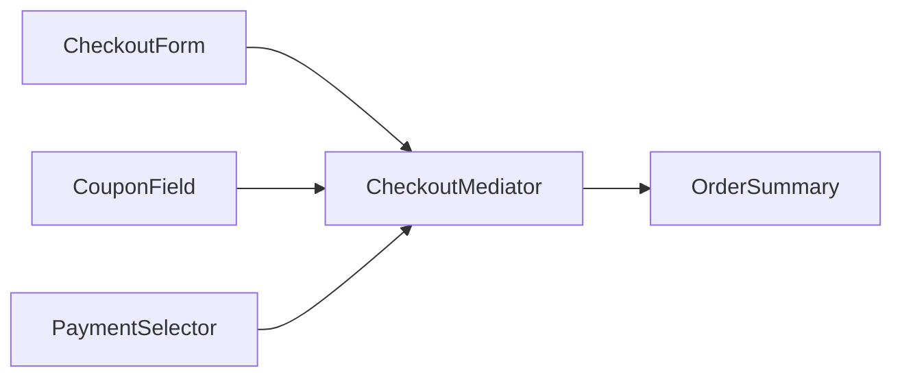

# Mediator Pattern

## Mục tiêu

Điều phối giao tiếp giữa nhiều component.

## Vấn đề thực tế

Hệ thống cần điều phối component trong form phức tạp. Hiện tại component gọi chéo nhau tạo dependency graph dày, khiến thay đổi lan sang code nghiệp vụ và test.

## Dấu hiệu nhận biết

- Component gọi chéo nhau tạo dependency graph dày.
- Test phải dựng chi tiết không liên quan đến behavior cần kiểm chứng.
- Yêu cầu mới buộc sửa class đang ổn định thay vì thêm collaborator độc lập.

## Ý tưởng giải pháp

Dùng Mediator để đặt boundary quanh phần thay đổi. Policy chính phụ thuộc contract nhỏ; chi tiết triển khai được đưa vào object có trách nhiệm rõ ràng.

## Khi nên dùng

- UI complex hoặc workflow nhiều participant.

## Khi không nên dùng

- Không biến mediator thành God Object.

## Ưu điểm

- Cô lập thay đổi liên quan đến điều phối component trong form phức tạp.
- Test policy và implementation độc lập.
- Thể hiện rõ quyết định dùng Mediator trong vocabulary của code.

## Nhược điểm

- Tăng số lượng type và bước điều hướng.
- Không có lợi nếu điều phối component trong form phức tạp chỉ có một biến thể ổn định.
- Cần composition root rõ để tránh giấu call flow.

## Bài tập

Thực hiện yêu cầu: **thay đổi form field dependency mà widget không gọi nhau**. Trước khi refactor, viết characterization test khóa behavior hiện tại; sau đó thêm implementation mới mà không sửa policy đã ổn định.

### Gợi ý cách làm

1. Khoanh vùng lực thay đổi: điều phối tương tác nhiều component.
2. Đặt contract nhỏ dùng vocabulary của use case, không dùng tên chung như `Behavior` hoặc `Manager`.
3. Di chuyển concrete detail ra sau contract; wiring tại composition root.
4. Viết test cho happy path, failure path và trường hợp implementation mới.
5. Hoàn thành khi: Component chỉ biết mediator contract.

### Tiêu chí tự review

- Invariant chính có được nói rõ: **colleague không gọi chéo nhau và mediator không thành God Object**?
- Client đã ngừng phụ thuộc concrete detail nào, và dependency được wire ở đâu?
- Test có kiểm chứng **thêm colleague, loop notification và mediator failure** thay vì chỉ assert class được gọi?
- Failure/return semantics giữa các implementation có nhất quán không?
- Có thể tách mediator theo workflow để giữ cohesion.

### Câu 1: Mediator giải quyết vấn đề gì?

**Trả lời:** Pattern này cô lập nhu cầu **điều phối tương tác nhiều component** sau một contract rõ ràng. Giá trị chính không phải giảm số dòng code mà là giảm phạm vi thay đổi và cho phép test policy tách khỏi concrete detail.

### Câu 2: Trade-off quan trọng nhất là gì?

**Trả lời:** Thiết kế thêm type, indirection và wiring. Nếu chỉ có một biến thể ổn định hoặc logic rất nhỏ, giải pháp trực tiếp thường dễ đọc hơn. Hãy chứng minh bằng change axis, testability hoặc ownership boundary thay vì áp dụng theo thói quen.  
> **Ngữ cảnh áp dụng:** Áp dụng riêng cho **Mediator Pattern**: liên hệ checklist với sơ đồ và code trước/sau trong bài, rồi nêu change axis mà pattern bảo vệ.

### Câu 3: So sánh với Observer

**Trả lời:** Observer phát sự kiện một chiều; Mediator điều phối hội thoại hai chiều/phức tạp.

### Câu 4: Bạn kiểm thử pattern này thế nào?

**Trả lời:** Bắt đầu bằng behavior contract của mediator: thêm colleague, loop notification và mediator failure. Sau đó thêm failure-path test cho exception/side effect, wiring test tại composition root và regression test để bảo đảm client không cần biết concrete implementation. Tránh mock từng method nội bộ vì điều đó khóa cấu trúc thay vì semantics.

## Mediator điều phối cộng tác



Mediator sở hữu coordination rule giữa colleague, nhưng không nên trở thành nơi chứa toàn bộ domain logic.

## Minh họa trước và sau refactor

### Trước khi áp dụng

```php
$countrySelect->onChange(function ($country) use ($citySelect, $taxField) {
    $citySelect->reload($country);
    $taxField->setRequired($country === 'VN');
});
```

### Sau khi áp dụng

```php
final class CheckoutFormMediator
{
    public function countryChanged(string $country): void
    {
        $this->citySelect->show($this->cities->forCountry($country));
        $this->taxField->required($country === 'VN');
    }
}
```

> Ý tưởng trọng tâm: Mediator điều phối giao tiếp.

## Ví dụ chạy được

Xem [`examples/behavioral/observer-order`](../../examples/behavioral/observer-order/README.md) để chạy bản `before.php` và `after.php`.

## Bài tập thực hành

1. Khóa behavior hiện tại bằng characterization test.
2. Thực hiện yêu cầu: thêm tương tác qua mediator.
3. Viết một test cho failure path đặc trưng của Mediator.
4. Ghi rõ khi nào giải pháp trực tiếp sẽ dễ hiểu hơn.

### Gợi ý thực hiện bài tập thực hành

1. Viết characterization test tái hiện pain point của mediator.
2. Đánh dấu chính xác nơi invariant “colleague không gọi chéo nhau và mediator không thành God Object” đang bị đe dọa.
3. Refactor một dependency hoặc branch mỗi lần; giữ output/public API trong bước đầu.
4. Chứng minh thiết kế bằng phép thử: **thêm colleague, loop notification và mediator failure**.
5. Ghi lại trường hợp không áp dụng: Có thể tách mediator theo workflow để giữ cohesion.

### Câu hỏi quan sát

- Trong ví dụ này, lực thay đổi nào được Mediator cô lập?
- Client còn biết concrete class hoặc lifecycle detail nào không?
- Test nào chứng minh có thể thay implementation mà không sửa policy?

## Hướng refactor an toàn

1. Viết characterization test cho behavior hiện tại, đặc biệt quanh **điều phối tương tác giữa nhiều colleague**.
2. Đánh dấu đúng change axis và dependency cần đảo chiều; chưa tạo interface cho phần ổn định.
3. Tách một bước nhỏ, giữ public behavior và chạy test sau mỗi commit.
4. Kiểm tra mediator không tích tụ toàn bộ business rule.
5. So sánh độ đọc hiểu, số type và chi phí wiring với phiên bản trực tiếp trước khi chấp nhận refactor.

## Kiểm thử nên tập trung vào đâu?

- **Behavior/contract:** kiểm tra mediator không tích tụ toàn bộ business rule.
- **Failure semantics:** exception, kết quả rỗng và side effect phải nhất quán giữa các implementation.
- **Wiring:** composition root chọn đúng collaborator mà không để client phụ thuộc concrete type.
- **Regression:** test bảo vệ behavior cũ, không khóa private method hoặc cấu trúc class.

Mediator giảm liên kết chéo nhưng dễ trở thành God Object nếu mọi quyết định đều dồn vào một nơi.

## Câu hỏi tự review

1. Pattern này đang bảo vệ **điều phối tương tác giữa nhiều colleague** hay chỉ tăng số lớp?
2. Test nào thất bại nếu một implementation vi phạm contract nhưng vẫn trả đúng kiểu dữ liệu?
3. Concrete detail nào đã biến mất khỏi client sau refactor?
4. Mediator giảm liên kết chéo nhưng dễ trở thành God Object nếu mọi quyết định đều dồn vào một nơi.

