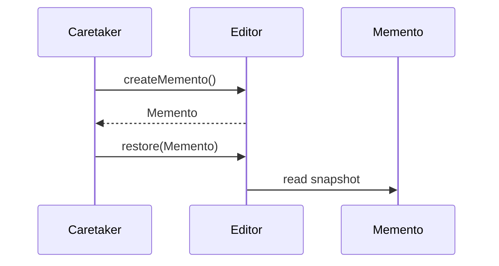

# Memento Pattern

## Mục tiêu

Lưu và phục hồi trạng thái mà không phá encapsulation.

## Vấn đề thực tế

Hệ thống cần hỗ trợ undo cho editor mà không lộ state nội bộ. Hiện tại client copy property private hoặc serialize tùy tiện, khiến thay đổi lan sang code nghiệp vụ và test.

## Dấu hiệu nhận biết

- Client copy property private hoặc serialize tùy tiện.
- Test phải dựng chi tiết không liên quan đến behavior cần kiểm chứng.
- Yêu cầu mới buộc sửa class đang ổn định thay vì thêm collaborator độc lập.

## Ý tưởng giải pháp

Dùng Memento để đặt boundary quanh phần thay đổi. Policy chính phụ thuộc contract nhỏ; chi tiết triển khai được đưa vào object có trách nhiệm rõ ràng.

## Khi nên dùng

- Undo, snapshot.

## Khi không nên dùng

- Không dùng khi snapshot quá lớn hoặc nhạy cảm.

## Ưu điểm

- Cô lập thay đổi liên quan đến hỗ trợ undo cho editor mà không lộ state nội bộ.
- Test policy và implementation độc lập.
- Thể hiện rõ quyết định dùng Memento trong vocabulary của code.

## Nhược điểm

- Tăng số lượng type và bước điều hướng.
- Không có lợi nếu hỗ trợ undo cho editor mà không lộ state nội bộ chỉ có một biến thể ổn định.
- Cần composition root rõ để tránh giấu call flow.

## Bài tập

Thực hiện yêu cầu: **undo editor state với giới hạn memory**. Trước khi refactor, viết characterization test khóa behavior hiện tại; sau đó thêm implementation mới mà không sửa policy đã ổn định.

### Gợi ý cách làm

1. Khoanh vùng lực thay đổi: lưu và khôi phục snapshot mà không lộ internals.
2. Đặt contract nhỏ dùng vocabulary của use case, không dùng tên chung như `Behavior` hoặc `Manager`.
3. Di chuyển concrete detail ra sau contract; wiring tại composition root.
4. Viết test cho happy path, failure path và trường hợp implementation mới.
5. Hoàn thành khi: Snapshot immutable và owner kiểm soát restore.

### Tiêu chí tự review

- Invariant chính có được nói rõ: **snapshot đủ để phục hồi nhưng không phá encapsulation**?
- Client đã ngừng phụ thuộc concrete detail nào, và dependency được wire ở đâu?
- Test có kiểm chứng **restore version mismatch và memory bound** thay vì chỉ assert class được gọi?
- Failure/return semantics giữa các implementation có nhất quán không?
- Memento không phải audit trail lâu dài.

### Câu 1: Memento giải quyết vấn đề gì?

**Trả lời:** Pattern này cô lập nhu cầu **lưu và khôi phục snapshot mà không lộ internals** sau một contract rõ ràng. Giá trị chính không phải giảm số dòng code mà là giảm phạm vi thay đổi và cho phép test policy tách khỏi concrete detail.

### Câu 2: Trade-off quan trọng nhất là gì?

**Trả lời:** Thiết kế thêm type, indirection và wiring. Nếu chỉ có một biến thể ổn định hoặc logic rất nhỏ, giải pháp trực tiếp thường dễ đọc hơn. Hãy chứng minh bằng change axis, testability hoặc ownership boundary thay vì áp dụng theo thói quen.  
> **Ngữ cảnh áp dụng:** Áp dụng riêng cho **Memento Pattern**: liên hệ checklist với sơ đồ và code trước/sau trong bài, rồi nêu change axis mà pattern bảo vệ.

### Câu 3: So sánh với Event Sourcing

**Trả lời:** Memento lưu snapshot; Event Sourcing lưu chuỗi sự kiện nghiệp vụ để tái tạo trạng thái.

### Câu 4: Bạn kiểm thử pattern này thế nào?

**Trả lời:** Bắt đầu bằng behavior contract của memento: restore version mismatch và memory bound. Sau đó thêm failure-path test cho exception/side effect, wiring test tại composition root và regression test để bảo đảm client không cần biết concrete implementation. Tránh mock từng method nội bộ vì điều đó khóa cấu trúc thay vì semantics.

## Lưu và phục hồi snapshot



Originator kiểm soát snapshot; caretaker chỉ lưu/khôi phục mà không đọc state nội bộ.

## Minh họa trước và sau refactor

### Trước khi áp dụng

```php
$history[] = serialize($editor);
$editor = unserialize(array_pop($history));
```

### Sau khi áp dụng

```php
$history->push($editor->createSnapshot());
$editor->type('Nội dung mới');
$editor->restore($history->pop());

final readonly class EditorSnapshot
{
    public function __construct(public string $content, public int $cursor) {}
}
```

> Ý tưởng trọng tâm: Memento lưu snapshot opaque.

## Ví dụ chạy được

Xem [`examples/behavioral/state-document`](../../examples/behavioral/state-document/README.md) để chạy bản `before.php` và `after.php`.

## Bài tập thực hành

1. Khóa behavior hiện tại bằng characterization test.
2. Thực hiện yêu cầu: khôi phục snapshot đúng version.
3. Viết một test cho failure path đặc trưng của Memento.
4. Ghi rõ khi nào giải pháp trực tiếp sẽ dễ hiểu hơn.

### Gợi ý thực hiện bài tập thực hành

1. Viết characterization test tái hiện pain point của memento.
2. Đánh dấu chính xác nơi invariant “snapshot đủ để phục hồi nhưng không phá encapsulation” đang bị đe dọa.
3. Refactor một dependency hoặc branch mỗi lần; giữ output/public API trong bước đầu.
4. Chứng minh thiết kế bằng phép thử: **restore version mismatch và memory bound**.
5. Ghi lại trường hợp không áp dụng: Memento không phải audit trail lâu dài.

### Câu hỏi quan sát

- Trong ví dụ này, lực thay đổi nào được Memento cô lập?
- Client còn biết concrete class hoặc lifecycle detail nào không?
- Test nào chứng minh có thể thay implementation mà không sửa policy?

## Hướng refactor an toàn

1. Viết characterization test cho behavior hiện tại, đặc biệt quanh **snapshot và phục hồi state mà không phá encapsulation**.
2. Đánh dấu đúng change axis và dependency cần đảo chiều; chưa tạo interface cho phần ổn định.
3. Tách một bước nhỏ, giữ public behavior và chạy test sau mỗi commit.
4. Kiểm tra version, memory limit và state không thể phục hồi.
5. So sánh độ đọc hiểu, số type và chi phí wiring với phiên bản trực tiếp trước khi chấp nhận refactor.

## Kiểm thử nên tập trung vào đâu?

- **Behavior/contract:** kiểm tra version, memory limit và state không thể phục hồi.
- **Failure semantics:** exception, kết quả rỗng và side effect phải nhất quán giữa các implementation.
- **Wiring:** composition root chọn đúng collaborator mà không để client phụ thuộc concrete type.
- **Regression:** test bảo vệ behavior cũ, không khóa private method hoặc cấu trúc class.

Memento phù hợp undo/snapshot ngắn hạn; không thay thế audit log hoặc Event Sourcing.

## Câu hỏi tự review

1. Pattern này đang bảo vệ **snapshot và phục hồi state mà không phá encapsulation** hay chỉ tăng số lớp?
2. Test nào thất bại nếu một implementation vi phạm contract nhưng vẫn trả đúng kiểu dữ liệu?
3. Concrete detail nào đã biến mất khỏi client sau refactor?
4. Memento phù hợp undo/snapshot ngắn hạn; không thay thế audit log hoặc Event Sourcing.

