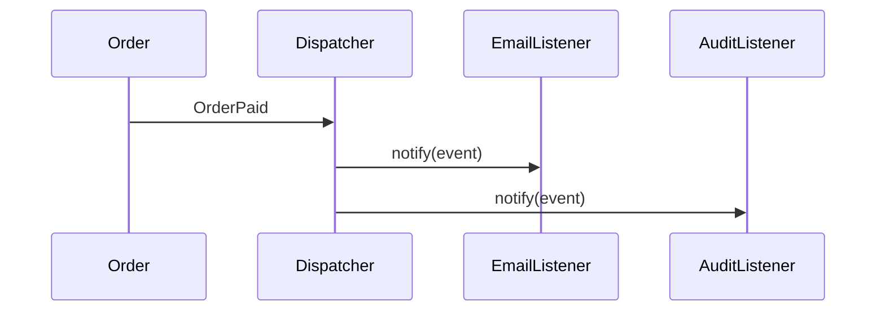

# Observer Pattern

## Mục tiêu

Thông báo subscriber khi subject thay đổi.

## Vấn đề thực tế

Hệ thống cần phát OrderPlaced cho email, metric và audit listener. Hiện tại order service gọi trực tiếp mọi side effect, khiến thay đổi lan sang code nghiệp vụ và test.

## Dấu hiệu nhận biết

- Order service gọi trực tiếp mọi side effect.
- Test phải dựng chi tiết không liên quan đến behavior cần kiểm chứng.
- Yêu cầu mới buộc sửa class đang ổn định thay vì thêm collaborator độc lập.

## Ý tưởng giải pháp

Dùng Observer để đặt boundary quanh phần thay đổi. Policy chính phụ thuộc contract nhỏ; chi tiết triển khai được đưa vào object có trách nhiệm rõ ràng.

## Khi nên dùng

- Domain event, notification.

## Khi không nên dùng

- Không dùng khi cần transaction đồng bộ chặt.

## Ưu điểm

- Cô lập thay đổi liên quan đến phát OrderPlaced cho email, metric và audit listener.
- Test policy và implementation độc lập.
- Thể hiện rõ quyết định dùng Observer trong vocabulary của code.

## Nhược điểm

- Tăng số lượng type và bước điều hướng.
- Không có lợi nếu phát OrderPlaced cho email, metric và audit listener chỉ có một biến thể ổn định.
- Cần composition root rõ để tránh giấu call flow.

## Bài tập

Thực hiện yêu cầu: **thêm listener audit mà publisher không đổi**. Trước khi refactor, viết characterization test khóa behavior hiện tại; sau đó thêm implementation mới mà không sửa policy đã ổn định.

### Gợi ý cách làm

1. Khoanh vùng lực thay đổi: phát thông báo tới nhiều subscriber.
2. Đặt contract nhỏ dùng vocabulary của use case, không dùng tên chung như `Behavior` hoặc `Manager`.
3. Di chuyển concrete detail ra sau contract; wiring tại composition root.
4. Viết test cho happy path, failure path và trường hợp implementation mới.
5. Hoàn thành khi: Publisher không phụ thuộc concrete listener; lỗi listener có policy rõ.

### Tiêu chí tự review

- Invariant chính có được nói rõ: **publisher không phụ thuộc listener và delivery semantics rõ**?
- Client đã ngừng phụ thuộc concrete detail nào, và dependency được wire ở đâu?
- Test có kiểm chứng **listener failure, duplicate, ordering, unsubscribe** thay vì chỉ assert class được gọi?
- Failure/return semantics giữa các implementation có nhất quán không?
- Async observer cần outbox/inbox và observability.

### Câu 1: Observer giải quyết vấn đề gì?

**Trả lời:** Pattern này cô lập nhu cầu **phát thông báo tới nhiều subscriber** sau một contract rõ ràng. Giá trị chính không phải giảm số dòng code mà là giảm phạm vi thay đổi và cho phép test policy tách khỏi concrete detail.

### Câu 2: Trade-off quan trọng nhất là gì?

**Trả lời:** Thiết kế thêm type, indirection và wiring. Nếu chỉ có một biến thể ổn định hoặc logic rất nhỏ, giải pháp trực tiếp thường dễ đọc hơn. Hãy chứng minh bằng change axis, testability hoặc ownership boundary thay vì áp dụng theo thói quen.  
> **Ngữ cảnh áp dụng:** Áp dụng riêng cho **Observer Pattern**: liên hệ checklist với sơ đồ và code trước/sau trong bài, rồi nêu change axis mà pattern bảo vệ.

### Câu 3: So sánh với Mediator hoặc Event Bus

**Trả lời:** Observer mô tả subscription trong-process; Event Bus thường thêm routing, async và operational concerns.

### Câu 4: Bạn kiểm thử pattern này thế nào?

**Trả lời:** Bắt đầu bằng behavior contract của observer: listener failure, duplicate, ordering, unsubscribe. Sau đó thêm failure-path test cho exception/side effect, wiring test tại composition root và regression test để bảo đảm client không cần biết concrete implementation. Tránh mock từng method nội bộ vì điều đó khóa cấu trúc thay vì semantics.

## Luồng publish/subscribe



Sơ đồ phải đi kèm delivery semantics: sync/async, ordering, duplicate và lỗi subscriber.

## Minh họa trước và sau refactor

### Trước khi áp dụng

```php
$order->markPaid();
$email->sendReceipt($order);
$analytics->track($order);
$audit->record($order);
```

### Sau khi áp dụng

```php
$order->markPaid();
$events->publish(new OrderPaid($order->id(), $order->total()));

$events->subscribe(OrderPaid::class, new SendReceiptListener($mailer));
$events->subscribe(OrderPaid::class, new RecordRevenueListener($analytics));
```

> Ý tưởng trọng tâm: Publisher phát event cho subscribers.

## Ví dụ chạy được

Xem [`examples/behavioral/observer-order`](../../examples/behavioral/observer-order/README.md) để chạy bản `before.php` và `after.php`.

## Bài tập thực hành

1. Khóa behavior hiện tại bằng characterization test.
2. Thực hiện yêu cầu: thêm listener mà publisher không đổi.
3. Viết một test cho failure path đặc trưng của Observer.
4. Ghi rõ khi nào giải pháp trực tiếp sẽ dễ hiểu hơn.

### Gợi ý thực hiện bài tập thực hành

1. Viết characterization test tái hiện pain point của observer.
2. Đánh dấu chính xác nơi invariant “publisher không phụ thuộc listener và delivery semantics rõ” đang bị đe dọa.
3. Refactor một dependency hoặc branch mỗi lần; giữ output/public API trong bước đầu.
4. Chứng minh thiết kế bằng phép thử: **listener failure, duplicate, ordering, unsubscribe**.
5. Ghi lại trường hợp không áp dụng: Async observer cần outbox/inbox và observability.

### Câu hỏi quan sát

- Trong ví dụ này, lực thay đổi nào được Observer cô lập?
- Client còn biết concrete class hoặc lifecycle detail nào không?
- Test nào chứng minh có thể thay implementation mà không sửa policy?

## Hướng refactor an toàn

1. Viết characterization test cho behavior hiện tại, đặc biệt quanh **phát sự kiện cho nhiều subscriber**.
2. Đánh dấu đúng change axis và dependency cần đảo chiều; chưa tạo interface cho phần ổn định.
3. Tách một bước nhỏ, giữ public behavior và chạy test sau mỗi commit.
4. Kiểm tra ordering, duplicate delivery, listener failure và unsubscribe.
5. So sánh độ đọc hiểu, số type và chi phí wiring với phiên bản trực tiếp trước khi chấp nhận refactor.

## Kiểm thử nên tập trung vào đâu?

- **Behavior/contract:** kiểm tra ordering, duplicate delivery, listener failure và unsubscribe.
- **Failure semantics:** exception, kết quả rỗng và side effect phải nhất quán giữa các implementation.
- **Wiring:** composition root chọn đúng collaborator mà không để client phụ thuộc concrete type.
- **Regression:** test bảo vệ behavior cũ, không khóa private method hoặc cấu trúc class.

Observer tách publisher khỏi subscriber nhưng delivery semantics phải được nói rõ.

## Câu hỏi tự review

1. Pattern này đang bảo vệ **phát sự kiện cho nhiều subscriber** hay chỉ tăng số lớp?
2. Test nào thất bại nếu một implementation vi phạm contract nhưng vẫn trả đúng kiểu dữ liệu?
3. Concrete detail nào đã biến mất khỏi client sau refactor?
4. Observer tách publisher khỏi subscriber nhưng delivery semantics phải được nói rõ.

