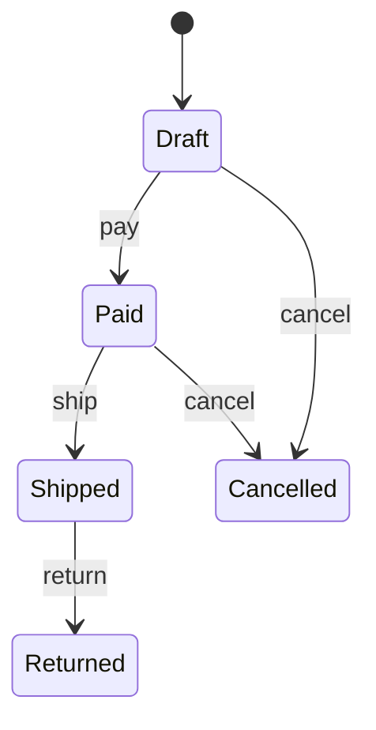

# State Pattern

## Mục tiêu

Thay đổi hành vi theo trạng thái object.

## Vấn đề thực tế

Hệ thống cần quản lý lifecycle booking với transition hợp lệ. Hiện tại switch trạng thái lặp ở nhiều method, khiến thay đổi lan sang code nghiệp vụ và test.

## Dấu hiệu nhận biết

- Switch trạng thái lặp ở nhiều method.
- Test phải dựng chi tiết không liên quan đến behavior cần kiểm chứng.
- Yêu cầu mới buộc sửa class đang ổn định thay vì thêm collaborator độc lập.

## Ý tưởng giải pháp

Dùng State để đặt boundary quanh phần thay đổi. Policy chính phụ thuộc contract nhỏ; chi tiết triển khai được đưa vào object có trách nhiệm rõ ràng.

## Khi nên dùng

- Workflow có transition và rule rõ.

## Khi không nên dùng

- Không dùng cho vài cờ boolean đơn giản.

## Ưu điểm

- Cô lập thay đổi liên quan đến quản lý lifecycle booking với transition hợp lệ.
- Test policy và implementation độc lập.
- Thể hiện rõ quyết định dùng State trong vocabulary của code.

## Nhược điểm

- Tăng số lượng type và bước điều hướng.
- Không có lợi nếu quản lý lifecycle booking với transition hợp lệ chỉ có một biến thể ổn định.
- Cần composition root rõ để tránh giấu call flow.

## Bài tập

Thực hiện yêu cầu: **thêm transition `Suspended` có rule riêng**. Trước khi refactor, viết characterization test khóa behavior hiện tại; sau đó thêm implementation mới mà không sửa policy đã ổn định.

### Gợi ý cách làm

1. Khoanh vùng lực thay đổi: thay behavior theo trạng thái nội tại.
2. Đặt contract nhỏ dùng vocabulary của use case, không dùng tên chung như `Behavior` hoặc `Manager`.
3. Di chuyển concrete detail ra sau contract; wiring tại composition root.
4. Viết test cho happy path, failure path và trường hợp implementation mới.
5. Hoàn thành khi: Transition hợp lệ nằm trong state/context, không rải switch.

### Tiêu chí tự review

- Invariant chính có được nói rõ: **transition hợp lệ được model explicit**?
- Client đã ngừng phụ thuộc concrete detail nào, và dependency được wire ở đâu?
- Test có kiểm chứng **invalid transition, guard, re-entry** thay vì chỉ assert class được gọi?
- Failure/return semantics giữa các implementation có nhất quán không?
- Enum + match tốt hơn khi state ít và behavior nhỏ.

### Câu 1: State giải quyết vấn đề gì?

**Trả lời:** Pattern này cô lập nhu cầu **thay behavior theo trạng thái nội tại** sau một contract rõ ràng. Giá trị chính không phải giảm số dòng code mà là giảm phạm vi thay đổi và cho phép test policy tách khỏi concrete detail.

### Câu 2: Trade-off quan trọng nhất là gì?

**Trả lời:** Thiết kế thêm type, indirection và wiring. Nếu chỉ có một biến thể ổn định hoặc logic rất nhỏ, giải pháp trực tiếp thường dễ đọc hơn. Hãy chứng minh bằng change axis, testability hoặc ownership boundary thay vì áp dụng theo thói quen.  
> **Ngữ cảnh áp dụng:** Áp dụng riêng cho **State Pattern**: liên hệ checklist với sơ đồ và code trước/sau trong bài, rồi nêu change axis mà pattern bảo vệ.

### Câu 3: So sánh với Strategy

**Trả lời:** Strategy thường do client chọn; State thay đổi theo lifecycle và có transition.

### Câu 4: Bạn kiểm thử pattern này thế nào?

**Trả lời:** Bắt đầu bằng behavior contract của state: invalid transition, guard, re-entry. Sau đó thêm failure-path test cho exception/side effect, wiring test tại composition root và regression test để bảo đảm client không cần biết concrete implementation. Tránh mock từng method nội bộ vì điều đó khóa cấu trúc thay vì semantics.

## State machine



Đọc state diagram trước class diagram: transition hợp lệ và guard quan trọng hơn số class state.

## Minh họa trước và sau refactor

### Trước khi áp dụng

```php
if ($order->status === 'paid') { $order->status = 'shipped'; }
else { throw new DomainException('Invalid transition'); }
```

### Sau khi áp dụng

```php
interface OrderState { public function ship(Order $order): void; }

final class PaidState implements OrderState
{
    public function ship(Order $order): void { $order->transitionTo(new ShippedState()); }
}

$order->ship();
```

> Ý tưởng trọng tâm: Mỗi state chứa hành vi/transition riêng.

## Ví dụ chạy được

Xem [`examples/behavioral/state-document`](../../examples/behavioral/state-document/README.md) để chạy bản `before.php` và `after.php`.

## Bài tập thực hành

1. Khóa behavior hiện tại bằng characterization test.
2. Thực hiện yêu cầu: chặn confirm sau cancel.
3. Viết một test cho failure path đặc trưng của State.
4. Ghi rõ khi nào giải pháp trực tiếp sẽ dễ hiểu hơn.

### Gợi ý thực hiện bài tập thực hành

1. Viết characterization test tái hiện pain point của state.
2. Đánh dấu chính xác nơi invariant “transition hợp lệ được model explicit” đang bị đe dọa.
3. Refactor một dependency hoặc branch mỗi lần; giữ output/public API trong bước đầu.
4. Chứng minh thiết kế bằng phép thử: **invalid transition, guard, re-entry**.
5. Ghi lại trường hợp không áp dụng: Enum + match tốt hơn khi state ít và behavior nhỏ.

### Câu hỏi quan sát

- Trong ví dụ này, lực thay đổi nào được State cô lập?
- Client còn biết concrete class hoặc lifecycle detail nào không?
- Test nào chứng minh có thể thay implementation mà không sửa policy?

## Hướng refactor an toàn

1. Viết characterization test cho behavior hiện tại, đặc biệt quanh **hành vi và transition phụ thuộc lifecycle**.
2. Đánh dấu đúng change axis và dependency cần đảo chiều; chưa tạo interface cho phần ổn định.
3. Tách một bước nhỏ, giữ public behavior và chạy test sau mỗi commit.
4. Kiểm tra transition hợp lệ/bất hợp lệ và guard.
5. So sánh độ đọc hiểu, số type và chi phí wiring với phiên bản trực tiếp trước khi chấp nhận refactor.

## Kiểm thử nên tập trung vào đâu?

- **Behavior/contract:** kiểm tra transition hợp lệ/bất hợp lệ và guard.
- **Failure semantics:** exception, kết quả rỗng và side effect phải nhất quán giữa các implementation.
- **Wiring:** composition root chọn đúng collaborator mà không để client phụ thuộc concrete type.
- **Regression:** test bảo vệ behavior cũ, không khóa private method hoặc cấu trúc class.

State làm state machine explicit; với vài condition ổn định, enum + match có thể đơn giản hơn.

## Câu hỏi tự review

1. Pattern này đang bảo vệ **hành vi và transition phụ thuộc lifecycle** hay chỉ tăng số lớp?
2. Test nào thất bại nếu một implementation vi phạm contract nhưng vẫn trả đúng kiểu dữ liệu?
3. Concrete detail nào đã biến mất khỏi client sau refactor?
4. State làm state machine explicit; với vài condition ổn định, enum + match có thể đơn giản hơn.

