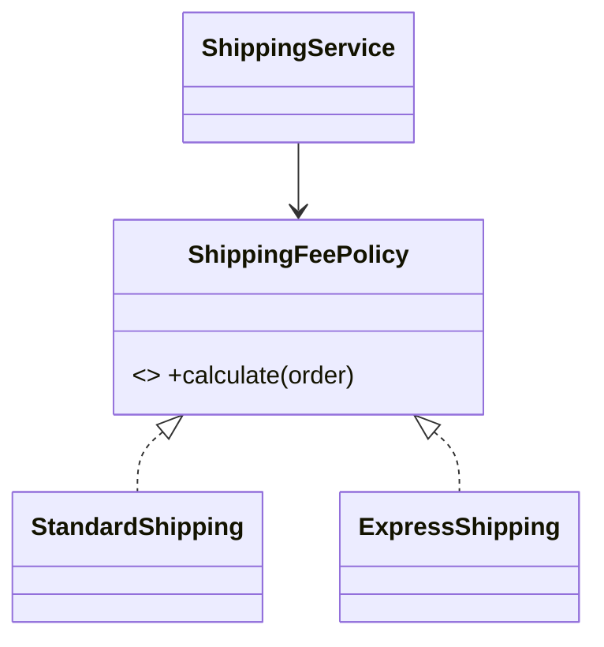

# Strategy Pattern

## Mục tiêu

Đóng gói thuật toán thay thế được.

## Vấn đề thực tế

Hệ thống cần thay thuật toán tính phí vận chuyển theo service level. Hiện tại use case chứa `if/switch` cho từng thuật toán, khiến thay đổi lan sang code nghiệp vụ và test.

## Dấu hiệu nhận biết

- Use case chứa `if/switch` cho từng thuật toán.
- Test phải dựng chi tiết không liên quan đến behavior cần kiểm chứng.
- Yêu cầu mới buộc sửa class đang ổn định thay vì thêm collaborator độc lập.

## Ý tưởng giải pháp

Dùng Strategy để đặt boundary quanh phần thay đổi. Policy chính phụ thuộc contract nhỏ; chi tiết triển khai được đưa vào object có trách nhiệm rõ ràng.

## Khi nên dùng

- Payment, pricing, export.

## Khi không nên dùng

- Không dùng khi chỉ có một hành vi ổn định.

## Ưu điểm

- Cô lập thay đổi liên quan đến thay thuật toán tính phí vận chuyển theo service level.
- Test policy và implementation độc lập.
- Thể hiện rõ quyết định dùng Strategy trong vocabulary của code.

## Nhược điểm

- Tăng số lượng type và bước điều hướng.
- Không có lợi nếu thay thuật toán tính phí vận chuyển theo service level chỉ có một biến thể ổn định.
- Cần composition root rõ để tránh giấu call flow.

## Bài tập

Thực hiện yêu cầu: **thêm same-day shipping mà context không đổi**. Trước khi refactor, viết characterization test khóa behavior hiện tại; sau đó thêm implementation mới mà không sửa policy đã ổn định.

### Gợi ý cách làm

1. Khoanh vùng lực thay đổi: thay thế thuật toán/policy.
2. Đặt contract nhỏ dùng vocabulary của use case, không dùng tên chung như `Behavior` hoặc `Manager`.
3. Di chuyển concrete detail ra sau contract; wiring tại composition root.
4. Viết test cho happy path, failure path và trường hợp implementation mới.
5. Hoàn thành khi: Context phụ thuộc strategy contract và không switch theo concrete type.

### Tiêu chí tự review

- Invariant chính có được nói rõ: **mọi strategy tuân cùng policy contract**?
- Client đã ngừng phụ thuộc concrete detail nào, và dependency được wire ở đâu?
- Test có kiểm chứng **contract test trên mọi strategy và edge input** thay vì chỉ assert class được gọi?
- Failure/return semantics giữa các implementation có nhất quán không?
- Strategy thừa nếu chỉ một nhánh ổn định.

### Câu 1: Strategy giải quyết vấn đề gì?

**Trả lời:** Pattern này cô lập nhu cầu **thay thế thuật toán/policy** sau một contract rõ ràng. Giá trị chính không phải giảm số dòng code mà là giảm phạm vi thay đổi và cho phép test policy tách khỏi concrete detail.

### Câu 2: Trade-off quan trọng nhất là gì?

**Trả lời:** Thiết kế thêm type, indirection và wiring. Nếu chỉ có một biến thể ổn định hoặc logic rất nhỏ, giải pháp trực tiếp thường dễ đọc hơn. Hãy chứng minh bằng change axis, testability hoặc ownership boundary thay vì áp dụng theo thói quen.  
> **Ngữ cảnh áp dụng:** Áp dụng riêng cho **Strategy Pattern**: liên hệ checklist với sơ đồ và code trước/sau trong bài, rồi nêu change axis mà pattern bảo vệ.

### Câu 3: So sánh với State

**Trả lời:** Strategy được chọn để thay thuật toán; State biểu diễn lifecycle và thường tự chuyển trạng thái.

### Câu 4: Bạn kiểm thử pattern này thế nào?

**Trả lời:** Bắt đầu bằng behavior contract của strategy: contract test trên mọi strategy và edge input. Sau đó thêm failure-path test cho exception/side effect, wiring test tại composition root và regression test để bảo đảm client không cần biết concrete implementation. Tránh mock từng method nội bộ vì điều đó khóa cấu trúc thay vì semantics.

## UML Strategy



Context phụ thuộc policy contract; việc chọn concrete strategy thuộc composition root hoặc factory, không thuộc thuật toán.

## Minh họa trước và sau refactor

### Trước khi áp dụng

```php
$fee = match ($serviceLevel) {
    'standard' => 30_000,
    'express' => max(50_000, (int) ($weight * 12_000)),
    default => throw new InvalidArgumentException('Unknown level'),
};
```

### Sau khi áp dụng

```php
interface ShippingFeePolicy { public function feeFor(Parcel $parcel): int; }

final class ExpressShipping implements ShippingFeePolicy
{
    public function feeFor(Parcel $parcel): int
    {
        return max(50_000, $parcel->weightInKg() * 12_000);
    }
}

$calculator = new ShippingCalculator(new ExpressShipping());
```

> Ý tưởng trọng tâm: Inject strategy qua interface.

## Ví dụ chạy được

Xem [`examples/behavioral/strategy-shipping`](../../examples/behavioral/strategy-shipping/README.md) để chạy bản `before.php` và `after.php`.

## Bài tập thực hành

1. Khóa behavior hiện tại bằng characterization test.
2. Thực hiện yêu cầu: thêm same-day strategy mà context không đổi.
3. Viết một test cho failure path đặc trưng của Strategy.
4. Ghi rõ khi nào giải pháp trực tiếp sẽ dễ hiểu hơn.

### Gợi ý thực hiện bài tập thực hành

1. Viết characterization test tái hiện pain point của strategy.
2. Đánh dấu chính xác nơi invariant “mọi strategy tuân cùng policy contract” đang bị đe dọa.
3. Refactor một dependency hoặc branch mỗi lần; giữ output/public API trong bước đầu.
4. Chứng minh thiết kế bằng phép thử: **contract test trên mọi strategy và edge input**.
5. Ghi lại trường hợp không áp dụng: Strategy thừa nếu chỉ một nhánh ổn định.

### Câu hỏi quan sát

- Trong ví dụ này, lực thay đổi nào được Strategy cô lập?
- Client còn biết concrete class hoặc lifecycle detail nào không?
- Test nào chứng minh có thể thay implementation mà không sửa policy?

## Hướng refactor an toàn

1. Viết characterization test cho behavior hiện tại, đặc biệt quanh **thay policy/algorithm độc lập**.
2. Đánh dấu đúng change axis và dependency cần đảo chiều; chưa tạo interface cho phần ổn định.
3. Tách một bước nhỏ, giữ public behavior và chạy test sau mỗi commit.
4. Thêm strategy mới và chạy contract test chung.
5. So sánh độ đọc hiểu, số type và chi phí wiring với phiên bản trực tiếp trước khi chấp nhận refactor.

## Kiểm thử nên tập trung vào đâu?

- **Behavior/contract:** thêm strategy mới và chạy contract test chung.
- **Failure semantics:** exception, kết quả rỗng và side effect phải nhất quán giữa các implementation.
- **Wiring:** composition root chọn đúng collaborator mà không để client phụ thuộc concrete type.
- **Regression:** test bảo vệ behavior cũ, không khóa private method hoặc cấu trúc class.

Strategy bảo vệ trục policy thay đổi; tránh tạo strategy cho một nhánh không có khả năng biến đổi.

## Câu hỏi tự review

1. Pattern này đang bảo vệ **thay policy/algorithm độc lập** hay chỉ tăng số lớp?
2. Test nào thất bại nếu một implementation vi phạm contract nhưng vẫn trả đúng kiểu dữ liệu?
3. Concrete detail nào đã biến mất khỏi client sau refactor?
4. Strategy bảo vệ trục policy thay đổi; tránh tạo strategy cho một nhánh không có khả năng biến đổi.

