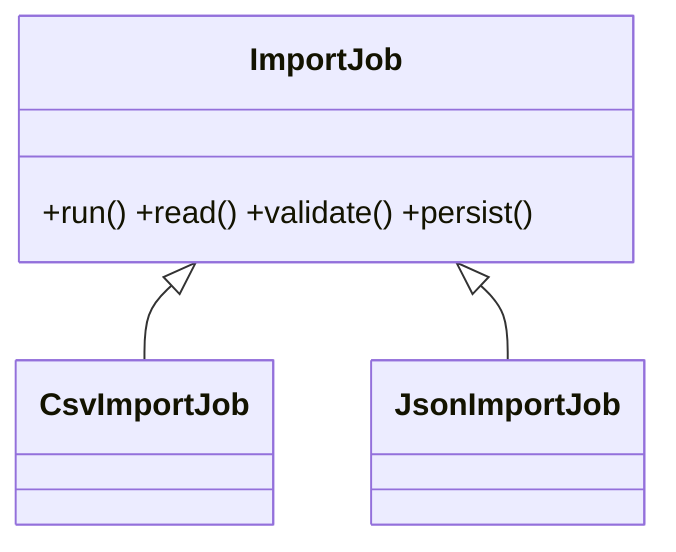

# Template Method Pattern

## Mục tiêu

Định nghĩa khung thuật toán và cho subclass tùy biến bước.

## Vấn đề thực tế

Hệ thống cần chuẩn hóa skeleton import với các bước tùy biến. Hiện tại CSV và JSON importer copy cùng flow validate/map/save, khiến thay đổi lan sang code nghiệp vụ và test.

## Dấu hiệu nhận biết

- Csv và json importer copy cùng flow validate/map/save.
- Test phải dựng chi tiết không liên quan đến behavior cần kiểm chứng.
- Yêu cầu mới buộc sửa class đang ổn định thay vì thêm collaborator độc lập.

## Ý tưởng giải pháp

Dùng Template Method để đặt boundary quanh phần thay đổi. Policy chính phụ thuộc contract nhỏ; chi tiết triển khai được đưa vào object có trách nhiệm rõ ràng.

## Khi nên dùng

- Quy trình ổn định, một số bước biến đổi.

## Khi không nên dùng

- Ưu tiên composition nếu inheritance gây coupling.

## Ưu điểm

- Cô lập thay đổi liên quan đến chuẩn hóa skeleton import với các bước tùy biến.
- Test policy và implementation độc lập.
- Thể hiện rõ quyết định dùng Template Method trong vocabulary của code.

## Nhược điểm

- Tăng số lượng type và bước điều hướng.
- Không có lợi nếu chuẩn hóa skeleton import với các bước tùy biến chỉ có một biến thể ổn định.
- Cần composition root rõ để tránh giấu call flow.

## Bài tập

Thực hiện yêu cầu: **thêm importer mới dùng chung parse/validate/persist flow**. Trước khi refactor, viết characterization test khóa behavior hiện tại; sau đó thêm implementation mới mà không sửa policy đã ổn định.

### Gợi ý cách làm

1. Khoanh vùng lực thay đổi: giữ skeleton algorithm nhưng cho subclass override hook.
2. Đặt contract nhỏ dùng vocabulary của use case, không dùng tên chung như `Behavior` hoặc `Manager`.
3. Di chuyển concrete detail ra sau contract; wiring tại composition root.
4. Viết test cho happy path, failure path và trường hợp implementation mới.
5. Hoàn thành khi: Base class bảo vệ thứ tự bước và hook contract.

### Tiêu chí tự review

- Invariant chính có được nói rõ: **skeleton giữ invariant dù subclass override hook**?
- Client đã ngừng phụ thuộc concrete detail nào, và dependency được wire ở đâu?
- Test có kiểm chứng **subclass hook failure và call order** thay vì chỉ assert class được gọi?
- Failure/return semantics giữa các implementation có nhất quán không?
- Inheritance làm coupling compile-time; Strategy linh hoạt hơn khi algorithm cần đổi runtime.

### Câu 1: Template Method giải quyết vấn đề gì?

**Trả lời:** Pattern này cô lập nhu cầu **giữ skeleton algorithm nhưng cho subclass override hook** sau một contract rõ ràng. Giá trị chính không phải giảm số dòng code mà là giảm phạm vi thay đổi và cho phép test policy tách khỏi concrete detail.

### Câu 2: Trade-off quan trọng nhất là gì?

**Trả lời:** Thiết kế thêm type, indirection và wiring. Nếu chỉ có một biến thể ổn định hoặc logic rất nhỏ, giải pháp trực tiếp thường dễ đọc hơn. Hãy chứng minh bằng change axis, testability hoặc ownership boundary thay vì áp dụng theo thói quen.  
> **Ngữ cảnh áp dụng:** Áp dụng riêng cho **Template Method Pattern**: liên hệ checklist với sơ đồ và code trước/sau trong bài, rồi nêu change axis mà pattern bảo vệ.

### Câu 3: So sánh với Strategy

**Trả lời:** Template Method dùng inheritance; Strategy dùng composition và thay thuật toán linh hoạt hơn.

### Câu 4: Bạn kiểm thử pattern này thế nào?

**Trả lời:** Bắt đầu bằng behavior contract của template method: subclass hook failure và call order. Sau đó thêm failure-path test cho exception/side effect, wiring test tại composition root và regression test để bảo đảm client không cần biết concrete implementation. Tránh mock từng method nội bộ vì điều đó khóa cấu trúc thay vì semantics.

## Template Method workflow



Base class cố định skeleton, hook chỉ mở những bước được phép; quá nhiều hook là dấu hiệu hierarchy khó hiểu.

## Minh họa trước và sau refactor

### Trước khi áp dụng

```php
final class CsvImporter { public function run() { /* open, parse, validate, save */ } }
final class JsonImporter { public function run() { /* open, parse, validate, save */ } }
```

### Sau khi áp dụng

```php
abstract class Importer
{
    final public function run(string $path): void
    {
        foreach ($this->parse($path) as $row) {
            $this->validate($row);
            $this->persist($row);
        }
    }
    abstract protected function parse(string $path): iterable;
}
```

> Ý tưởng trọng tâm: Base class giữ skeleton, subclass override hook.

## Ví dụ chạy được

Xem [`examples/creational/builder-report`](../../examples/creational/builder-report/README.md) để chạy bản `before.php` và `after.php`.

## Bài tập thực hành

1. Khóa behavior hiện tại bằng characterization test.
2. Thực hiện yêu cầu: override hook nhưng giữ transaction flow.
3. Viết một test cho failure path đặc trưng của Template Method.
4. Ghi rõ khi nào giải pháp trực tiếp sẽ dễ hiểu hơn.

### Gợi ý thực hiện bài tập thực hành

1. Viết characterization test tái hiện pain point của template method.
2. Đánh dấu chính xác nơi invariant “skeleton giữ invariant dù subclass override hook” đang bị đe dọa.
3. Refactor một dependency hoặc branch mỗi lần; giữ output/public API trong bước đầu.
4. Chứng minh thiết kế bằng phép thử: **subclass hook failure và call order**.
5. Ghi lại trường hợp không áp dụng: Inheritance làm coupling compile-time; Strategy linh hoạt hơn khi algorithm cần đổi runtime.

### Câu hỏi quan sát

- Trong ví dụ này, lực thay đổi nào được Template Method cô lập?
- Client còn biết concrete class hoặc lifecycle detail nào không?
- Test nào chứng minh có thể thay implementation mà không sửa policy?

## Hướng refactor an toàn

1. Viết characterization test cho behavior hiện tại, đặc biệt quanh **khung thuật toán ổn định với hook có kiểm soát**.
2. Đánh dấu đúng change axis và dependency cần đảo chiều; chưa tạo interface cho phần ổn định.
3. Tách một bước nhỏ, giữ public behavior và chạy test sau mỗi commit.
4. Kiểm tra subclass không phá invariant của skeleton.
5. So sánh độ đọc hiểu, số type và chi phí wiring với phiên bản trực tiếp trước khi chấp nhận refactor.

## Kiểm thử nên tập trung vào đâu?

- **Behavior/contract:** kiểm tra subclass không phá invariant của skeleton.
- **Failure semantics:** exception, kết quả rỗng và side effect phải nhất quán giữa các implementation.
- **Wiring:** composition root chọn đúng collaborator mà không để client phụ thuộc concrete type.
- **Regression:** test bảo vệ behavior cũ, không khóa private method hoặc cấu trúc class.

Template Method dùng inheritance nên coupling cao hơn Strategy; ưu tiên khi skeleton thực sự ổn định.

## Câu hỏi tự review

1. Pattern này đang bảo vệ **khung thuật toán ổn định với hook có kiểm soát** hay chỉ tăng số lớp?
2. Test nào thất bại nếu một implementation vi phạm contract nhưng vẫn trả đúng kiểu dữ liệu?
3. Concrete detail nào đã biến mất khỏi client sau refactor?
4. Template Method dùng inheritance nên coupling cao hơn Strategy; ưu tiên khi skeleton thực sự ổn định.

