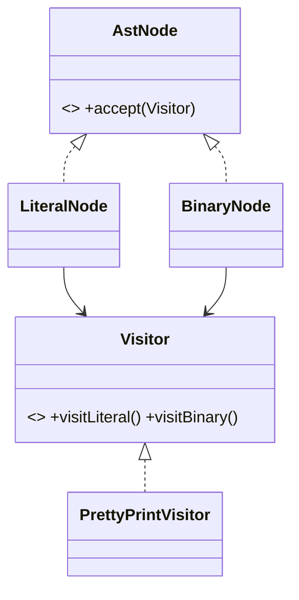

# Visitor Pattern

## Mục tiêu

Thêm operation lên object structure mà ít sửa element.

## Vấn đề thực tế

Hệ thống cần thêm operation báo cáo cho object graph ổn định. Hiện tại mỗi element phải thêm method cho từng loại report, khiến thay đổi lan sang code nghiệp vụ và test.

## Dấu hiệu nhận biết

- Mỗi element phải thêm method cho từng loại report.
- Test phải dựng chi tiết không liên quan đến behavior cần kiểm chứng.
- Yêu cầu mới buộc sửa class đang ổn định thay vì thêm collaborator độc lập.

## Ý tưởng giải pháp

Dùng Visitor để đặt boundary quanh phần thay đổi. Policy chính phụ thuộc contract nhỏ; chi tiết triển khai được đưa vào object có trách nhiệm rõ ràng.

## Khi nên dùng

- AST, reporting trên cấu trúc ổn định.

## Khi không nên dùng

- Không dùng nếu element thay đổi thường xuyên.

## Ưu điểm

- Cô lập thay đổi liên quan đến thêm operation báo cáo cho object graph ổn định.
- Test policy và implementation độc lập.
- Thể hiện rõ quyết định dùng Visitor trong vocabulary của code.

## Nhược điểm

- Tăng số lượng type và bước điều hướng.
- Không có lợi nếu thêm operation báo cáo cho object graph ổn định chỉ có một biến thể ổn định.
- Cần composition root rõ để tránh giấu call flow.

## Bài tập

Thực hiện yêu cầu: **thêm export operation cho AST mà node classes không đổi**. Trước khi refactor, viết characterization test khóa behavior hiện tại; sau đó thêm implementation mới mà không sửa policy đã ổn định.

### Gợi ý cách làm

1. Khoanh vùng lực thay đổi: thêm operation mới lên object structure ổn định.
2. Đặt contract nhỏ dùng vocabulary của use case, không dùng tên chung như `Behavior` hoặc `Manager`.
3. Di chuyển concrete detail ra sau contract; wiring tại composition root.
4. Viết test cho happy path, failure path và trường hợp implementation mới.
5. Hoàn thành khi: Visitor xử lý mọi concrete element và compiler/test phát hiện thiếu case.

### Tiêu chí tự review

- Invariant chính có được nói rõ: **operation mới thêm mà không sửa element classes**?
- Client đã ngừng phụ thuộc concrete detail nào, và dependency được wire ở đâu?
- Test có kiểm chứng **visitor mới, unknown node và exhaustiveness** thay vì chỉ assert class được gọi?
- Failure/return semantics giữa các implementation có nhất quán không?
- Visitor bất lợi khi node type thay đổi thường xuyên.

### Câu 1: Visitor giải quyết vấn đề gì?

**Trả lời:** Pattern này cô lập nhu cầu **thêm operation mới lên object structure ổn định** sau một contract rõ ràng. Giá trị chính không phải giảm số dòng code mà là giảm phạm vi thay đổi và cho phép test policy tách khỏi concrete detail.

### Câu 2: Trade-off quan trọng nhất là gì?

**Trả lời:** Thiết kế thêm type, indirection và wiring. Nếu chỉ có một biến thể ổn định hoặc logic rất nhỏ, giải pháp trực tiếp thường dễ đọc hơn. Hãy chứng minh bằng change axis, testability hoặc ownership boundary thay vì áp dụng theo thói quen.  
> **Ngữ cảnh áp dụng:** Áp dụng riêng cho **Visitor Pattern**: liên hệ checklist với sơ đồ và code trước/sau trong bài, rồi nêu change axis mà pattern bảo vệ.

### Câu 3: So sánh với Double Dispatch hoặc method trực tiếp

**Trả lời:** Visitor dễ thêm operation nhưng khó thêm element; method trực tiếp có trade-off ngược lại.

### Câu 4: Bạn kiểm thử pattern này thế nào?

**Trả lời:** Bắt đầu bằng behavior contract của visitor: visitor mới, unknown node và exhaustiveness. Sau đó thêm failure-path test cho exception/side effect, wiring test tại composition root và regression test để bảo đảm client không cần biết concrete implementation. Tránh mock từng method nội bộ vì điều đó khóa cấu trúc thay vì semantics.

## UML Visitor



Visitor mở rộng operation trên object structure ổn định; thêm node type mới sẽ buộc cập nhật mọi visitor.

## Minh họa trước và sau refactor

### Trước khi áp dụng

```php
foreach ($nodes as $node) {
    if ($node instanceof NumberNode) { /* export number */ }
    elseif ($node instanceof AddNode) { /* export addition */ }
}
```

### Sau khi áp dụng

```php
interface AstVisitor
{
    public function visitNumber(NumberNode $node): string;
    public function visitAdd(AddNode $node): string;
}

final class SqlVisitor implements AstVisitor { /* one operation over all node types */ }
$result = $expression->accept(new SqlVisitor());
```

> Ý tưởng trọng tâm: Visitor đóng gói operation trên object structure.

## Ví dụ chạy được

Xem [`examples/enterprise/specification-discount`](../../examples/enterprise/specification-discount/README.md) để chạy bản `before.php` và `after.php`.

## Bài tập thực hành

1. Khóa behavior hiện tại bằng characterization test.
2. Thực hiện yêu cầu: thêm exporter mới mà element không đổi.
3. Viết một test cho failure path đặc trưng của Visitor.
4. Ghi rõ khi nào giải pháp trực tiếp sẽ dễ hiểu hơn.

### Gợi ý thực hiện bài tập thực hành

1. Viết characterization test tái hiện pain point của visitor.
2. Đánh dấu chính xác nơi invariant “operation mới thêm mà không sửa element classes” đang bị đe dọa.
3. Refactor một dependency hoặc branch mỗi lần; giữ output/public API trong bước đầu.
4. Chứng minh thiết kế bằng phép thử: **visitor mới, unknown node và exhaustiveness**.
5. Ghi lại trường hợp không áp dụng: Visitor bất lợi khi node type thay đổi thường xuyên.

### Câu hỏi quan sát

- Trong ví dụ này, lực thay đổi nào được Visitor cô lập?
- Client còn biết concrete class hoặc lifecycle detail nào không?
- Test nào chứng minh có thể thay implementation mà không sửa policy?

## Hướng refactor an toàn

1. Viết characterization test cho behavior hiện tại, đặc biệt quanh **thêm operation mới trên object structure ổn định**.
2. Đánh dấu đúng change axis và dependency cần đảo chiều; chưa tạo interface cho phần ổn định.
3. Tách một bước nhỏ, giữ public behavior và chạy test sau mỗi commit.
4. Thêm visitor mới và kiểm tra exhaustiveness khi có node mới.
5. So sánh độ đọc hiểu, số type và chi phí wiring với phiên bản trực tiếp trước khi chấp nhận refactor.

## Kiểm thử nên tập trung vào đâu?

- **Behavior/contract:** thêm visitor mới và kiểm tra exhaustiveness khi có node mới.
- **Failure semantics:** exception, kết quả rỗng và side effect phải nhất quán giữa các implementation.
- **Wiring:** composition root chọn đúng collaborator mà không để client phụ thuộc concrete type.
- **Regression:** test bảo vệ behavior cũ, không khóa private method hoặc cấu trúc class.

Visitor thuận lợi khi operation tăng thường xuyên; bất lợi khi element type thay đổi nhiều.

## Câu hỏi tự review

1. Pattern này đang bảo vệ **thêm operation mới trên object structure ổn định** hay chỉ tăng số lớp?
2. Test nào thất bại nếu một implementation vi phạm contract nhưng vẫn trả đúng kiểu dữ liệu?
3. Concrete detail nào đã biến mất khỏi client sau refactor?
4. Visitor thuận lợi khi operation tăng thường xuyên; bất lợi khi element type thay đổi nhiều.

