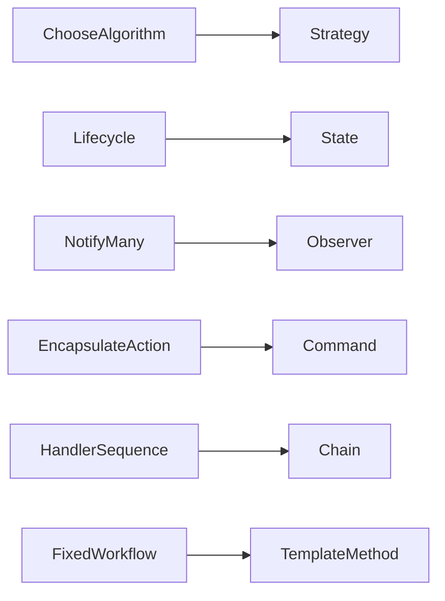

# Behavioral Patterns

Nhóm Behavioral tập trung vào phân phối trách nhiệm, luồng điều khiển, transition và giao tiếp giữa object.

## Mục tiêu học tập

- Nhận diện algorithm, state, command, event, chain và collaboration thay đổi độc lập.
- Làm rõ synchronous/asynchronous semantics, ordering, retry và idempotency.
- Giữ domain invariant rõ ràng dù control flow được phân tán.

## Nội dung

| Tài liệu | Giá trị chính |
|---|---|
| [Chain of Responsibility Pattern](01-chain-of-responsibility.md) | Học và áp dụng chủ đề **Chain of Responsibility Pattern** qua context, trade-off và bài tập liên quan. |
| [Command Pattern](02-command.md) | Học và áp dụng chủ đề **Command Pattern** qua context, trade-off và bài tập liên quan. |
| [Interpreter Pattern](03-interpreter.md) | Học và áp dụng chủ đề **Interpreter Pattern** qua context, trade-off và bài tập liên quan. |
| [Iterator Pattern](04-iterator.md) | Học và áp dụng chủ đề **Iterator Pattern** qua context, trade-off và bài tập liên quan. |
| [Mediator Pattern](05-mediator.md) | Học và áp dụng chủ đề **Mediator Pattern** qua context, trade-off và bài tập liên quan. |
| [Memento Pattern](06-memento.md) | Học và áp dụng chủ đề **Memento Pattern** qua context, trade-off và bài tập liên quan. |
| [Observer Pattern](07-observer.md) | Học và áp dụng chủ đề **Observer Pattern** qua context, trade-off và bài tập liên quan. |
| [State Pattern](08-state.md) | Học và áp dụng chủ đề **State Pattern** qua context, trade-off và bài tập liên quan. |
| [Strategy Pattern](09-strategy.md) | Học và áp dụng chủ đề **Strategy Pattern** qua context, trade-off và bài tập liên quan. |
| [Template Method Pattern](10-template-method.md) | Học và áp dụng chủ đề **Template Method Pattern** qua context, trade-off và bài tập liên quan. |
| [Visitor Pattern](11-visitor.md) | Học và áp dụng chủ đề **Visitor Pattern** qua context, trade-off và bài tập liên quan. |

## Cách học đề xuất

1. Viết ra behavior đang thay đổi: algorithm, state transition, command hay event reaction.
2. Dùng sequence/state diagram trước khi tạo interface.
3. So sánh Strategy–State, Command–Strategy và Chain–Pipeline.
4. Test transition, ordering, duplicate delivery và undo/retry khi liên quan.
5. Đánh giá lifecycle của object và ownership của side effect.

## Tiêu chí hoàn thành

- Chọn pattern theo loại collaboration runtime.
- Mô hình hóa state transition và invalid path rõ ràng.
- Test ordering/delivery semantics thay vì chỉ assert class được gọi.
- Nêu được chi phí indirection và lifecycle complexity.

## Bản đồ lựa chọn

