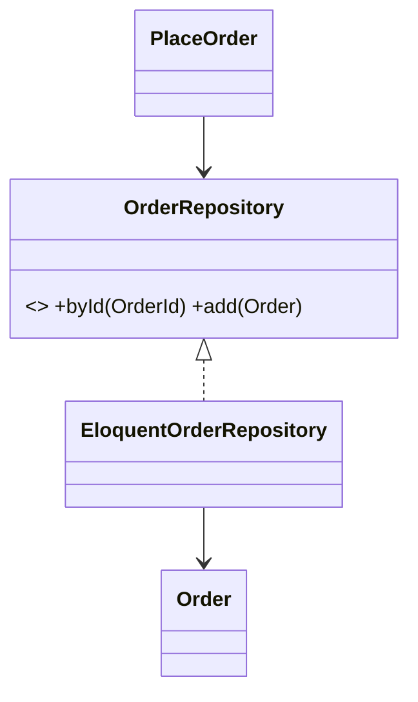
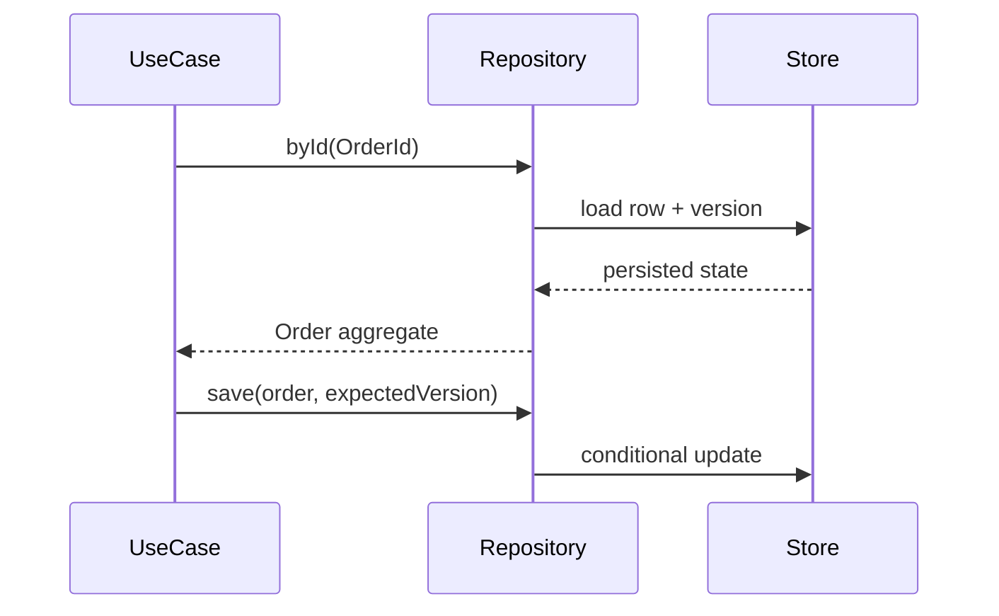

# Repository Pattern

## Mục tiêu

Tạo một collection-like boundary cho aggregate, để application dùng ngôn ngữ nghiệp vụ thay vì SQL/ORM.

## Vấn đề cần giải quyết

Repository không phải lớp “đổi tên” cho `Model::find()` hoặc `query()->where()`. Nó hữu ích khi application cần tải và lưu aggregate theo semantics ổn định, trong khi chi tiết persistence, mapping, caching hoặc nguồn dữ liệu có thể thay đổi.

Ba câu hỏi trước khi tạo repository:

1. Đối tượng được truy cập có phải aggregate/root với invariant cần bảo vệ không?
2. Contract có thể đặt tên theo use case như `ordersAwaitingPayment()` hay chỉ là CRUD chung?
3. Repository có giúp domain/application không biết ORM, hay chỉ thêm một lớp forwarding?

## Mô hình cộng tác

## Cách áp dụng trong PHP

Repository nên trả domain object/aggregate, không trả query builder. Query báo cáo, filter động và projection lớn thường thuộc Query Object hoặc read model. Transaction boundary thường do application service/Unit of Work kiểm soát, không nằm rải rác trong từng repository method.

## Khi nên dùng

- Aggregate có identity/invariant và được tải–lưu qua nhiều use case.
- Application cần collection semantics như `byId`, `add`, `ordersAwaitingPayment`.
- Cần contract test dùng chung cho in-memory và persistence implementation.

## Khi không nên dùng

- Màn hình CRUD đơn giản có thể dùng ORM trực tiếp.
- Reporting/filter động phù hợp Query Object hơn.
- Contract chỉ sao chép tên method của ORM mà không thêm domain semantics.

## Trade-off và rủi ro

Repository tạo vocabulary và collection semantics cho aggregate nhưng thêm mapping/wiring. Chi phí chỉ hợp lý khi domain query, persistence isolation hoặc nhiều adapter thực sự tồn tại.

## Kiểm thử

1. Contract test cho `add`, `get`, not-found và uniqueness semantics.
2. Integration test mapping aggregate ↔ persistence.
3. Test transaction/locking ở nơi repository tham gia consistency boundary.
4. Test tenant hoặc ownership filter nếu repository phục vụ multi-tenant.

## Bài tập có hướng dẫn

Viết `OrderRepository` với in-memory implementation. Test uniqueness của order number, not-found semantics và việc application service không import ORM class.

### Tiêu chí hoàn thành

- Method dùng ngôn ngữ domain, không trả Query Builder.
- Not-found/duplicate semantics rõ bằng type hoặc exception.
- In-memory và real implementation cùng pass contract test.
- Reporting query được tách khỏi aggregate repository.

## Tài liệu liên quan

- [Repository exercise](../../exercises/module-16-repository/README.md)
- [Production Repository exercise](../../exercises/module-42-repository/README.md)
- [ADR về Repository](../../decisions/examples/003-repository-usage-policy.md)
- [Repository source](../../src/Enterprise/Repository/)

## Phân tích sâu

**Mental model:** Repository là collection nghiệp vụ của aggregate. Mental model cần giữ là identity + aggregate semantics + optimistic version; reporting/filter động không thuộc boundary này.

## Failure và observability

Repository cần phân biệt aggregate không tồn tại, optimistic-lock conflict và storage outage. Theo dõi load/save latency, conflict rate và aggregate size; log identifier có kiểm soát, không ghi toàn bộ entity.

## Test strategy chi tiết

Tập trung vào save/load aggregate, optimistic locking, not-found semantics. Kết hợp unit test cho policy/contract, integration test cho mapping/query/transaction và architecture test cho dependency direction. Một test chỉ xác minh method được gọi chưa đủ chứng minh pattern giữ đúng behavior.

## Quyết định áp dụng

Đối chiếu Repository với việc dùng ORM trực tiếp. ADR phải ghi aggregate semantics, transaction owner, contract tests và trigger loại bỏ Repository nếu nó chỉ forward CRUD.
