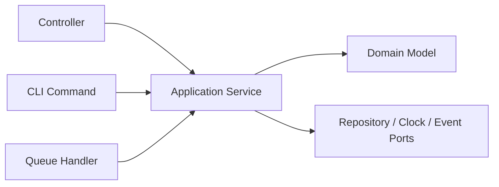
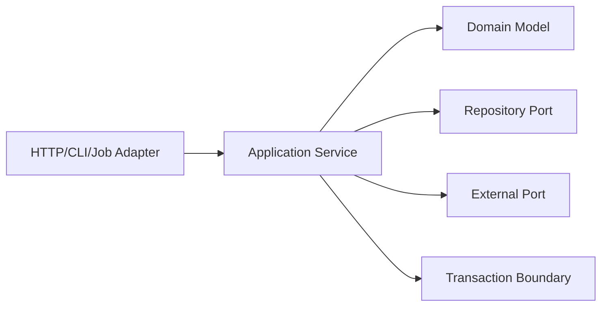

# Service Layer

## Mục tiêu

Đặt use-case orchestration vào một boundary rõ giữa transport và domain.

## Vấn đề cần giải quyết

Controller, CLI command và queue handler thường cần cùng một use case. Nếu workflow nằm trong controller, logic bị nhân bản; nếu dồn vào entity, entity phải biết transaction, authorization hoặc event publishing. Service Layer giải quyết khoảng trống đó.

Application service nên:
- nhận command/input DTO đã validate ở mức transport;
- tải aggregate qua port;
- gọi domain behavior;
- quản lý transaction;
- ghi event/outbox;
- trả result độc lập HTTP/framework.

## Mô hình cộng tác

## Cách áp dụng trong PHP

Service Layer không phải “Big Service”. Business invariant vẫn thuộc entity/value object/domain service phù hợp. Application service điều phối một use case, không trở thành nơi chứa mọi helper.

## Khi nên dùng

- Một use case điều phối nhiều aggregate, repository hoặc external port.
- Cần transaction boundary, authorization context hoặc orchestration rõ.
- Controller/CLI/Job phải dùng chung cùng workflow.

## Khi không nên dùng

- Logic chỉ là một phép gọi domain object đơn giản.
- Service chỉ forward từng method mà không sở hữu use case.
- Business rule bị kéo khỏi entity/value object chỉ để “service hóa”.

## Trade-off và rủi ro

Service Layer làm rõ application workflow nhưng có thể trở thành lớp trung gian vô nghĩa. Chỉ giữ nó khi có orchestration, policy coordination hoặc nhiều entrypoint dùng chung use case.

## Kiểm thử

1. Unit test orchestration với fake ports/repositories.
2. Test transaction rollback khi một bước thất bại.
3. Test authorization/idempotency ở application boundary.
4. Integration test wiring với framework entry point.

## Bài tập có hướng dẫn

Thiết kế `ApproveInvoice` dùng repository, clock và event publisher. Viết test transaction rollback khi invariant thất bại.

### Tiêu chí hoàn thành

- Method đặt tên theo use case, không phải CRUD chung.
- Transaction và side-effect ordering được mô tả rõ.
- Domain rule vẫn nằm trong domain object/policy phù hợp.
- Controller/Job chỉ chuyển input và map output.

## Tình huống thực tế: đăng ký khách hàng

`CustomerRegistrationService` phải kiểm tra identity duplicate, tạo aggregate, lưu qua repository và phát `CustomerRegistered` sau commit. Domain object sở hữu rule email/status; application service sở hữu orchestration và transaction. Nếu provider gửi welcome email lỗi, registration không được rollback mù quáng: email là side effect hậu commit và cần retry/idempotency riêng. Evidence tốt gồm use-case test với fake ports, integration test transaction và metric cho duplicate registration hoặc welcome delivery failure.

## Tài liệu liên quan

- [Service Layer exercise](../../exercises/module-26-service-layer/README.md)
- [Production Service Layer exercise](../../exercises/module-52-service-layer/README.md)
- [Application Service trong Laravel](../../framework-integration/laravel/02-application-services.md)
- [Service Layer source](../../src/Enterprise/ServiceLayer/)

## Phân tích sâu

**Mental model:** Service Layer điều phối một use case: bắt đầu transaction, tải aggregate, gọi domain behavior, persistence và phát event. Nó không được trở thành nơi chứa toàn bộ business rule.

## Failure và observability

Service Layer phải phân biệt validation, authorization, domain conflict và dependency failure. Theo dõi use-case latency, rollback count và side-effect failure; correlation id phải đi xuyên transaction và outbound call.

## Test strategy chi tiết

Tập trung vào thin controller, explicit command, rollback và side-effect ordering. Kết hợp unit test cho policy/contract, integration test cho mapping/query/transaction và architecture test cho dependency direction. Một test chỉ xác minh method được gọi chưa đủ chứng minh pattern giữ đúng behavior.

## Quyết định áp dụng

So sánh Service Layer với controller/transaction script. Ghi rõ use-case boundary, transaction owner, orchestration test và dấu hiệu service đang biến thành God Object.
