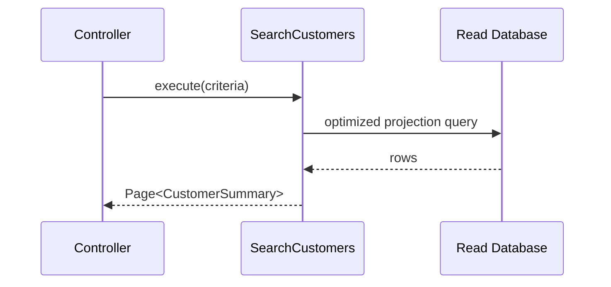
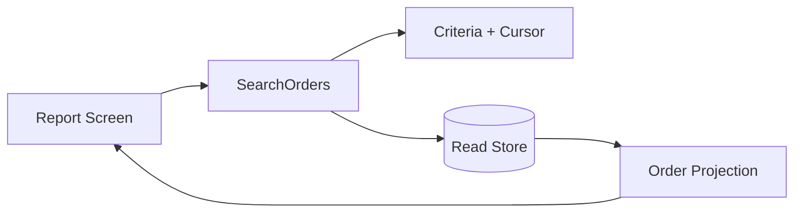

# Query Object

## Mục tiêu

Đóng gói truy vấn đọc phức tạp và trả read model đúng nhu cầu màn hình/API.

## Vấn đề cần giải quyết

Read side thay đổi theo filter, sort, pagination và projection. Ép các truy vấn này vào aggregate repository thường làm contract persistence bị kéo theo yêu cầu UI. Query Object tạo một đơn vị có tên, input rõ và output ổn định.

Một Query Object tốt mô tả câu hỏi của hệ thống: `SearchActiveCustomers`, `MonthlyRevenueReport`, không phải `GenericQueryBuilder`.

## Mô hình cộng tác

## Cách áp dụng trong PHP

Query Object có thể dùng SQL/ORM trực tiếp vì nó là adapter đọc. Tuy nhiên output nên là read model/DTO, không trả ORM model sống. Hãy test filter semantics và pagination; integration test query plan/index cho truy vấn quan trọng.

## Khi nên dùng

- Read use case có filter, sort, projection hoặc pagination riêng.
- Query thay đổi độc lập với aggregate write model.
- Cần tối ưu SQL/index mà không làm rò persistence vào controller.

## Khi không nên dùng

- Query chỉ là `findById` ổn định.
- Cần thay đổi aggregate và read trong cùng transaction.
- Object trở thành “generic query builder” nhận mọi field.

## Trade-off và rủi ro

Query Object cô lập read complexity và tối ưu projection nhưng tăng số type và mapping. Chi phí hợp lý khi read model có lifecycle/performance khác write model.

## Kiểm thử

1. Integration test trên schema/index thật cho filter và ordering.
2. Test cursor/page boundary và deterministic sorting.
3. Test projection mapping khi column null/optional.
4. Performance regression test cho query quan trọng.

## Bài tập có hướng dẫn

Tạo `SearchOrders` hỗ trợ status, date range, cursor pagination và stable sort. Giải thích vì sao không đặt nó trong `OrderRepository`.

### Tiêu chí hoàn thành

- Tên query phản ánh màn hình/use case đọc.
- Input criteria được validate và type hóa.
- Output là projection/read model, không phải query builder.
- Explain plan hoặc index assumption được ghi lại cho query lớn.

## Tình huống thực tế: danh sách đơn hàng backoffice

`SearchOrders` nhận criteria bất biến, dùng half-open date range và sort `created_at DESC, id DESC` để cursor ổn định. Query trả projection vừa đủ cho bảng, không hydrate aggregate. Cần kiểm tra query plan, composite index, giới hạn page size và behavior khi cursor cũ sau dữ liệu mới được chèn. Evidence gồm boundary tests cho thời gian, property test không trùng/không bỏ sót record và benchmark bằng dataset đại diện thay vì vài chục row.

## Tài liệu liên quan

- [Query Object exercise](../../exercises/module-17-query-object/README.md)
- [Production Query Object exercise](../../exercises/module-43-query-object/README.md)
- [ADR Query Object](../../decisions/examples/006-query-object-for-complex-read-models.md)
- [Query source](../../src/Enterprise/Query/)

## Phân tích sâu

**Mental model:** Query Object là read concern: criteria, sort ổn định, pagination và projection. Nó tối ưu cho câu hỏi của màn hình, không giả vờ là aggregate repository.

## Failure và observability

Query Object cần biểu diễn invalid filter, timeout và pagination cursor lỗi rõ ràng. Theo dõi query latency, rows scanned, cache hit và slow-query count; không gắn raw search term nhạy cảm vào metric label.

## Test strategy chi tiết

Tập trung vào stable filters, explain plan, deterministic ordering. Kết hợp unit test cho policy/contract, integration test cho mapping/query/transaction và architecture test cho dependency direction. Một test chỉ xác minh method được gọi chưa đủ chứng minh pattern giữ đúng behavior.

## Quyết định áp dụng

So sánh Query Object với scope/repository method. Ghi query plan, pagination contract, projection schema và trigger tách query khi báo cáo thay đổi độc lập aggregate.
