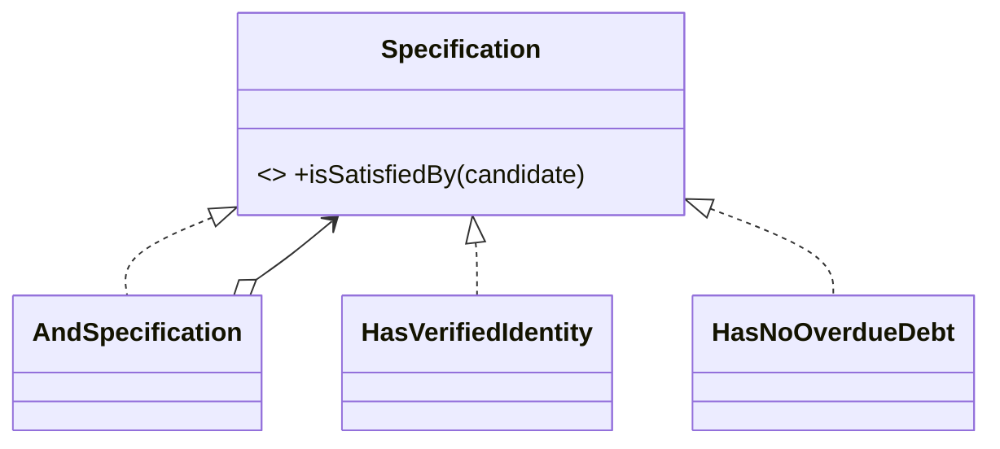
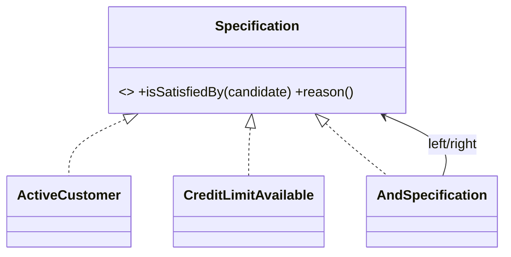

# Specification Pattern

## Mục tiêu

Biểu diễn rule nghiệp vụ có tên và có thể kết hợp, kiểm thử độc lập.

## Vấn đề cần giải quyết

Specification phù hợp khi cùng một rule được dùng ở nhiều use case hoặc cần composition AND/OR/NOT. Giá trị lớn nhất là vocabulary và khả năng giải thích, không phải biến mọi `if` thành object.

Ví dụ `CustomerIsEligibleForCredit` có thể kết hợp `HasVerifiedIdentity`, `HasNoOverdueDebt` và `WithinCreditLimit`.

## Mô hình cộng tác

## Cách áp dụng trong PHP

Tránh specification chỉ bọc một biểu thức dùng một lần hoặc phụ thuộc query builder. Nếu cần translate specification thành SQL, hãy tách domain specification với query criteria hoặc giới hạn rõ subset có thể translate.

## Khi nên dùng

- Business rule cần tái sử dụng và kết hợp AND/OR/NOT.
- Cần giải thích vì sao candidate đạt/không đạt rule.
- Rule được dùng ở validation, eligibility hoặc policy evaluation.

## Khi không nên dùng

- Điều kiện chỉ dùng một lần và rất ngắn.
- Specification bị dùng để xây SQL tùy ý nhưng không có domain meaning.
- Rule cần side effect hoặc orchestration thay vì predicate thuần.

## Trade-off và rủi ro

Specification giúp đặt tên/combine rule nhưng dễ tạo object graph khó đọc. Chỉ dùng khi rule cần tái sử dụng, giải thích hoặc kết hợp; predicate nhỏ vẫn là baseline tốt.

## Kiểm thử

1. Truth table cho mỗi atomic specification.
2. Property-based test cho composition AND/OR/NOT.
3. Test edge cases ở boundary giá trị/thời gian.
4. Nếu translate sang SQL, contract test parity giữa in-memory và database.

## Bài tập có hướng dẫn

Viết eligibility specification có lý do từ chối, truth table và test composition. So sánh với Policy object trả decision chi tiết.

### Tiêu chí hoàn thành

- Mỗi specification có tên nghiệp vụ rõ.
- Predicate thuần, không side effect.
- Composition giữ semantics và short-circuit mong đợi.
- Có test cho boundary/negative cases, không chỉ happy path.

## Tình huống thực tế: eligibility cho promotion

Promotion chỉ áp dụng khi customer active, market phù hợp, minimum spend đạt và không thuộc risk segment. Mỗi specification trả boolean cùng reason code; `AndSpecification` giữ thứ tự giải thích có chủ đích để UI và audit biết rule nào từ chối. Không nên biến mọi điều kiện kỹ thuật thành Specification: timeout hoặc database availability là failure của infrastructure. Evidence gồm truth table, property test cho phép kết hợp và review vocabulary với domain expert.

## Tài liệu liên quan

- [Specification exercise](../../exercises/module-18-specification/README.md)
- [Production Specification exercise](../../exercises/module-44-specification/README.md)
- [Specification lab](../../labs/advanced/discount-engine/README.md)
- [Specification source](../../src/Enterprise/Specification/)

## Phân tích sâu

**Mental model:** Specification đóng gói predicate nghiệp vụ có thể đặt tên, kết hợp và giải thích. Mental model là rule composition + reason code, không phải wrapper tùy ý cho mọi boolean.

## Failure và observability

Specification nên trả predicate deterministic; lỗi thường là dữ liệu thiếu hoặc rule không áp dụng được, không phải timeout. Theo dõi rule-match distribution và version; audit cần giải thích specification nào tạo quyết định.

## Test strategy chi tiết

Tập trung vào truth table, edge cases, avoid leaky ORM expression. Kết hợp unit test cho policy/contract, integration test cho mapping/query/transaction và architecture test cho dependency direction. Một test chỉ xác minh method được gọi chưa đủ chứng minh pattern giữ đúng behavior.

## Quyết định áp dụng

So sánh Specification với predicate/function đơn giản. Ghi rule reuse, composition semantics, reason code và property-based tests cho luật kết hợp.
