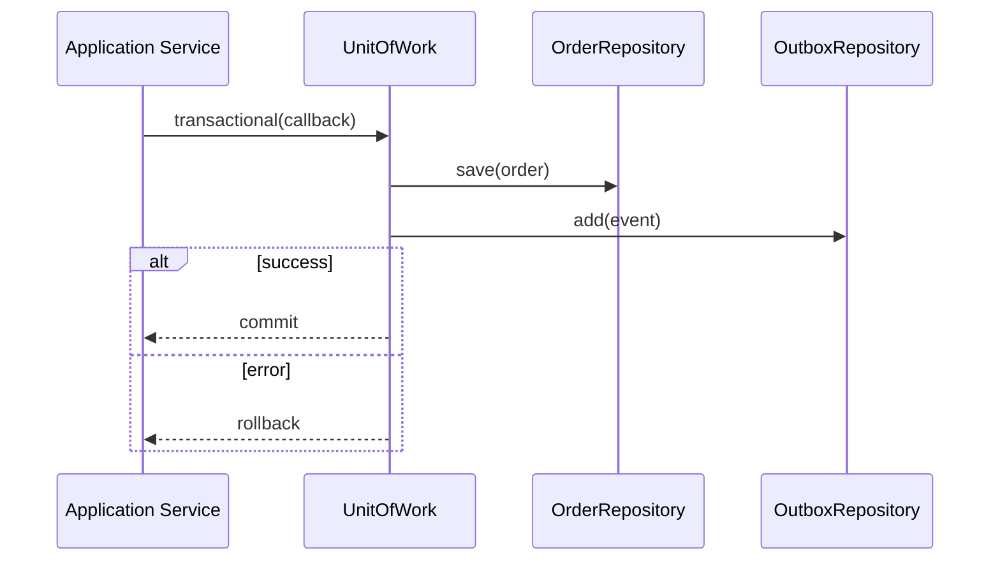
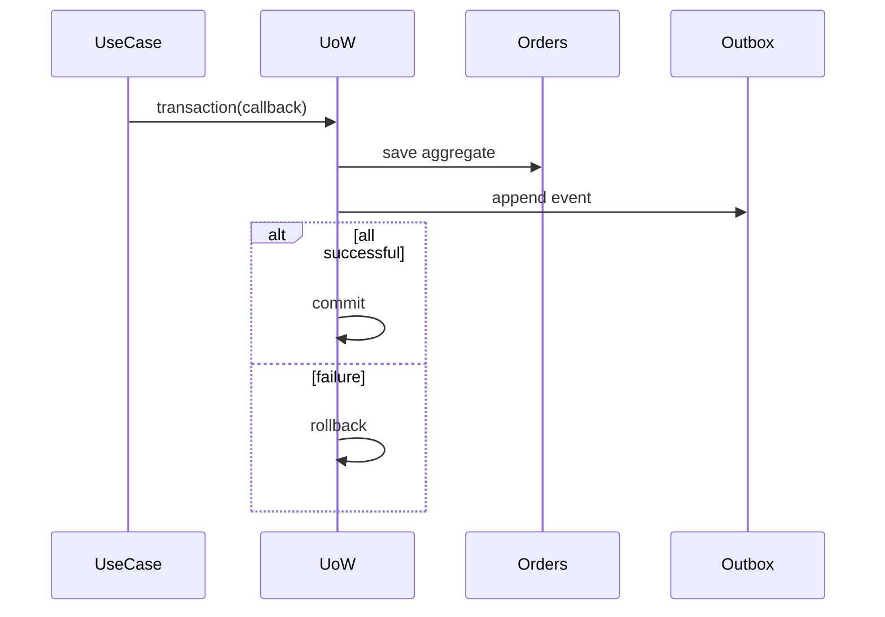

# Unit of Work

## Mục tiêu

Quản lý một transaction boundary gồm nhiều thay đổi và bảo đảm commit/rollback nhất quán.

## Vấn đề cần giải quyết

Khi một use case thay đổi nhiều aggregate hoặc ghi thêm outbox/audit record, từng repository tự commit sẽ tạo partial state. Unit of Work gom các thay đổi trong một transaction do application service sở hữu.

Trong ORM hiện đại, Entity Manager/DB transaction đã cung cấp nhiều behavior của Unit of Work. Không cần bọc lại chỉ để đổi tên; chỉ tạo port nếu application cần độc lập framework hoặc semantics bổ sung.

## Mô hình cộng tác

## Cách áp dụng trong PHP

Phải định nghĩa nested transaction policy, exception propagation và side effect ngoài database. Không gọi network trong transaction dài; ghi intent vào outbox rồi publish sau commit.

## Khi nên dùng

- Nhiều thay đổi phải commit/rollback như một consistency boundary.
- ORM tracking hoặc explicit change set cần được gom lại.
- Application service cần kiểm soát transaction một cách nhất quán.

## Khi không nên dùng

- Mỗi operation đã atomic tại storage.
- Transaction kéo dài qua network call hoặc user interaction.
- Unit of Work bị trộn với Repository/Service Locator.

## Trade-off và rủi ro

Unit of Work điều phối persistence atomically nhưng che giấu thời điểm I/O nếu thiết kế kém. Dùng khi nhiều aggregate/repository phải commit cùng boundary; tránh khi một transaction script đã đủ rõ.

## Kiểm thử

1. Test commit chỉ xảy ra một lần ở outer transaction.
2. Test rollback khi callback ném exception.
3. Test nested transaction semantics hoặc cấm nesting rõ ràng.
4. Integration test deadlock/retry policy với database thật.

## Bài tập có hướng dẫn

Viết `InMemoryUnitOfWork` và integration test database cho rollback khi outbox insert thất bại.

### Tiêu chí hoàn thành

- Transaction boundary nằm ở application use case.
- External call không nằm trong DB transaction dài.
- Rollback semantics rõ khi partial side effect đã xảy ra.
- Metrics/log có transaction/correlation context.

## Tình huống thực tế: đặt hàng và outbox

Use case tạo Order, trừ reservation và append integration event phải commit nguyên tử. Unit of Work mở transaction, repository ghi state và outbox ghi event trong cùng connection; publisher chạy sau đó. Cần mô phỏng lỗi trước commit, sau commit nhưng trước publish và duplicate publish. Evidence không chỉ là mock `commit()` được gọi, mà là integration test chứng minh rollback, visibility của transaction và reconciliation cho pending outbox quá lâu.

## Tài liệu liên quan

- [Unit of Work exercise](../../exercises/module-19-unit-of-work/README.md)
- [Production Unit of Work exercise](../../exercises/module-45-unit-of-work/README.md)
- [Transactional Outbox lab](../../labs/advanced/05-transactional-outbox/README.md)
- [Unit of Work source](../../src/Enterprise/UnitOfWork/)

## Phân tích sâu

**Mental model:** Unit of Work sở hữu atomic boundary và tracked changes. Câu hỏi trung tâm là commit/rollback nào phải xảy ra cùng nhau, không phải gom repository vào một class lớn.

## Failure và observability

Unit of Work phải làm rõ commit conflict, rollback failure và partial side effect. Theo dõi transaction duration, rollback count, deadlock và outbox backlog; mọi recovery cần transaction/correlation id.

## Test strategy chi tiết

Tập trung vào partial failure, nested transaction, outbox coordination. Kết hợp unit test cho policy/contract, integration test cho mapping/query/transaction và architecture test cho dependency direction. Một test chỉ xác minh method được gọi chưa đủ chứng minh pattern giữ đúng behavior.

## Quyết định áp dụng

So sánh Unit of Work với transaction callback trực tiếp. Ghi identity map, commit order, rollback semantics và test failure giữa nhiều repository.
