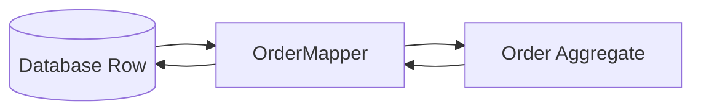
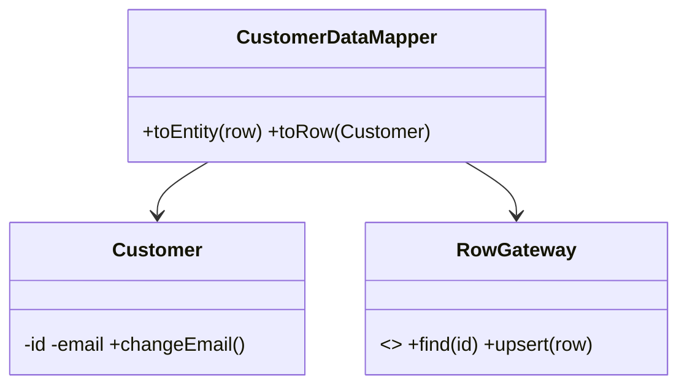

# Data Mapper

## Mục tiêu

Tách domain object khỏi schema và persistence API.

## Vấn đề cần giải quyết

Data Mapper chuyển đổi giữa row/document và entity/value object. Domain model không có `save()`, không biết tên cột và không phụ thuộc ORM annotation/attribute nếu mục tiêu là model độc lập.

Pattern phù hợp với domain phức tạp hoặc nhiều mapping rule; CRUD đơn giản có thể dùng Active Record hiệu quả hơn.

## Mô hình cộng tác

## Cách áp dụng trong PHP

Mapper phải xử lý identity, nullability, enum/value object, version và backward-compatible schema. Đừng đặt business invariant vào mapper; mapper chỉ tái tạo state hợp lệ đã được persistence tin cậy hoặc báo corruption rõ ràng.

## Khi nên dùng

- Domain model cần độc lập schema/ORM.
- Mapping phức tạp: value object, inheritance, legacy columns.
- Persistence model thay đổi khác nhịp với domain model.

## Khi không nên dùng

- CRUD đơn giản và Active Record đủ rõ.
- Mapper chỉ copy field 1–1 nhưng tạo nhiều ceremony.
- Team không có test mapping/migration phù hợp.

## Trade-off và rủi ro

Data Mapper giữ domain model độc lập persistence nhưng tăng mapping code. Chi phí hợp lý khi domain behavior phức tạp hoặc storage thay đổi độc lập model.

## Kiểm thử

1. Round-trip test domain → row → domain.
2. Test nullability, enum/value-object và legacy conversion.
3. Test schema migration backward compatibility.
4. Test invalid persisted data được quarantine/raise rõ.

## Bài tập có hướng dẫn

Viết mapper round-trip cho Order chứa Money và Address. Test schema cũ thiếu field optional và row invalid.

### Tiêu chí hoàn thành

- Domain object không import ORM annotation/type.
- Mapping rule tập trung, versionable và có round-trip test.
- Invariant được kiểm tra khi hydrate.
- Không để mapper chứa business workflow.

## Tài liệu liên quan

- [Data Mapper exercise](../../exercises/module-20-data-mapper/README.md)
- [Production Data Mapper exercise](../../exercises/module-46-data-mapper/README.md)
- [Active Record vs Data Mapper](../08-interactive/comparisons/active-record-vs-data-mapper.md)
- [Data Mapper source](../../src/Enterprise/DataMapper/)

## Phân tích sâu

**Mental model:** Data Mapper tách domain model khỏi schema và ORM lifecycle. Mapping phải xử lý type, nullability, version và migration; domain object không biết row/table.

## Failure và observability

Data Mapper phải phát hiện schema mismatch, missing column và invalid persisted value. Theo dõi mapping failure theo schema version và migration batch; log field name nhưng redaction dữ liệu nhạy cảm.

## Test strategy chi tiết

Tập trung vào round-trip, missing columns, migration compatibility. Kết hợp unit test cho policy/contract, integration test cho mapping/query/transaction và architecture test cho dependency direction. Một test chỉ xác minh method được gọi chưa đủ chứng minh pattern giữ đúng behavior.

## Quyết định áp dụng

So sánh Data Mapper với Active Record. Ghi mapping ownership, lazy-loading policy, identity semantics và integration tests cho schema evolution.

### Boundary note

Mapper không nên chứa business rule; nó chỉ chuyển đổi representation và bảo toàn identity/value semantics.

## Schema evolution và mapping compatibility

Khi schema thay đổi, mapper phải hỗ trợ giai đoạn đọc cả dữ liệu cũ lẫn mới trước khi writer chuyển hoàn toàn. Không để migration database buộc domain model nhận field nullable hoặc trạng thái trung gian không hợp lệ. Với thay đổi lớn, dùng expand–migrate–contract: thêm cột/bảng mới, cập nhật mapper đọc hai dạng, backfill có thể resume, chuyển writer, đo mismatch rồi mới xóa cấu trúc cũ. Integration test cần chạy fixture của nhiều schema version và xác nhận hydration vẫn đi qua constructor/factory bảo vệ invariant.
