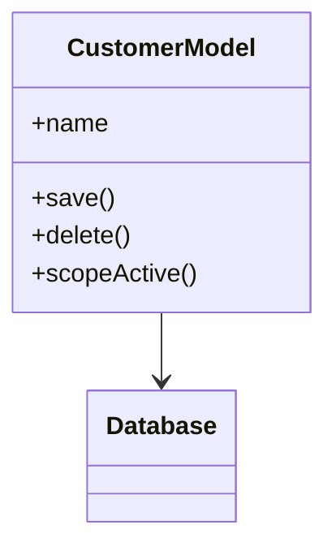
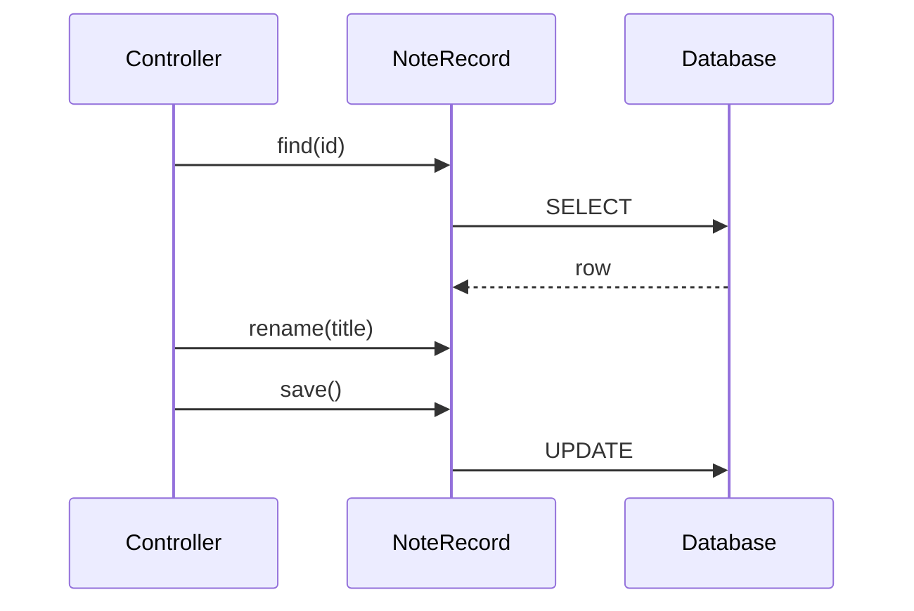

# Active Record

## Mục tiêu

Kết hợp state và persistence behavior trong cùng model để tối ưu tốc độ phát triển.

## Vấn đề cần giải quyết

Active Record phù hợp với CRUD, admin, form-driven application và domain rule vừa phải. Model cung cấp query/save/delete trực tiếp, giảm ceremony và tận dụng framework ecosystem.

Rủi ro xuất hiện khi model trở thành global gateway cho mọi query, business workflow và side effect; test cần database ở mọi nơi và domain bị khóa vào ORM lifecycle.

## Mô hình cộng tác

## Cách áp dụng trong PHP

Không cần loại bỏ Active Record theo giáo điều. Hãy giới hạn boundary: application CRUD có thể dùng trực tiếp; workflow phức tạp tách application service, value object và query object. Tránh generic repository chỉ để che một ORM mà code vẫn phụ thuộc model ở mọi nơi.

## Khi nên dùng

- Ứng dụng CRUD hoặc domain đơn giản, table–object mapping trực tiếp.
- Tốc độ phát triển và framework conventions quan trọng.
- Transaction/query phức tạp chưa vượt khả năng model/query scope.

## Khi không nên dùng

- Aggregate có invariant phức tạp và persistence phải độc lập.
- Model phình thành God Object với query, workflow, integration.
- Cần nhiều persistence implementation.

## Trade-off và rủi ro

Active Record tối ưu tốc độ phát triển CRUD nhưng gắn object với persistence lifecycle. Nó phù hợp model đơn giản; khi invariant và collaboration tăng, coupling này trở thành chi phí chính.

## Kiểm thử

1. Model test cho scope/cast/relationship có ý nghĩa.
2. Integration test constraint và transaction thật.
3. Feature test tránh over-mock ORM internals.
4. Architecture test chặn controller đặt business rule dài.

## Bài tập có hướng dẫn

Xây CRUD Customer bằng Active Record, sau đó thêm use case credit approval. Chỉ ra điểm nào nên tách khỏi model và điểm nào giữ lại.

### Tiêu chí hoàn thành

- Active Record chỉ giữ behavior gần dữ liệu và invariant phù hợp.
- Query phức tạp được tách Query Object/scope có tên.
- Không gọi external API từ model lifecycle hook khó kiểm soát.
- Có trigger rõ khi chuyển sang richer domain model.

## Tình huống thực tế: ghi chú nội bộ đơn giản

`NoteRecord` có `find`, `rename` và `save`, phù hợp khi nghiệp vụ chủ yếu CRUD và transaction không trải qua nhiều aggregate. Khi note bắt đầu có approval workflow, version conflict, audit policy hoặc collaboration với permission aggregate, callback và persistence method trên record dễ che transaction/failure. Lúc đó cần đánh giá chuyển sang Data Mapper/Repository bằng parallel change, không rewrite toàn bộ ngay. Evidence là số rule ngoài CRUD, test cần database và tần suất schema/lifecycle thay đổi.

## Tài liệu liên quan

- [Active Record exercise](../../exercises/module-21-active-record/README.md)
- [Production Active Record exercise](../../exercises/module-47-active-record/README.md)
- [Active Record vs Data Mapper](../08-interactive/comparisons/active-record-vs-data-mapper.md)
- [Active Record source](../../src/Enterprise/ActiveRecord/)

## Phân tích sâu

**Mental model:** Active Record kết hợp dữ liệu và persistence, phù hợp CRUD đơn giản. Mental model là record lifecycle gắn DB; khi invariant/collaboration tăng, coupling này có thể trở thành giới hạn.

## Failure và observability

Active Record cần thống nhất validation failure, not-found và persistence conflict. Theo dõi N+1, query count, lazy-load và save failure; khi domain rule tăng, metric này giúp nhận biết lúc nên tách boundary.

## Test strategy chi tiết

Tập trung vào validation location, N+1, domain growth threshold. Kết hợp unit test cho policy/contract, integration test cho mapping/query/transaction và architecture test cho dependency direction. Một test chỉ xác minh method được gọi chưa đủ chứng minh pattern giữ đúng behavior.

## Quyết định áp dụng

So sánh Active Record với Data Mapper/Repository. Ghi mức độ domain complexity, transaction pattern, test database và trigger migrate khi model bắt đầu chứa workflow phức tạp.
