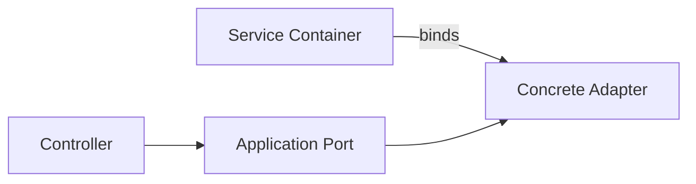

# Service Container trong Laravel

## Vai trò

Binding abstraction, contextual binding, lifecycle singleton/scoped.

## Nguyên tắc áp dụng

- Khai báo binding ở service provider/composition root.
- Dùng contextual binding khi cùng contract cần implementation khác theo consumer.
- Chọn `singleton`, `scoped` hoặc transient dựa trên lifecycle thật.
- Constructor injection cho application/domain service.

## Sai lầm thường gặp

- Gọi `app()` bên trong business code làm dependency bị ẩn.
- Bind interface không có consumer/change axis.
- Dùng singleton cho object mang request/user state.
- Closure binding đọc config/secret mỗi lần resolve không cần thiết.

## Ví dụ Laravel

```php
app()->bind(PaymentGateway::class, fn () => new StripeGateway(config('services.stripe.key')));
```

## Lưu ý production

- Test container resolution cho binding quan trọng và contextual binding.
- Test lifecycle scoped trong queue worker/Octane.
- Architecture test chặn `app()` trong domain namespace.
- Kiểm tra config cache và boot order trong CI.

## Khái niệm trọng tâm

- binding interface, contextual binding, singleton/scoped lifecycle và composition root.
- Phân biệt framework convenience với architectural boundary: Laravel có thể resolve dependency nhưng domain/application vẫn nên phụ thuộc contract có nghĩa.
- Kiểm tra lifecycle, transaction và failure semantics thay vì chỉ kiểm tra class được resolve thành công.

## Luồng hoạt động



Sơ đồ cần cho thấy composition root quyết định implementation và lifecycle; domain service chỉ nhận contract, không gọi container hoặc đọc configuration trực tiếp.

## Tình huống production

Binding sai lifecycle có thể làm state của tenant hoặc request bị giữ trong worker dài hạn. Với queue worker và Octane, singleton không còn đồng nghĩa “một lần trong request”. Hãy test scoped dependency, contextual binding và reset state giữa job/request. Container chỉ nên wire object graph; không đặt business decision hoặc query động vào closure binding.

## Case production mở rộng

**Tình huống:** Contextual binding theo tenant và worker lifecycle. Hãy xác định entrypoint, lifecycle, transaction boundary và phần nào phải nằm ngoài framework để code vẫn kiểm thử được khi thay queue/ORM/container.

### Test matrix

- Test transient/scoped/singleton bằng ba entrypoint HTTP, queue và CLI; assertion phải chứng minh state không rò giữa request.
- Thêm một failure test chứng minh lỗi framework được dịch thành error contract có nghĩa cho application.
- Ghi rõ test nào là unit, contract, integration và smoke; không thay thế integration test bằng mock mọi dependency.

### Observability và runbook

- Theo dõi container resolution failure, singleton memory growth và tenant context mismatch.
- Dashboard phải cho phép drill-down từ signal đến correlation ID, tenant/user, retry/version và runbook owner.
- Revisit thiết kế khi framework lifecycle trở thành source of truth hoặc domain rule chỉ còn kiểm tra được bằng HTTP test.
