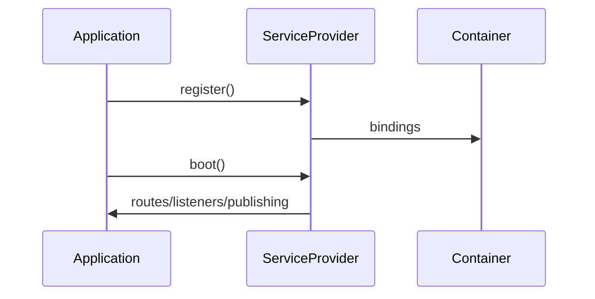

# Service Provider trong Laravel

## Vai trò

Nơi đăng ký dependency và bootstrap package/module.

## Nguyên tắc áp dụng

- Provider chỉ đăng ký/bind/boot integration, không chứa business workflow.
- Tách `register()` và `boot()` đúng lifecycle.
- Dùng package discovery/deferred provider có chủ đích.
- Boot side effect phải idempotent trong test/worker.

## Sai lầm thường gặp

- Query database hoặc gọi API trong `register()`.
- Provider khổng lồ đăng ký mọi module.
- Business rule/transaction nằm trong `boot()`.
- Phụ thuộc thứ tự provider không được tài liệu hóa.

## Ví dụ Laravel

```php
public function register(): void { $this->app->bind(Clock::class, SystemClock::class); }
```

## Lưu ý production

- Test package/provider boot trong app tối thiểu.
- Test config publish/cache và route/event registration.
- Kiểm tra provider không tạo network/DB side effect khi container build.
- Đo startup impact nếu provider nặng.

## Khái niệm trọng tâm

- register vs boot, package boundary, deferred provider và config publication.
- Phân biệt framework convenience với architectural boundary: Laravel có thể resolve dependency nhưng domain/application vẫn nên phụ thuộc contract có nghĩa.
- Kiểm tra lifecycle, transaction và failure semantics thay vì chỉ kiểm tra class được resolve thành công.

## Luồng hoạt động



Sơ đồ cần tách bootstrapping khỏi business flow: provider đăng ký binding/extension, còn use case chạy sau khi object graph đã hoàn tất.


## Review bootstrapping

`register()` chỉ khai báo binding và configuration độc lập runtime; `boot()` dành cho wiring cần container đã hoàn tất. Provider không nên query database, gọi HTTP hoặc chứa business rule. Với Octane/worker dài hạn, phải phân biệt singleton, scoped và transient để tránh rò tenant/request state.

## Case production mở rộng

**Tình huống:** Boot order, deferred provider và package boundary. Hãy xác định entrypoint, lifecycle, transaction boundary và phần nào phải nằm ngoài framework để code vẫn kiểm thử được khi thay queue/ORM/container.

### Test matrix

- Integration test provider registration, config cache và command discovery; không mock container internals.
- Thêm một failure test chứng minh lỗi framework được dịch thành error contract có nghĩa cho application.
- Ghi rõ test nào là unit, contract, integration và smoke; không thay thế integration test bằng mock mọi dependency.

### Observability và runbook

- Cảnh báo khi boot thực hiện I/O, migration hoặc gọi external service làm startup phụ thuộc mạng.
- Dashboard phải cho phép drill-down từ signal đến correlation ID, tenant/user, retry/version và runbook owner.
- Revisit thiết kế khi framework lifecycle trở thành source of truth hoặc domain rule chỉ còn kiểm tra được bằng HTTP test.
