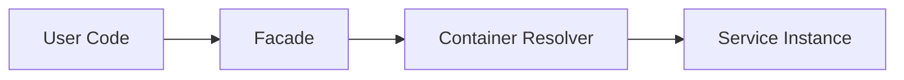

# Facade trong Laravel

## Vai trò

Proxy tĩnh tới object trong container; tiện dụng nhưng cần kiểm soát coupling.

## Nguyên tắc áp dụng

- Facade chỉ là ergonomic access tại framework edge.
- Underlying service vẫn có contract và có thể inject trực tiếp.
- Dùng facade fake trong feature test, không coi static call là domain API.
- Giữ call chain ngắn và có nghĩa.

## Sai lầm thường gặp

- Facade xuất hiện trong entity/domain service.
- Hidden dependency làm unit test phải boot Laravel.
- Facade bao một God Service đa trách nhiệm.
- Mock facade quá nhiều khiến test gắn implementation detail.

## Ví dụ Laravel

```php
Cache::remember('users:active', 60, fn () => User::query()->active()->get());
```

## Lưu ý production

- Feature test integration qua facade khi cần.
- Unit test underlying service bằng dependency injection.
- Architecture test giới hạn facade namespace ở delivery/infrastructure.
- Test failure mapping của service phía sau facade.

## Khái niệm trọng tâm

- static proxy, underlying container binding, testing fake và hidden dependency risk.
- Phân biệt framework convenience với architectural boundary: Laravel có thể resolve dependency nhưng domain/application vẫn nên phụ thuộc contract có nghĩa.
- Kiểm tra lifecycle, transaction và failure semantics thay vì chỉ kiểm tra class được resolve thành công.

## Luồng hoạt động



Sơ đồ cần làm rõ Facade của Laravel là access mechanism tới container binding; code domain không nên phụ thuộc static facade vì làm ẩn dependency.

## Tình huống production

Laravel Facade là static proxy tới container binding, không phải GoF Facade theo nghĩa đơn giản hóa subsystem. Lạm dụng Facade làm dependency ẩn và khiến test phụ thuộc global container state. Với domain/application code, ưu tiên constructor injection. Facade phù hợp ở framework edge hoặc API ergonomics khi lifecycle và fake behavior được hiểu rõ.

## Case production mở rộng

**Tình huống:** Static proxy của Laravel không phải GoF Facade mặc định. Hãy xác định entrypoint, lifecycle, transaction boundary và phần nào phải nằm ngoài framework để code vẫn kiểm thử được khi thay queue/ORM/container.

### Test matrix

- Test contract phía sau facade qua dependency injection; facade test chỉ nên xác nhận wiring hoặc compatibility layer.
- Thêm một failure test chứng minh lỗi framework được dịch thành error contract có nghĩa cho application.
- Ghi rõ test nào là unit, contract, integration và smoke; không thay thế integration test bằng mock mọi dependency.

### Observability và runbook

- Theo dõi global state, hidden dependency và khả năng chạy trong long-lived worker.
- Dashboard phải cho phép drill-down từ signal đến correlation ID, tenant/user, retry/version và runbook owner.
- Revisit thiết kế khi framework lifecycle trở thành source of truth hoặc domain rule chỉ còn kiểm tra được bằng HTTP test.
