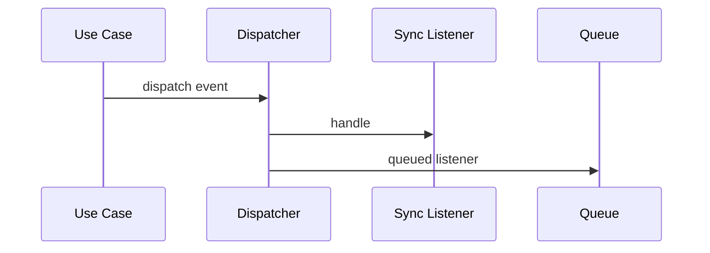

# Events trong Laravel

## Vai trò

Tách side effect khỏi transaction chính qua event/listener.

## Nguyên tắc áp dụng

- Event diễn tả fact đã xảy ra, payload tối thiểu và versionable.
- Phát after-commit nếu listener cần dữ liệu bền vững.
- Listener side effect phải idempotent khi queued.
- Phân biệt domain event và integration event.

## Sai lầm thường gặp

- Dùng event để che flow bắt buộc đồng bộ.
- Listener phụ thuộc ordering không được đảm bảo.
- Payload chứa Eloquent model lớn/PII không cần thiết.
- Một event kích hoạt chuỗi listener khó trace.

## Ví dụ Laravel

```php
OrderPlaced::dispatch($order); // listener nên chạy after commit khi có side effect
```

## Lưu ý production

- Test event được dispatch đúng thời điểm.
- Test queued listener retry/duplicate và after-commit.
- Contract test payload/version cho integration event.
- Observability test correlation ID và failed jobs.

## Khái niệm trọng tâm

- domain event vs integration event, sync/queued listener, ordering và idempotency.
- Phân biệt framework convenience với architectural boundary: Laravel có thể resolve dependency nhưng domain/application vẫn nên phụ thuộc contract có nghĩa.
- Kiểm tra lifecycle, transaction và failure semantics thay vì chỉ kiểm tra class được resolve thành công.

## Luồng hoạt động



Sơ đồ cần phân biệt domain fact, dispatcher và listener; side effect cần after-commit hoặc outbox thay vì phát event trước khi transaction bền vững.

## Tình huống production

Event dispatch trước commit có thể khiến listener đọc state chưa tồn tại hoặc gửi notification cho transaction bị rollback. Với side effect quan trọng, dùng after-commit hoặc Outbox. Listener bất đồng bộ phải idempotent, có correlation ID và phân biệt retryable/permanent failure. Test cần mô phỏng duplicate delivery và transaction rollback.

## Case production mở rộng

**Tình huống:** Domain fact, application notification và delivery semantics. Hãy xác định entrypoint, lifecycle, transaction boundary và phần nào phải nằm ngoài framework để code vẫn kiểm thử được khi thay queue/ORM/container.

### Test matrix

- Test event được tạo sau invariant; integration test after-commit, duplicate subscriber và version compatibility.
- Thêm một failure test chứng minh lỗi framework được dịch thành error contract có nghĩa cho application.
- Ghi rõ test nào là unit, contract, integration và smoke; không thay thế integration test bằng mock mọi dependency.

### Observability và runbook

- Theo dõi subscriber lag, duplicate effect, handler failure và event schema drift.
- Dashboard phải cho phép drill-down từ signal đến correlation ID, tenant/user, retry/version và runbook owner.
- Revisit thiết kế khi framework lifecycle trở thành source of truth hoặc domain rule chỉ còn kiểm tra được bằng HTTP test.
