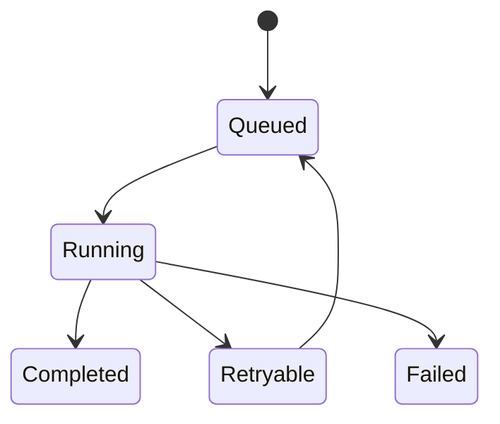

# Jobs trong Laravel

## Vai trò

Đóng gói tác vụ có thể queue, retry, timeout và monitor.

## Nguyên tắc áp dụng

- Job payload nhỏ, serializable và dùng ID/version thay vì model graph.
- Handler idempotent, timeout/retry/backoff rõ.
- Phân loại retryable và permanent failure.
- Có uniqueness/dedup nếu duplicate gây hại.

## Sai lầm thường gặp

- Dispatch job trước DB commit.
- Retry vô hạn side effect không idempotent.
- Job chứa quá nhiều workflow và phụ thuộc ambient auth.
- Không có dead-letter/failed-job runbook.

## Ví dụ Laravel

```php
SendOrderConfirmation::dispatch($order->id)->afterCommit();
```

## Lưu ý production

- Test handle happy/failure path không cần queue thật.
- Integration test serialization và after-commit.
- Test duplicate delivery, timeout và max-attempt behavior.
- Theo dõi queue latency, attempts, failure reason.

## Khái niệm trọng tâm

- retry/backoff/timeout, unique jobs, idempotency và failed jobs.
- Phân biệt framework convenience với architectural boundary: Laravel có thể resolve dependency nhưng domain/application vẫn nên phụ thuộc contract có nghĩa.
- Kiểm tra lifecycle, transaction và failure semantics thay vì chỉ kiểm tra class được resolve thành công.

## Luồng hoạt động



Sơ đồ cần thể hiện producer, queue, worker, retry/dead-letter và idempotency boundary; Job là execution envelope, không phải nơi chứa mọi domain rule.


## Tình huống production cần nhớ

Job xử lý payment hoặc webhook phải mang idempotency key, payload version và correlation ID. Timeout không luôn đồng nghĩa thất bại: nếu dependency có thể đã hoàn tất, handler chuyển sang reconciliation thay vì retry mù. `tries`, `backoff` và `timeout` phải xuất phát từ deadline nghiệp vụ, không dùng cùng cấu hình cho mọi queue.

## Case production mở rộng

**Tình huống:** Execution envelope, deadline và ambiguous outcome. Hãy xác định entrypoint, lifecycle, transaction boundary và phần nào phải nằm ngoài framework để code vẫn kiểm thử được khi thay queue/ORM/container.

### Test matrix

- Test serialization, retry classification, timeout-after-success và reconciliation branch.
- Thêm một failure test chứng minh lỗi framework được dịch thành error contract có nghĩa cho application.
- Ghi rõ test nào là unit, contract, integration và smoke; không thay thế integration test bằng mock mọi dependency.

### Observability và runbook

- Theo dõi queue age, retry count, dead-letter age và ratio ambiguous outcome.
- Dashboard phải cho phép drill-down từ signal đến correlation ID, tenant/user, retry/version và runbook owner.
- Revisit thiết kế khi framework lifecycle trở thành source of truth hoặc domain rule chỉ còn kiểm tra được bằng HTTP test.
