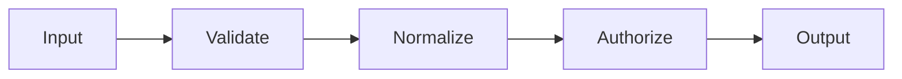

# Pipeline trong Laravel

## Vai trò

Xử lý dữ liệu qua chuỗi pipe có trách nhiệm nhỏ.

## Nguyên tắc áp dụng

- Mỗi pipe có trách nhiệm nhỏ và contract thống nhất.
- Thứ tự pipe được cấu hình/test rõ.
- Pipe quyết định transform hoặc short-circuit có semantics cụ thể.
- Dữ liệu truyền qua pipeline có type/context rõ.

## Sai lầm thường gặp

- Pipeline che giấu workflow có branching phức tạp.
- Pipe phụ thuộc side effect/order ngầm.
- Dùng closure vô danh khiến trace/debug khó.
- Exception bị bắt chung và mất taxonomy.

## Ví dụ Laravel

```php
app(Pipeline::class)->send($draft)->through([ValidateOrder::class, ReserveStock::class])->thenReturn();
```

## Lưu ý production

- Unit test từng pipe và contract input/output.
- Test ordering, short-circuit và exception propagation.
- Integration test pipeline composition thật.
- Benchmark chỉ khi pipeline nằm trên hot path đã profile.

## Khái niệm trọng tâm

- pipe ordering, short-circuit, immutable payload và error ownership.
- Phân biệt framework convenience với architectural boundary: Laravel có thể resolve dependency nhưng domain/application vẫn nên phụ thuộc contract có nghĩa.
- Kiểm tra lifecycle, transaction và failure semantics thay vì chỉ kiểm tra class được resolve thành công.

## Luồng hoạt động



Sơ đồ cần thể hiện payload typed đi qua các stage có ordering rõ ràng; mỗi pipe chỉ sở hữu một transformation/guard và không giữ request-global state.

## Tình huống production

Pipeline dễ che ordering dependency khi stage âm thầm yêu cầu field do stage trước tạo. Hãy dùng typed context, validate precondition và ghi rõ stage có thể short-circuit hay không. Không dùng Pipeline để phân tán transaction boundary qua nhiều class. Test nên khóa order, context mutation, exception propagation và retry safety.

## Case production mở rộng

**Tình huống:** Typed payload, ordering và compensation boundary. Hãy xác định entrypoint, lifecycle, transaction boundary và phần nào phải nằm ngoài framework để code vẫn kiểm thử được khi thay queue/ORM/container.

### Test matrix

- Test each pipe contract, short-circuit, exception propagation và order-sensitive behavior.
- Thêm một failure test chứng minh lỗi framework được dịch thành error contract có nghĩa cho application.
- Ghi rõ test nào là unit, contract, integration và smoke; không thay thế integration test bằng mock mọi dependency.

### Observability và runbook

- Theo dõi bước chậm nhất, short-circuit reason, partial side effect và compensation failure.
- Dashboard phải cho phép drill-down từ signal đến correlation ID, tenant/user, retry/version và runbook owner.
- Revisit thiết kế khi framework lifecycle trở thành source of truth hoặc domain rule chỉ còn kiểm tra được bằng HTTP test.
