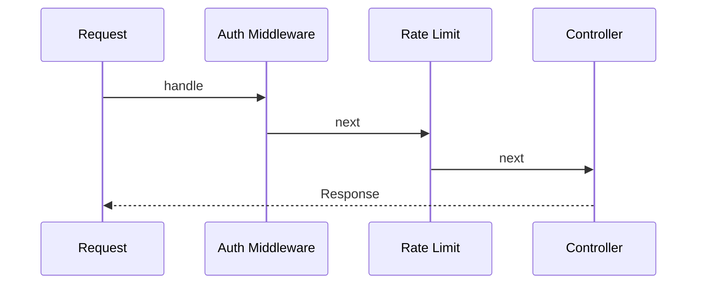

# Middleware trong Laravel

## Vai trò

Chain of Responsibility tại HTTP boundary.

## Nguyên tắc áp dụng

- Middleware dùng cho concern cross-cutting tại HTTP boundary.
- Thứ tự auth, rate limit, tenancy, binding được tài liệu hóa.
- Không chứa domain decision dài.
- Response/error mapping nhất quán.

## Sai lầm thường gặp

- Business workflow nằm trong middleware.
- Tenant context mutable rò giữa request/worker.
- Middleware order thay đổi nhưng không có test.
- Catch mọi exception và trả 200/response mơ hồ.

## Ví dụ Laravel

```php
Route::middleware(['auth', EnsureAccountActive::class])->group(fn () => Route::get('/orders', ...));
```

## Lưu ý production

- Feature test middleware order và bypass route.
- Test auth/tenant isolation, rate-limit headers.
- Test exception mapping và correlation ID.
- Octane/worker test cho request-scoped state.

## Khái niệm trọng tâm

- HTTP boundary, ordering, termination middleware và cross-cutting concerns.
- Phân biệt framework convenience với architectural boundary: Laravel có thể resolve dependency nhưng domain/application vẫn nên phụ thuộc contract có nghĩa.
- Kiểm tra lifecycle, transaction và failure semantics thay vì chỉ kiểm tra class được resolve thành công.

## Luồng hoạt động



Sơ đồ cần đặt middleware ở HTTP boundary cho cross-cutting concern; authorization/domain policy vẫn phải sống ở use case hoặc domain service phù hợp.


## Ordering và request scope

Tenant resolution phải chạy trước authorization và rate limiting nếu policy phụ thuộc tenant; audit middleware nên ghi kết quả sau response nhưng không nuốt exception. Không giữ mutable state trong singleton middleware khi worker sống lâu. Test cần khóa thứ tự pipeline và xác nhận short-circuit không bỏ qua security header hoặc correlation ID.

## Case production mở rộng

**Tình huống:** Request-scoped cross-cutting policy. Hãy xác định entrypoint, lifecycle, transaction boundary và phần nào phải nằm ngoài framework để code vẫn kiểm thử được khi thay queue/ORM/container.

### Test matrix

- Test ordering, tenant isolation, authentication short-circuit và response transformation.
- Thêm một failure test chứng minh lỗi framework được dịch thành error contract có nghĩa cho application.
- Ghi rõ test nào là unit, contract, integration và smoke; không thay thế integration test bằng mock mọi dependency.

### Observability và runbook

- Theo dõi authorization mismatch, context leakage và latency per middleware.
- Dashboard phải cho phép drill-down từ signal đến correlation ID, tenant/user, retry/version và runbook owner.
- Revisit thiết kế khi framework lifecycle trở thành source of truth hoặc domain rule chỉ còn kiểm tra được bằng HTTP test.
