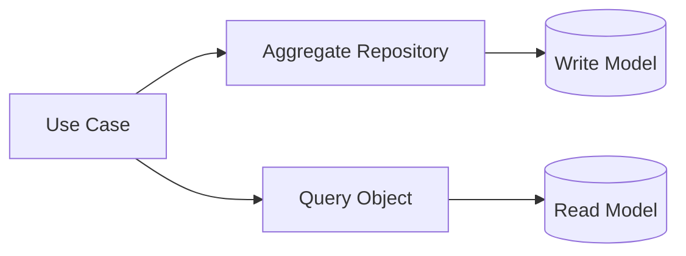

# Repository và Query Object trong Laravel

## Vai trò

Chỉ dùng khi tạo giá trị vượt việc bọc Eloquent.

## Nguyên tắc áp dụng

- Repository chỉ cho aggregate write semantics; Query Object cho read projection.
- Eloquent có thể là implementation detail ở infrastructure.
- Pagination/order deterministic và index-aware.
- Không ép mọi query qua generic repository.

## Sai lầm thường gặp

- Repository forward từng method Eloquent.
- Trả Builder ra khỏi boundary.
- Dùng aggregate repository cho reporting joins lớn.
- Query Object nhận mảng filter tùy ý không type hóa.

## Ví dụ Laravel

```php
$orders = app(SearchOrders::class)->execute(new OrderCriteria(status: 'paid'));
```

## Lưu ý production

- Contract test repository và integration test mapping.
- Query Object test SQL/filter/order/pagination trên database thật.
- Test tenant scope và authorization filter.
- Explain-plan/performance regression cho query trọng yếu.

## Khái niệm trọng tâm

- aggregate writes vs read projection, Eloquent boundary và pagination.
- Phân biệt framework convenience với architectural boundary: Laravel có thể resolve dependency nhưng domain/application vẫn nên phụ thuộc contract có nghĩa.
- Kiểm tra lifecycle, transaction và failure semantics thay vì chỉ kiểm tra class được resolve thành công.

## Luồng hoạt động



Sơ đồ cần tách aggregate write path qua Repository khỏi read projection qua Query Object; không ép cả hai dùng cùng model hay cùng performance contract.


## Cách kiểm chứng boundary

Repository test phải chứng minh aggregate semantics như optimistic version và not-found behavior. Query Object test tập trung filter, ordering, cursor stability và projection shape. Nếu hai loại test giống hệt nhau, boundary read/write có thể đang được tách chỉ theo tên chứ chưa theo mục tiêu.

## Case production mở rộng

**Tình huống:** Write aggregate và read projection là hai boundary khác nhau. Hãy xác định entrypoint, lifecycle, transaction boundary và phần nào phải nằm ngoài framework để code vẫn kiểm thử được khi thay queue/ORM/container.

### Test matrix

- Contract test repository semantics; query-object integration test cursor, sort stability và projection mapping.
- Thêm một failure test chứng minh lỗi framework được dịch thành error contract có nghĩa cho application.
- Ghi rõ test nào là unit, contract, integration và smoke; không thay thế integration test bằng mock mọi dependency.

### Observability và runbook

- Theo dõi optimistic conflict, query latency, cursor invalidation và replica staleness.
- Dashboard phải cho phép drill-down từ signal đến correlation ID, tenant/user, retry/version và runbook owner.
- Revisit thiết kế khi framework lifecycle trở thành source of truth hoặc domain rule chỉ còn kiểm tra được bằng HTTP test.
