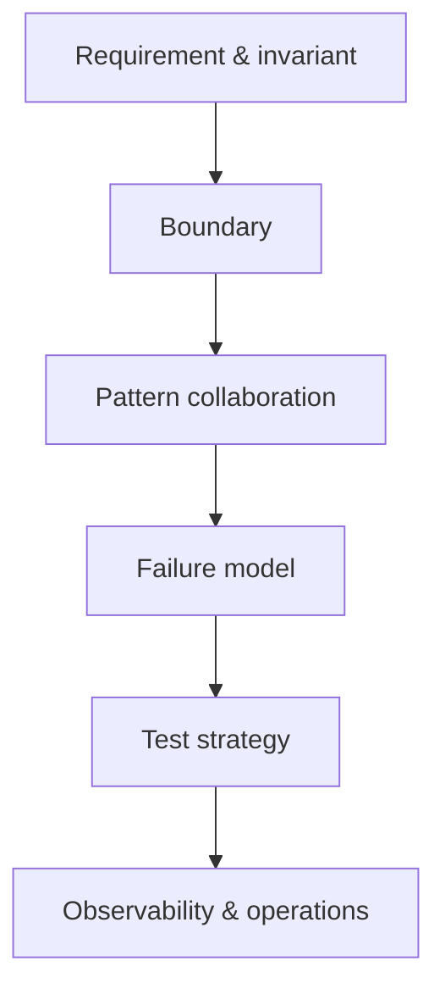

# Practical Case Studies

Case study kết hợp nhiều pattern trong một use case có invariant, failure và operational constraint. Mục tiêu không phải “nhồi nhiều pattern”, mà học cách chọn boundary và collaboration tối thiểu để hệ thống thay đổi an toàn.

## Bản đồ case study

| Case study | Invariant chính | Pattern trọng tâm | Production concern |
|---|---|---|---|
| [Payment](payment-system/README.md) | không charge trùng, ledger cân bằng | Strategy, Adapter, State, Observer | idempotency, reconciliation |
| [Notification](notification-system/README.md) | đúng recipient/channel, không duplicate | Strategy, Adapter, Decorator | retry, dead-letter, provider routing |
| [Order](order-processing/README.md) | transition và quantity hợp lệ | State, Command, Saga | compensation, fulfillment |
| [Discount](discount-engine/README.md) | rule deterministic, explainable | Strategy, Specification, Chain | conflict, priority, audit |
| [Export](export-system/README.md) | dữ liệu nhất quán, format đúng | Factory, Strategy, Template Method | streaming, memory, delivery |

## Phương pháp học

1. Đọc requirement và viết invariant bằng câu có thể test.
2. Vẽ sequence/transaction boundary trước khi nhìn pattern.
3. Đọc phiên bản before và chỉ ra change axis.
4. Chạy test/example rồi gây failure có chủ đích.
5. So sánh với production module tương ứng.
6. Viết ADR ngắn giải thích vì sao không chọn phương án đơn giản hơn.

## Definition of Done

- Giải thích được vai trò của từng pattern trong collaboration.
- Chỉ ra source of truth và transaction owner.
- Có test success, conflict, timeout/duplicate nếu liên quan.
- Có metric hoặc log giúp điều tra failure.
- Nêu được giới hạn và bước migration tiếp theo.

## Bài tập xuyên suốt

Chọn một case study và loại bỏ một pattern. Đánh giá complexity giảm bao nhiêu, requirement nào khó hơn và evidence nào cho biết abstraction đó cần thiết hay thừa.
