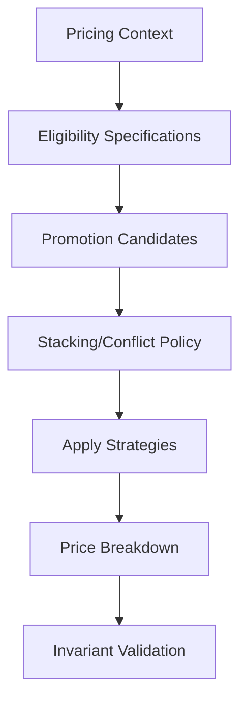
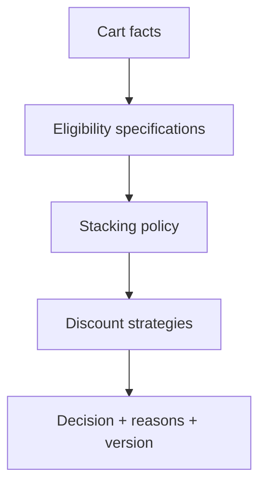

# Case Study: Discount Engine

## Bối cảnh

Promotion có điều kiện theo customer segment, time window, product category, quantity và coupon. Nhiều rule có thể áp dụng đồng thời nhưng thứ tự, stacking và rounding phải giải thích được.

## Invariant

- Giá cuối không âm và dùng cùng currency.
- Mỗi discount result phải có explanation/audit trail.
- Exclusive promotion không được stack với promotion bị cấm.
- Rounding chỉ thực hiện tại điểm đã định nghĩa, không ở mỗi rule tùy ý.

## Pattern và vai trò

- **Specification:** eligibility rule thuần, kết hợp AND/OR/NOT.
- **Strategy:** công thức discount như percentage, fixed amount, buy-X-get-Y.
- **Chain/Pipeline:** evaluation stages có thứ tự rõ; không dùng để che conflict policy.
- **Composite:** nhóm rule nếu domain thật sự có cây điều kiện.

## Failure và edge cases

- Coupon hết hạn giữa preview và checkout.
- Hai promotion exclusive cùng match.
- Currency mismatch hoặc rounding drift.
- Rule config sai làm discount vượt subtotal.
- Segment/read model stale.

## Test strategy

- Truth table cho specification.
- Property test: final price nằm trong `[0, subtotal]`.
- Golden test cho price breakdown và explanation.
- Boundary test time zone/effective date.
- Mutation test để phát hiện rule branch thiếu test.

## Bài tập

Thiết kế “20% cho VIP, tối đa 200.000; không stack coupon; miễn phí shipping vẫn được phép”. Viết policy conflict, explanation output và test tại cap boundary.

## Tài liệu liên quan

- [Specification](../../04-enterprise-patterns/04-specification.md)
- [Strategy](../../03-behavioral/09-strategy.md)
- [Discount lab](../../../labs/advanced/discount-engine/README.md)

## Failure rehearsal bắt buộc

Mô phỏng hai promotion không tương thích, coupon hết quota trong lúc checkout và rule version thay đổi giữa preview với confirm. Engine phải trả decision explanation, policy version và reason code; không chỉ trả số tiền cuối. Property-based tests nên kiểm tra tổng giảm không âm và không vượt subtotal.

