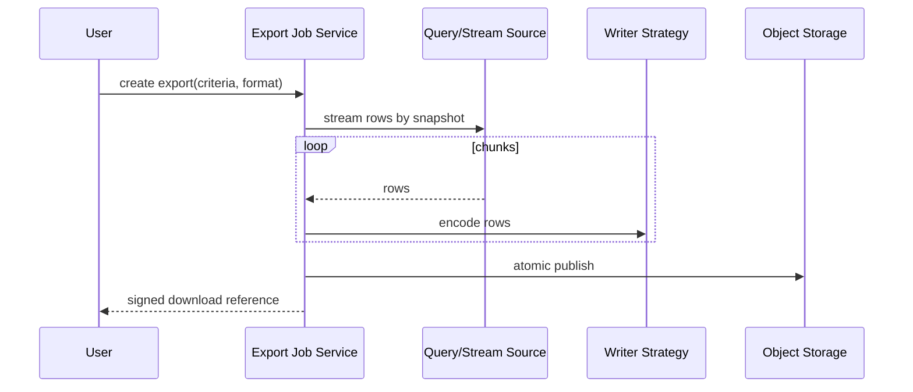

# Case Study: Export System

## Bối cảnh

Hệ thống xuất CSV, JSON và các định dạng khác cho dataset lớn. Yêu cầu chính gồm schema ổn định, streaming để không hết memory, audit, retry và bảo vệ dữ liệu nhạy cảm.

## Invariant

- Một export job gắn với schema version, criteria snapshot và timezone.
- Column order/encoding phải deterministic.
- File chỉ được publish khi hoàn chỉnh; partial file không được coi là thành công.
- Người dùng chỉ tải dữ liệu họ được authorize tại thời điểm tạo job.

## Pattern và vai trò

- **Strategy:** writer/format encoding.
- **Factory Method:** job creator chọn writer family và configuration.
- **Adapter:** storage, compressor hoặc encryption provider.
- **Builder:** export specification nhiều option có validation.
- **Template Method/Pipeline:** lifecycle prepare → stream → finalize → publish.

## Failure model

- Query cursor invalid hoặc source data thay đổi giữa chunks.
- Writer lỗi do encoding/invalid field.
- Upload multipart thất bại giữa chừng.
- Retry tạo hai file hoặc hai notification.
- Signed URL/PII bị log.

## Test strategy

- Golden file test cho schema/escaping/encoding.
- Streaming memory test với dataset lớn.
- Resume/retry test với checkpoint hoặc restart semantics rõ.
- Security test row-level authorization và redaction.
- Contract test storage adapter và atomic publish.

## Bài tập

Thiết kế export 10 triệu dòng CSV nén ZIP. Chỉ rõ snapshot semantics, chunk size, checksum, retry policy và cách không publish partial artifact.

## Tài liệu liên quan

- [Factory Method](../../01-creational/01-factory-method.md)
- [Strategy](../../03-behavioral/09-strategy.md)
- [Export lab](../../../labs/beginner/05-file-export-factory/README.md)

## Failure rehearsal bắt buộc

Mô phỏng export dữ liệu lớn bị hết bộ nhớ, upload object storage thành công nhưng callback thất bại và cùng job được retry. Thiết kế cần streaming, deterministic file key, checksum và idempotent completion record. Test đo peak memory, resume/retry và quyền truy cập download URL.

