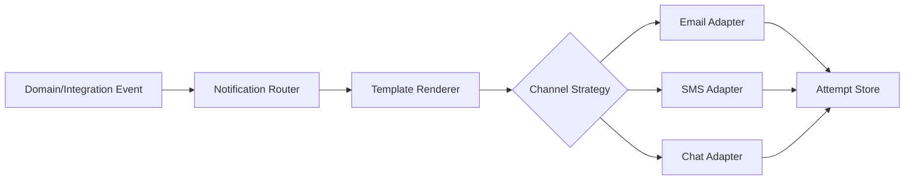
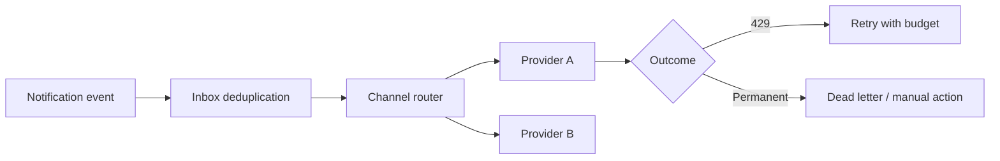

# Case Study: Notification System

## Bối cảnh

Hệ thống gửi Email, SMS, Push và Chatwork cho nhiều loại sự kiện. Mỗi channel có template, quota, credential và error semantics khác nhau. Mục tiêu không phải “gửi bằng mọi giá” mà là **delivery có identity, quan sát được và không trùng ngoài ý muốn**.

## Invariant

- Mỗi notification có `notification_id` và mỗi attempt có `attempt_id` riêng.
- Template version và rendered content phải audit được.
- Retry chỉ áp dụng cho lỗi tạm thời; invalid recipient không được retry vô hạn.
- Tenant/channel credential không được rò qua log hoặc cross-tenant cache.

## Pattern và vai trò

- **Strategy:** routing channel/fallback policy.
- **Factory:** tạo adapter theo tenant/channel configuration.
- **Adapter:** chuẩn hóa provider API và error taxonomy.
- **Decorator:** rate limit, tracing, redaction và retry policy.
- **Observer:** tạo notification request từ event; không gửi trực tiếp trong transaction nghiệp vụ.

## Failure cần xử lý

- Provider rate limit → schedule retry theo `Retry-After`.
- Invalid recipient → permanent failure và suppression list.
- Template rendering lỗi → fail trước provider call, lưu template/version.
- Duplicate event → dedup theo notification identity.
- Provider accepted nhưng status callback mất → polling/reconciliation theo provider ID.

## Test strategy

- Golden/approval test cho template rendering và escaping.
- Contract test adapter với temporary/permanent error mapping.
- Test retry schedule, max attempts và dead-letter workflow.
- Security test tenant isolation, credential redaction và template injection.
- Load test queue latency và provider quota behavior.

## Bài tập

Thiết kế fallback Email → SMS chỉ khi email trả permanent bounce, không fallback khi timeout chưa rõ kết quả. Mô tả state machine của delivery attempt và test duplicate event.

## Tài liệu liên quan

- [Notification production platform](../../../production/notification-platform/README.md)
- [Observer](../../03-behavioral/07-observer.md)
- [Adapter](../../02-structural/01-adapter.md)

## Failure rehearsal bắt buộc

Mô phỏng provider trả 429, một channel bị disable và cùng event được giao hai lần. Router phải phân loại lỗi retryable/permanent, consumer phải idempotent và fallback không được gửi trùng sang channel đã thành công. Dashboard cần queue lag, attempt count và delivery outcome theo provider.

