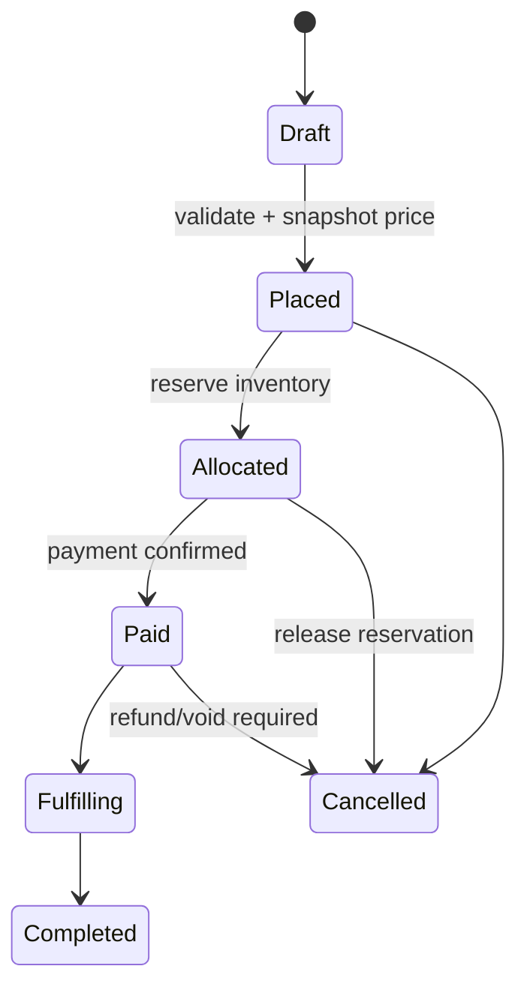
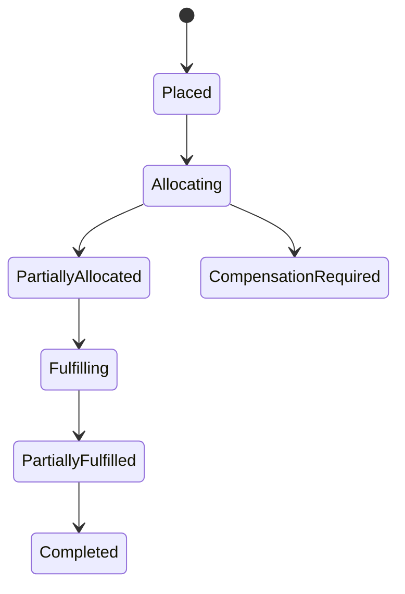

# Case Study: Order Processing

## Bối cảnh

Order đi qua tạo đơn, pricing, reservation, payment, fulfillment, cancellation và return. Đây là workflow dài với nhiều consistency boundary; không nên giữ một database transaction xuyên payment/inventory/shipping.

## Invariant

- Order total phải khớp line snapshot tại thời điểm đặt hàng.
- Không fulfillment quantity vượt quantity đã allocation.
- Cancellation chỉ áp dụng cho quantity chưa shipped.
- Mọi transition phải audit được bằng actor, reason và version.

## Pattern và vai trò

- **State:** transition và guard của order lifecycle.
- **Command:** `PlaceOrder`, `AllocateStock`, `CancelOrder`, `ShipItems` có idempotency/audit context.
- **Saga/Process Manager:** điều phối bước xuyên service và compensation.
- **Specification:** eligibility cho cancellation/return/promotion.
- **Repository + Unit of Work:** aggregate consistency trong một boundary.

## Failure model

- Allocation thành công nhưng payment fail → release reservation.
- Payment thành công nhưng event mất → outbox và recovery scan.
- Duplicate `ShipItems` → idempotency theo shipment command.
- Concurrent cancellation/fulfillment → optimistic locking và conflict response.
- Saga stuck → timeout state, operator action và reconciliation.

## Test strategy

- Transition table test cho toàn bộ state/command hợp lệ và bất hợp lệ.
- Property test: shipped + cancelled + remaining = ordered quantity.
- Concurrency test cancellation vs fulfillment.
- Saga integration test với duplicate/out-of-order event.
- Audit reconstruction test cho một order timeline.

## Bài tập

Thiết kế partial shipment và partial cancellation. Vẽ aggregate boundary, event flow và conflict handling khi hai warehouse cùng allocate dòng hàng cuối.

## Tài liệu liên quan

- [OMS production](../../../production/order-management-system/README.md)
- [State](../../03-behavioral/08-state.md)
- [Saga](../../../handbook/microservices/03-saga.md)

## Failure rehearsal bắt buộc

Mô phỏng order đã allocate một phần inventory nhưng shipment creation thất bại. Process manager phải lưu tiến độ, chọn retry hoặc compensation và tránh hoàn tác những item đã bàn giao cho carrier. Test cần bao phủ partial fulfillment, cancel race và replay event.

