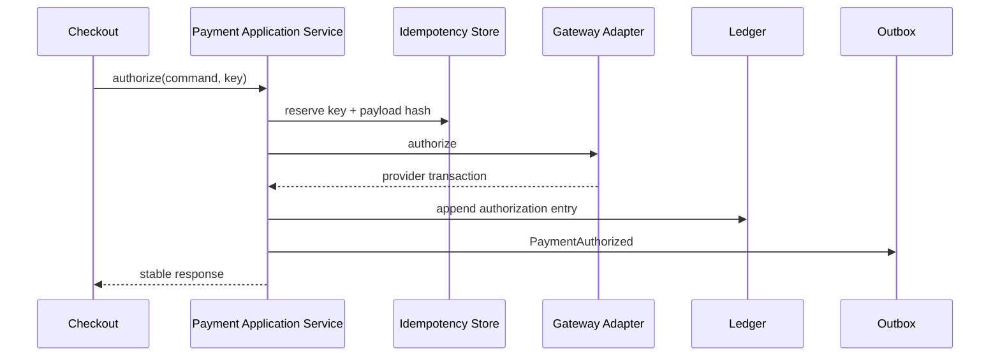
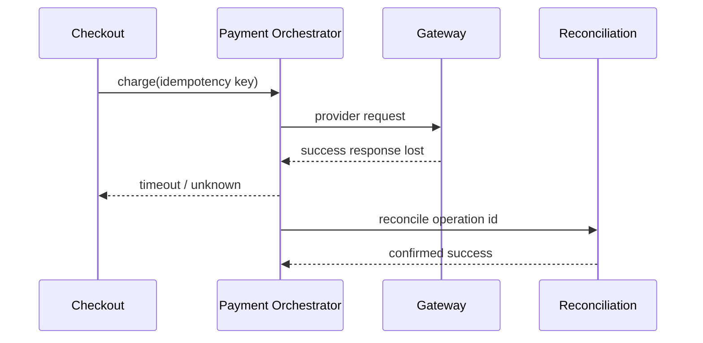

# Case Study: Payment System

## Bối cảnh

Hệ thống cần hỗ trợ nhiều payment provider, retry khi timeout, webhook đến trễ và đối soát khi trạng thái local khác provider. Rủi ro lớn nhất là **charge trùng**, **mất dấu giao dịch đã thành công** và **refund sai số tiền**.

## Invariant

- Một `payment_intent` chỉ được capture tối đa số tiền đã authorize.
- Cùng idempotency key với cùng payload phải trả cùng kết quả; payload khác phải bị từ chối.
- Ledger entry bất biến; sửa sai bằng reversal, không update lịch sử.
- Webhook không được tin là source duy nhất; phải verify signature và reconcile.

## Pattern và vai trò

- **Strategy:** chọn routing/cost policy giữa provider, không chứa SDK mapping.
- **Adapter:** dịch request, response và error taxonomy của từng provider.
- **State:** bảo vệ transition `created → authorized → captured/refunded/failed`.
- **Decorator:** thêm metrics/tracing/circuit breaker quanh gateway contract; thứ tự wrapper phải rõ.
- **Outbox + Observer:** phát integration event sau khi transaction local commit.

## Failure matrix

| Failure | Phản ứng |
|---|---|
| Timeout trước khi biết provider result | lookup/reconcile bằng provider reference trước khi retry |
| Provider thành công, local commit lỗi | reconciliation job tạo ledger/outbox còn thiếu |
| Duplicate webhook | inbox/dedup theo event ID |
| Currency/amount mismatch | quarantine + security alert |
| Capture vượt authorize | domain rejection, không gọi provider |

## Test strategy

- Unit test state transition, amount/currency invariant và routing policy.
- Contract test tất cả gateway adapter với cùng error model.
- Integration test idempotency store, ledger và outbox trong cùng transaction.
- Failure injection cho timeout sau provider success.
- Reconciliation test từ provider snapshot về local state.

## Bài tập

Thiết kế luồng capture có partial capture. Vẽ sequence diagram, chỉ rõ idempotency scope, ledger entries và cách xử lý khi response bị mất sau khi provider đã capture.

## ADR cần viết

“Chọn local ledger làm source of operational truth và dùng provider reconciliation thay vì đồng bộ trạng thái chỉ bằng webhook.”

## Tài liệu liên quan

- [Idempotency](../../../handbook/microservices/05-idempotency.md)
- [Transactional Outbox](../../../decisions/013-use-outbox-for-integration-events.md)
- [Payment production platform](../../../production/payment-platform/README.md)

## Failure rehearsal bắt buộc

Mô phỏng provider đã charge thành công nhưng client timeout trước khi nhận response. Hệ thống không được retry mù. Cần operation ID, idempotency key, status query hoặc reconciliation. Test phải chứng minh duplicate request không tạo duplicate charge và audit trail phân biệt `unknown` với `failed`.

