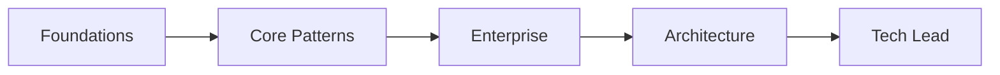

# Training Roadmap

## Tuần 1: nền tảng
OOP, SOLID, coupling/cohesion, DI và composition.

## Tuần 2: core patterns
Strategy, Factory, Adapter, Decorator, Observer.

## Tuần 3: workflow patterns
State, Command, Chain, Pipeline, Specification.

## Tuần 4: case study
Thiết kế, coding, testing, review và retrospective.

## Cách sử dụng tài liệu này

Với **Training Roadmap**, người học cần tạo một artifact có thể review: sơ đồ, đoạn code, checklist hoặc quyết định thiết kế. Bắt đầu từ một tình huống thật, ghi outcome mong đợi và failure path; sau đó mới áp dụng kỹ thuật trong bài.

## Hoạt động thực hành

1. Lập skill matrix cho nhóm theo OOP, GoF, enterprise pattern, testing và architecture.
2. Chọn một capability để đo baseline bằng bài code review hoặc live coding.
3. Xếp lesson theo dependency kiến thức; không dạy Repository trước coupling/DI.
4. Sau mỗi tuần, thu artifact: test, diagram, ADR hoặc refactor PR.
5. Điều chỉnh roadmap bằng evidence từ rubric thay vì số buổi đã học.

## Tiêu chí hoàn thành

- Người học hoàn thành learning evidence của từng level, không chỉ đọc bài.
- Mỗi checkpoint có artifact: code, diagram, test hoặc ADR.
- Mentor ghi gap và quyết định bài tiếp theo dựa trên evidence.

## Mô hình triển khai

## Chuẩn đầu ra

- Mỗi chặng kết thúc bằng artifact có thể review, không chỉ đọc lý thuyết.
- Có checklist chuẩn bị, thời lượng, deliverable và tiêu chí pass/fail.
- Giảng viên phải chỉ ra một giải pháp đơn giản hơn và giải thích khi nào pattern đáng dùng.
- Học viên phải tái hiện ít nhất một failure path và trình bày cách quan sát nó.

## Phản hồi sau buổi học

Đo tỷ lệ học viên hoàn thành artifact ở mỗi level, số concept phải học lại và khả năng giải thích một quyết định bằng evidence sau hai tuần.
