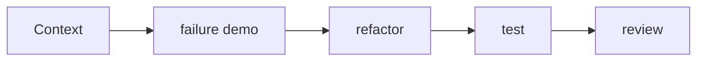

# Workshop Plan

Mỗi buổi 120 phút:

1. 15 phút: vấn đề thực tế.
2. 20 phút: code smell và lực thay đổi.
3. 25 phút: pattern và trade-off.
4. 45 phút: pair programming lab.
5. 15 phút: review và retrospective.

Tám buổi: Foundations, Factory/Builder, Strategy/State, Adapter/Facade, Decorator/Proxy, Observer/Command, Chain/Pipeline, Case Study.

## Cách sử dụng tài liệu này

Với **Workshop Plan**, người học cần tạo một artifact có thể review: sơ đồ, đoạn code, checklist hoặc quyết định thiết kế. Bắt đầu từ một tình huống thật, ghi outcome mong đợi và failure path; sau đó mới áp dụng kỹ thuật trong bài.

## Hoạt động thực hành

1. Chuẩn bị repository starter có test đỏ và một failure path tái hiện được.
2. Mở workshop bằng câu hỏi thiết kế, chưa nêu tên pattern.
3. Timebox discovery, implementation, review và retrospective thành các chặng riêng.
4. Yêu cầu mỗi nhóm trình bày một trade-off và một phương án đơn giản hơn.
5. Kết thúc bằng commit/ADR nhỏ để học viên mang kết quả về dự án.

## Tiêu chí hoàn thành

- Workshop tạo ra một refactor chạy được và một review note có trade-off.
- Nhóm demo cả happy path lẫn failure injection.
- Retrospective ghi điều sẽ làm khác khi áp dụng vào production.

## Mô hình triển khai

## Chuẩn đầu ra

- Workshop phải có code chạy, failure path và reflection.
- Có checklist chuẩn bị, thời lượng, deliverable và tiêu chí pass/fail.
- Giảng viên phải chỉ ra một giải pháp đơn giản hơn và giải thích khi nào pattern đáng dùng.
- Học viên phải tái hiện ít nhất một failure path và trình bày cách quan sát nó.

## Phản hồi sau buổi học

Thu phản hồi về nhịp độ live coding, thời gian debug failure và mức hữu ích của peer review; điều chỉnh agenda theo bottleneck thật.
