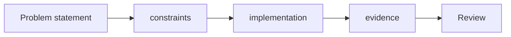

# Assignment

Thiết kế một hệ thống Order Processing hỗ trợ nhiều payment gateway, rule discount, notification channel và export report.

## Deliverables
- Source code.
- Unit test.
- Diagram.
- Hai ADR.
- README mô tả trade-off.

## Ràng buộc
Không được dùng pattern nếu không giải thích được lực thay đổi mà pattern xử lý.

## Cách sử dụng tài liệu này

Với **Assignment**, người học cần tạo một artifact có thể review: sơ đồ, đoạn code, checklist hoặc quyết định thiết kế. Bắt đầu từ một tình huống thật, ghi outcome mong đợi và failure path; sau đó mới áp dụng kỹ thuật trong bài.

## Hoạt động thực hành

1. Cung cấp business scenario, constraints và acceptance criteria có thể kiểm thử.
2. Yêu cầu nộp baseline test trước khi refactor.
3. Chấm behavior, naming, dependency direction và failure handling; không chấm số pattern.
4. Bắt buộc có README giải thích lựa chọn và trường hợp không nên dùng.
5. Cho phép nhiều lời giải nếu assumption được ghi rõ và test chứng minh.

## Tiêu chí hoàn thành

- Submission gồm source, tests, diagram và rationale.
- Học viên giải thích alternative bị loại và rollback/migration nếu có.
- Reviewer chấm correctness, clarity, evidence và operability.

## Mô hình triển khai

## Chuẩn đầu ra

- Bài nộp gồm ADR ngắn, code, tests và trade-off.
- Có checklist chuẩn bị, thời lượng, deliverable và tiêu chí pass/fail.
- Giảng viên phải chỉ ra một giải pháp đơn giản hơn và giải thích khi nào pattern đáng dùng.
- Học viên phải tái hiện ít nhất một failure path và trình bày cách quan sát nó.

## Phản hồi sau buổi học

Đánh giá lỗi phổ biến trong bài nộp, chất lượng test và khả năng bảo vệ trade-off; cập nhật đề bài nếu nhiều học viên hiểu sai cùng một constraint.
