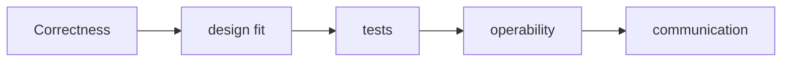

# Assessment Rubric

| Tiêu chí | Trọng số |
|---|---:|
| Hiểu đúng vấn đề | 20% |
| Chọn pattern hợp lý | 20% |
| Code dễ đọc và bảo trì | 20% |
| Unit test | 15% |
| Phân tích trade-off | 15% |
| Trình bày | 10% |

Điểm trừ lớn: abstraction không có lý do, global state, test phụ thuộc implementation, bỏ qua failure mode.

## Cách sử dụng tài liệu này

Với **Assessment Rubric**, người học cần tạo một artifact có thể review: sơ đồ, đoạn code, checklist hoặc quyết định thiết kế. Bắt đầu từ một tình huống thật, ghi outcome mong đợi và failure path; sau đó mới áp dụng kỹ thuật trong bài.

## Hoạt động thực hành

1. Chấm “hiểu vấn đề” trước “chọn pattern”.
2. Tách điểm correctness, testability, maintainability, trade-off và communication.
3. Dùng descriptor cụ thể cho mức chưa đạt/đạt/tốt/xuất sắc.
4. Calibration bằng cách hai reviewer chấm cùng một submission và thảo luận lệch điểm.
5. Lưu ví dụ bài làm chuẩn để giảm đánh giá cảm tính ở cohort sau.

## Tiêu chí hoàn thành

- Điểm cao yêu cầu invariant đúng, test có giá trị và trade-off trung thực.
- Không cộng điểm chỉ vì dùng nhiều pattern/class.
- Feedback phải chỉ ra bước cải thiện có thể hành động.

## Mô hình triển khai

## Chuẩn đầu ra

- Không chấm điểm theo số pattern được sử dụng.
- Có checklist chuẩn bị, thời lượng, deliverable và tiêu chí pass/fail.
- Giảng viên phải chỉ ra một giải pháp đơn giản hơn và giải thích khi nào pattern đáng dùng.
- Học viên phải tái hiện ít nhất một failure path và trình bày cách quan sát nó.

## Phản hồi sau buổi học

Hiệu chỉnh rubric giữa các reviewer bằng ba bài mẫu; nếu chênh điểm lớn, tiêu chí còn mơ hồ và cần ví dụ neo.
