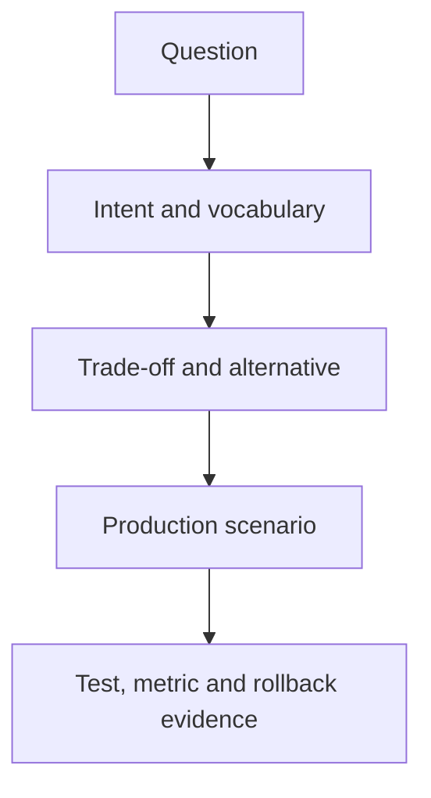

# Interview Questions

## Junior
1. Strategy khác chuỗi if/else ở điểm nào?
2. Vì sao ưu tiên composition?
3. Adapter giải quyết vấn đề gì?

## Middle
1. Khi nào Repository là over-engineering?
2. So sánh State và Strategy.
3. Thiết kế retry bằng Decorator cần lưu ý gì?

## Senior
1. Chọn pattern cho payment integration và phân tích failure mode.
2. Khi nào event-driven làm flow khó kiểm soát?
3. Làm sao đánh giá abstraction đã đủ ổn định?

## Tech Lead
1. Thiết lập guideline dùng pattern trong team thế nào?
2. Review thiết kế khi team có hai giải pháp đều hợp lệ ra sao?
3. Đo tác động maintainability bằng tín hiệu nào?

## Cách sử dụng tài liệu này

Với **Interview Questions**, người học cần tạo một artifact có thể review: sơ đồ, đoạn code, checklist hoặc quyết định thiết kế. Bắt đầu từ một tình huống thật, ghi outcome mong đợi và failure path; sau đó mới áp dụng kỹ thuật trong bài.

## Hoạt động thực hành

1. Bắt đầu bằng tình huống thay đổi thật thay vì hỏi định nghĩa.
2. Yêu cầu ứng viên vẽ dependency và nêu failure path trước khi chọn pattern.
3. Đào sâu bằng câu hỏi “khi nào giải pháp trực tiếp tốt hơn?”.
4. Chấm reasoning, assumption và test strategy hơn khả năng nhớ tên GoF.
5. Kết thúc bằng feedback có ví dụ cụ thể và tiêu chí level.

## Tiêu chí hoàn thành

- Câu trả lời nối context, forces, decision, trade-off và evidence.
- Ứng viên phải xử lý follow-up về failure/migration.
- Interviewer hiệu chỉnh rubric để giảm đánh giá theo từ khóa.

## Cách biến câu hỏi thành đánh giá năng lực

Mỗi câu hỏi nên có ba lớp: **nhận biết intent**, **phân tích trade-off** và **áp dụng vào tình huống có failure**. Ví dụ, thay vì chỉ hỏi “Repository là gì?”, hãy đưa yêu cầu dashboard nhiều join và yêu cầu ứng viên quyết định giữa Repository, Query Object và truy vấn trực tiếp; sau đó hỏi cách đo hiệu năng và cách giữ write-side invariant.

Rubric nên chấm cách ứng viên làm rõ giả định, nhận diện failure, chọn baseline và biết khi nào không dùng pattern—không chỉ số lượng tên pattern họ nhớ.
