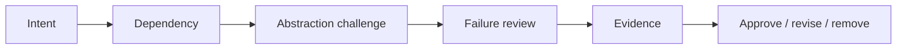

# Code Review Checklist

## Problem fit
- Pattern giải quyết vấn đề thay đổi cụ thể nào?
- Có giải pháp đơn giản hơn không?

## Boundary
- Dependency direction đúng chưa?
- Framework/vendor có bị rò vào domain không?

## Behavior
- Invariant được bảo vệ ở đâu?
- Failure, retry, idempotency và transaction đã rõ chưa?

## Maintainability
- Tên class mô tả vai trò?
- Flow có theo dõi được?
- Test xác minh hành vi?
- Có abstraction thừa?

## Cách sử dụng tài liệu này

Với **Code Review Checklist**, người học cần tạo một artifact có thể review: sơ đồ, đoạn code, checklist hoặc quyết định thiết kế. Bắt đầu từ một tình huống thật, ghi outcome mong đợi và failure path; sau đó mới áp dụng kỹ thuật trong bài.

## Hoạt động thực hành

1. Xác nhận PR giải quyết behavior nào và có baseline test hay chưa.
2. Theo dấu dependency mới: client biết ít hơn hay chỉ có thêm lớp trung gian?
3. Kiểm tra invariant, error mapping, transaction và observability.
4. Tìm abstraction chưa có consumer/variation thật hoặc interface mirror implementation.
5. Ghi comment theo risk và suggestion cụ thể, tránh tranh luận tên pattern thuần túy.

## Tiêu chí hoàn thành

- Review xác nhận dependency direction, ownership và failure semantics.
- Mọi abstraction mới có test hoặc evidence thay đổi.
- Comment tập trung risk/maintainability thay vì sở thích cá nhân.

## Quy trình review theo bằng chứng

1. **Reconstruct intent**: mô tả problem, invariant và change axis bằng một câu.
2. **Trace dependency**: vẽ dependency direction và xác định boundary kỹ thuật.
3. **Challenge abstraction**: so sánh với baseline trực tiếp; hỏi abstraction nào có thể xóa.
4. **Inspect failure**: timeout, duplicate, stale state, partial commit và invalid transition được xử lý ở đâu.
5. **Verify evidence**: test, metric, log field, dashboard và rollback plan có đủ để xác nhận quyết định không.

Checklist chỉ là bộ nhớ hỗ trợ. Reviewer phải viết nhận xét gắn với một risk cụ thể và đề xuất test hoặc evidence có thể kiểm chứng.
