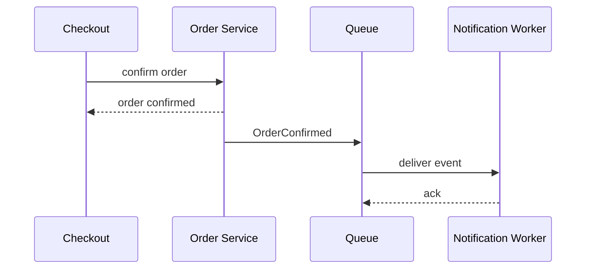

# Chọn đồng bộ hay bất đồng bộ

## Mục tiêu học tập

Quyết định khi nào caller cần outcome ngay và khi nào có thể chấp nhận eventual consistency.

## Bối cảnh

**Order confirmation** là tình huống tổng hợp dùng để luyện quyết định. Hãy bắt đầu từ invariant, ownership và failure thay vì chọn pattern theo tên.

## Mô hình phân tích

## Dữ kiện cần làm rõ

- Caller có cần biết kết quả cuối trước khi tiếp tục?
- Nếu worker chậm 10 phút, trạng thái nào hiển thị cho người dùng?
- Command/event có key để retry mà không tạo side effect trùng không?

## Bài tập tương tác

1. Tách các bước của order confirmation thành phần bắt buộc đồng bộ và phần có thể trì hoãn.
2. Mô phỏng queue unavailable sau khi order đã commit.
3. Đề xuất status model để UI giải thích pending/sent/failed.

## Câu hỏi review

- Invariant nào phải hoàn tất trước khi trả response?
- Retry có tạo side effect trùng không?
- Người dùng quan sát trạng thái trung gian ở đâu?

## Gợi ý lời giải

Giữ invariant tạo Order trong transaction; notification có thể chuyển async nếu có outbox và trạng thái quan sát được.

## Deliverable

- Bảng sync/async cho từng bước.
- Sequence diagram có queue failure.
- Metric queue lag và notification failure.

## Tiêu chí hoàn thành

- Không đẩy business rejection sang worker.
- Có recovery khi publish thất bại.
- Giải thích latency/consistency trade-off.

## Enterprise drill

### Tình huống thực tế

Hệ thống checkout cần phát hành hóa đơn, cập nhật CRM và gửi email sau khi đơn hàng được xác nhận. Hóa đơn là điều kiện hoàn tất giao dịch; email có thể chậm; CRM có thể tạm thời không khả dụng.

### Ma trận quyết định

| Thành phần | Lựa chọn | Lý do kiểm chứng |
|---|---|---|
| Phát hành hóa đơn | Đồng bộ | Lỗi phải chặn commit vì đây là kết quả người dùng đang chờ |
| Gửi email | Bất đồng bộ | Cho phép retry và theo dõi queue lag |
| Đồng bộ CRM | Bất đồng bộ có reconciliation | Không để outage của CRM làm checkout thất bại |

### Failure rehearsal

Mô phỏng worker dừng sau khi transaction commit nhưng trước khi publish message. Thiết kế phải chỉ ra Outbox hoặc cơ chế phục hồi tương đương.

### Hướng lời giải tham khảo

Tách quyết định theo mức nhất quán và mức chịu trễ, không theo sở thích công nghệ. Những side effect bắt buộc cho response ở lại trong transaction; side effect có thể phục hồi đi qua durable message và idempotent consumer.

### Evidence cần bàn giao

- Sequence diagram chỉ rõ transaction kết thúc trước khi message được publish.
- Test crash-after-commit chứng minh Outbox có thể phát lại.
- Metric queue lag và oldest pending được gắn với SLO cụ thể.
- Decision note phân loại từng side effect theo consistency và latency.
