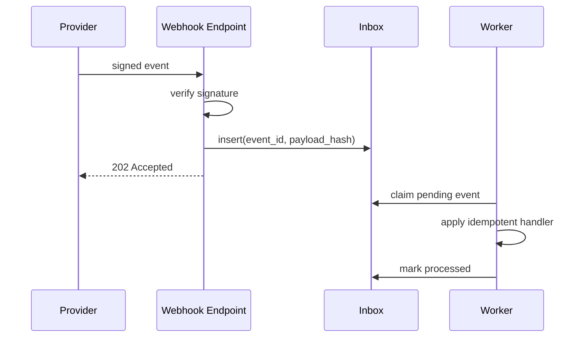

# Thiết kế webhook bền vững

## Mục tiêu học tập

Thiết kế inbox, xác thực chữ ký, idempotency và retry để xử lý at-least-once delivery.

## Bối cảnh

**Payment provider webhook** là tình huống tổng hợp dùng để luyện quyết định. Hãy bắt đầu từ invariant, ownership và failure thay vì chọn pattern theo tên.

## Mô hình phân tích

## Dữ kiện cần làm rõ

- Provider ký payload bằng thuật toán nào và clock skew bao nhiêu?
- Event ID có ổn định qua retry không?
- Handler nào có side effect không thể rollback?

## Bài tập tương tác

1. Thiết kế bảng inbox với unique key và payload hash.
2. Mô phỏng duplicate, out-of-order và signature invalid.
3. Viết retry/dead-letter policy cho worker.

## Câu hỏi review

- Nếu provider gửi cùng event với payload khác thì sao?
- Ack nên xảy ra trước hay sau business processing?
- Dead-letter và replay được kiểm soát thế nào?

## Gợi ý lời giải

Ack nhanh sau khi verify và persist inbox; business processing tách khỏi HTTP request.

## Deliverable

- Inbox schema.
- Failure matrix bốn loại webhook.
- Replay runbook có audit.

## Tiêu chí hoàn thành

- Duplicate không tạo side effect lần hai.
- Payload conflict bị phát hiện.
- Replay có giới hạn và owner.

## Enterprise drill

### Tình huống thực tế

Nhà cung cấp thanh toán gửi webhook có thể trùng, đảo thứ tự hoặc timeout sau khi phía nhận đã xử lý thành công.

### Ma trận quyết định

| Thành phần | Lựa chọn | Lý do kiểm chứng |
|---|---|---|
| Xác thực chữ ký | Trước khi parse nghiệp vụ | Từ chối payload giả mạo |
| Inbox deduplication | Theo event id | Không chạy side effect hai lần |
| State transition | So sánh version/status | Bỏ qua event cũ nhưng giữ audit |

### Failure rehearsal

Gửi cùng event ba lần rồi gửi event cũ hơn. Kết quả phải chỉ có một transition hợp lệ và lưu được lý do bỏ qua.

### Hướng lời giải tham khảo

Webhook endpoint chỉ xác thực, ghi Inbox và trả acknowledgement nhanh. Worker xử lý transition idempotent; lỗi tạm thời retry có giới hạn, lỗi permanent đi exception queue kèm runbook.

### Evidence cần bàn giao

- Webhook contract ghi signature, event id và ordering field.
- Inbox test chứng minh duplicate delivery không nhân đôi side effect.
- Audit record lưu lý do bỏ qua event cũ.
- Runbook có lookup theo provider reference trước khi retry.
