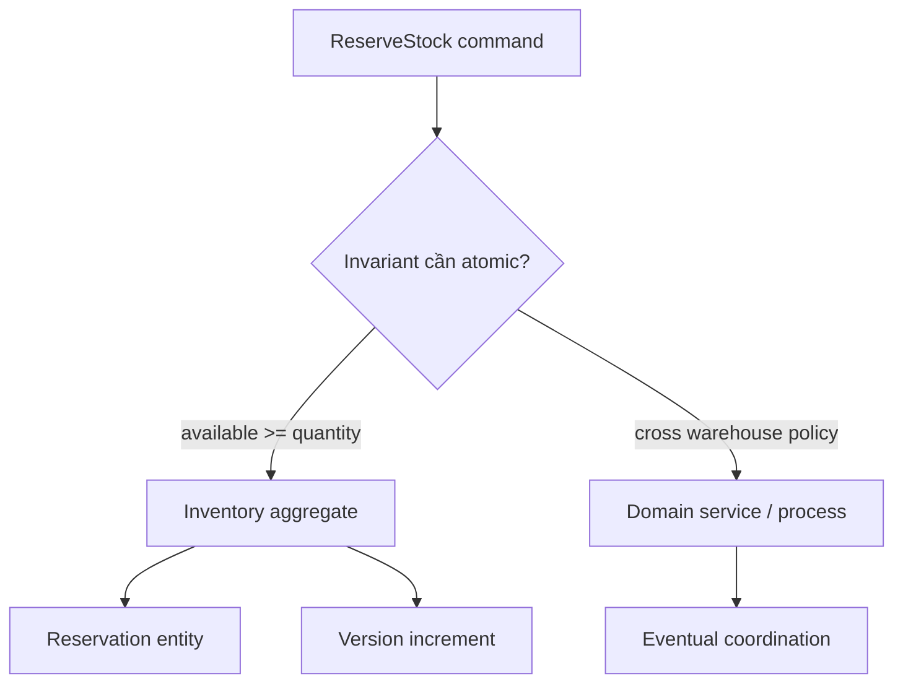

# Tìm Aggregate Boundary

## Mục tiêu học tập

Tìm transaction boundary nhỏ nhất vẫn bảo vệ invariant available-to-promise.

## Bối cảnh

**Inventory reservation** là tình huống tổng hợp dùng để luyện quyết định. Hãy bắt đầu từ invariant, ownership và failure thay vì chọn pattern theo tên.

## Mô hình phân tích

## Dữ kiện cần làm rõ

- Invariant nào phải đúng ngay sau command ReserveStock?
- Warehouse khác có cần cùng transaction không?
- Reservation hết hạn được xử lý bởi aggregate hay process ngoài?

## Bài tập tương tác

1. Viết invariant bằng câu nghiệp vụ.
2. Đề xuất hai boundary và so sánh contention.
3. Tạo state transition cho reservation.

## Câu hỏi review

- Invariant nào thực sự cần atomicity?
- Object nào chỉ được tham chiếu bằng identity?
- Boundary có gây contention hoặc load graph quá lớn không?

## Gợi ý lời giải

Bắt đầu từ invariant atomic, không bắt đầu từ sơ đồ database hoặc màn hình.

## Deliverable

- Aggregate diagram.
- Decision table cho reserve/release/expire.
- Concurrency test plan.

## Tiêu chí hoàn thành

- Root là entry point duy nhất.
- Boundary không load object graph không cần thiết.
- Cross-aggregate flow dùng identity/event rõ.

## Enterprise drill

### Tình huống thực tế

Đơn hàng chứa line item, coupon, payment intent và shipment. Nhóm đang cân nhắc đưa tất cả vào một aggregate để “dễ nhất quán”.

### Ma trận quyết định

| Thành phần | Lựa chọn | Lý do kiểm chứng |
|---|---|---|
| Order + line items | Cần invariant tổng tiền | Cùng transaction |
| Payment intent | Có lifecycle/provider riêng | Tham chiếu bằng id |
| Shipment | Thay đổi độc lập sau checkout | Process manager điều phối |

### Failure rehearsal

Tạo hai request đồng thời thay coupon và line item. Thiết kế phải nêu optimistic version hoặc serialization point bảo vệ tổng tiền.

### Hướng lời giải tham khảo

Aggregate boundary đi theo invariant cần atomicity, không đi theo quan hệ dữ liệu. Giữ Order nhỏ; payment và shipment là aggregate riêng, phối hợp bằng event/process manager.

### Evidence cần bàn giao

- Context diagram chỉ rõ aggregate root và reference bằng id.
- Concurrency test chứng minh invariant tổng tiền dưới stale version.
- Decision record giải thích vì sao payment/shipment nằm ngoài Order.
- Event contract mô tả cách phối hợp sau commit.
