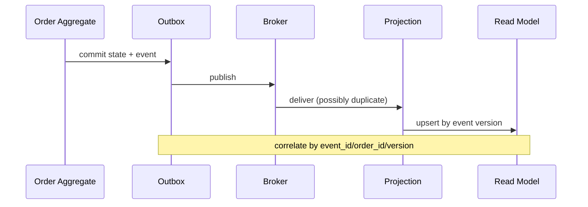

# Debug eventual consistency

## Mục tiêu học tập

Điều tra vì sao write model đã đúng nhưng read model chưa phản ánh.

## Bối cảnh

**Order projection** là tình huống tổng hợp dùng để luyện quyết định. Hãy bắt đầu từ invariant, ownership và failure thay vì chọn pattern theo tên.

## Mô hình phân tích

## Dữ kiện cần làm rõ

- Event version nào đã commit nhưng chưa xuất hiện ở projection?
- Consumer offset và inbox record đang ở trạng thái nào?
- Có event đến sai thứ tự hay poison payload không?

## Bài tập tương tác

1. Tạo timeline từ aggregate commit đến read model update.
2. Định nghĩa metric lag theo event time và processing time.
3. Viết quy trình replay an toàn theo partition/order ID.

## Câu hỏi review

- Lag nằm ở outbox, broker, consumer hay projection?
- Consumer xử lý out-of-order event thế nào?
- Metric nào phân biệt backlog với poison message?

## Gợi ý lời giải

Theo dõi event_id, aggregate_id, version và causation_id xuyên suốt pipeline.

## Deliverable

- Correlation timeline.
- Dashboard lag/backlog/error.
- Replay và reconciliation runbook.

## Tiêu chí hoàn thành

- Phân biệt lost, delayed, duplicate và out-of-order.
- Projection update idempotent.
- Không sửa read model thủ công mà thiếu audit.

## Enterprise drill

### Tình huống thực tế

Dashboard báo doanh thu thấp hơn ledger trong vài phút và đội vận hành không biết đây là lag bình thường hay mất event.

### Ma trận quyết định

| Thành phần | Lựa chọn | Lý do kiểm chứng |
|---|---|---|
| Projection lag | Đo offset/time | Có SLO rõ |
| Missing event | So sánh source sequence | Chạy replay/reconciliation |
| Duplicate event | Idempotent projection | Không nhân đôi số liệu |

### Failure rehearsal

Dừng consumer, phát sinh 100 event rồi khởi động lại. Dashboard phải bắt kịp và metric lag phải phản ánh đúng quá trình phục hồi.

### Hướng lời giải tham khảo

Bắt đầu từ source of truth và sequence/offset. Quan sát lag, throughput và error rate; cung cấp replay có checkpoint và reconciliation để phân biệt trễ với mất dữ liệu.

### Evidence cần bàn giao

- Dashboard hiển thị consumer offset, lag và oldest unprocessed event.
- Replay test bắt kịp projection mà không nhân đôi số liệu.
- Reconciliation query so sánh projection với source sequence.
- Runbook phân biệt backlog bình thường và event bị mất.
